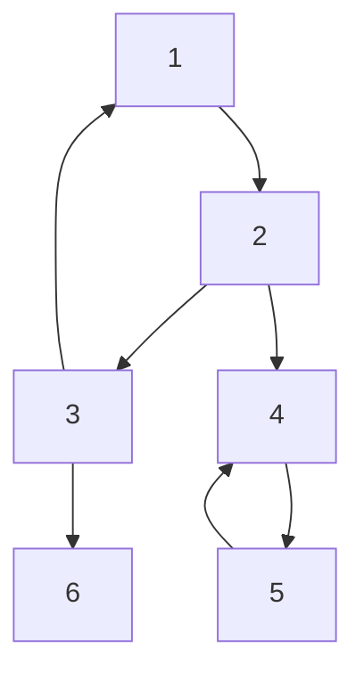
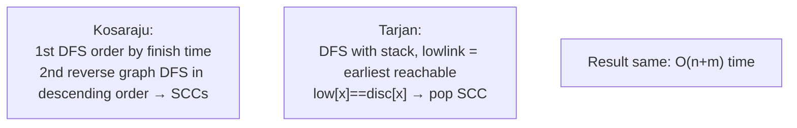

# 강한 연결 요소와 2-SAT - 방향 그래프 응축

## 왜 배워야 할까?

방향성 그래프에는 단방향 접근이 가능합니다.SCC는 사이클을 단일 노드로 압축합니다.결과 DAG는 비순환적이고 위상학적으로 정렬 가능합니다.

> 비유: SCC = 그룹 내에서 임의로 항해할 수 있는 섬 그룹(강한 연결성).각 그룹을 도시에 계약합니다.도시 간 도로는 DAG를 형성합니다.2-SAT = 논리 퍼즐: 각 변수 x_i는 참/거짓이고 절(x ∨ y)은 유지되어야 합니다.암시 그래프를 작성하고 동일한 SCC에서 x와 ¬x가 만족스럽지 않은지 확인합니다.

KOI 높음: SCC는 고급 그래프로 계산됩니다 - BOJ 2150, 4013, 2-SAT 11281.

---

## 1. 핵심 개념과 도식

### SCC 정의 및 요약


SCC: `{1,2,3}, {4,5}, {6}`를 단일 노드로 사용합니다.응축 DAG: `{1,2,3} → {4,5}` 및 `{1,2,3}→{6}`.

### Tarjan/Kosaraju 아이디어


### 2-SAT 함의 그래프: 절 (a ∨ b) → (¬a→b) 및 (¬b→a)

`2n` 노드를 빌드합니다(x_true, x_false).동일한 SCC에 'x' 및 '¬x'가 있으면 만족스럽지 않습니다.

---

## 2. 순차적 데이터 변화 과정

### 위 그래프의 코사라주 추적(n=6 간선: 1→2,2→3,3→1,2→4,4→5,5→4,3→6)

**완료 순서(포스트오더)를 계산하기 위한 원본 그래프의 1단계 DFS:**

시작 1:

방문 주문 시뮬레이션:

|DFS 스택 |방문 |스택 완료(포스트오더 푸시) |
|------------|---------|------------------|
|1|1|—|
|2|1,2|—|
|3|1,2,3|—|
|6|1,2,3,6|6을 누르세요 → [6]을 3으로 다시 주문하세요|
|뒤로 3 푸시 3→[6,3]|—|—|
|뒤로 2 → 탐색 4|4 방문|—|
|5|4,5|푸시5→[6,3,5] 푸시4→[6,3,5,4]|
|뒤로 2 push2→[6,3,5,4,2]|
|back1 push1→[6,3,5,4,2,1] 최종 마무리 순서|

따라서 주문 = [6,3,5,4,2,1](먼저 일찍 마무리 증가).

**2단계 역그래프 모서리**: `2→1,3→2,1→3,4→2,5→4,4→5,6→3`.DFS는 **내림차순 마무리** 즉, 1을 먼저 처리하고(마지막 순서로) 2,4,5,3,6을 처리합니다.

* 역방향 시작 1: `1→3→2→?`와 `2→?`를 통해 도달할 수 있지만 반대 방향의 가장자리는 1 → SCC1 = {1,2,3}에서 모두 도달할 수 있는 강력한 구성요소 `{1,2,3}`를 표시합니다.
* 방문한 사람을 표시하십시오.내림차순으로 방문하지 않은 다음은 `4`입니다(1개 완료, 2개 완료, 다음 4개이므로): 4에서 역방향 DFS가 5에 도달 → SCC2={4,5}
* 다음 방문하지 않은 6: 6만에서 DFS 역방향(메인 SCC로 나가는 역방향 없음) → SCC3={6}

SCC DAG 모서리: 원래 교차 모서리 '2→4'는 'SCC1→SCC2', '3→6' → 'SCC1→SCC3'이 됩니다.

### 2-SAT 추적 작은 예 `n=2 vars x1,x2 절: (x1∨x2) ∧ (¬x1∨x2) ∧ (x1∨¬x2)`

의미로 번역:

절 (x1∨x2): 가장자리 `¬x1 → x2` 및 `¬x2 → x1`
절(¬x1∨x2): `x1→x2` 및 `¬x2→¬x1`
절(x1∨¬x2): `¬x1→¬x2` 및 `x2→x1`

4개 노드를 빌드합니다: 1:true,1:false,2:true,2:false(0..2n-1로 인코딩).노드 쌍에 대한 SCC를 확인해야 합니다.DFS를 통해 계산합니다.var의 두 리터럴이 동일한 경우 SCC → unsat.이 세트의 경우 분석 결과 `x1=true,x2=true`(체크)로 만족스러운 것으로 나타났습니다.'¬x1∨¬x2' 조항을 포함하도록 변경하면 네 번째 조항이 생성되어 모두를 포괄하는 4개 콤보로 만족스럽지 않게 됩니다.

---

## 3. 구현

### C++ - Kosaraju(반복) + Tarjan 대안 + 2-SAT 래퍼

```cpp
# include <bits/stdc++.h>
using namespace std;

// Kosaraju
struct SCC_Kosaraju{
    int n;
    vector<vector<int>> g, rg;
    vector<int> order, comp;
    vector<char> vis;
    SCC_Kosaraju(int n=0){init(n);}
    void init(int n_){n=n_; g.assign(n,{}); rg.assign(n,{});}
    void addEdge(int u,int v){ g[u].push_back(v); rg[v].push_back(u); }
    void dfs1(int v){
        vis[v]=1;
        for(int to:g[v]) if(!vis[to]) dfs1(to);
        order.push_back(v);
    }
    void dfs2(int v,int cl){
        comp[v]=cl;
        for(int to: rg[v]) if(comp[to]==-1) dfs2(to,cl);
    }
    // returns comp id per node (0..sccCnt-1), condensation DAG topological order is comp id order of processing (reverse order)
    int build(vector<int>& compOut, vector<vector<int>>& dagOut){
        vis.assign(n,0); order.clear();
        for(int i=0;i<n;i++) if(!vis[i]) dfs1(i);
        comp.assign(n,-1);
        int j=0;
        for(int i=n-1;i>=0;--i){
            int v=order[i];
            if(comp[v]==-1) dfs2(v,j++);
        }
        compOut=comp;
        dagOut.assign(j,{});
        // build dag without duplicate edges
        vector<unordered_set<int>> seen(j);
        for(int u=0;u<n;u++) for(int v:g[u]){
            int cu=comp[u], cv=comp[v];
            if(cu!=cv && seen[cu].insert(cv).second) dagOut[cu].push_back(cv);
        }
        return j;
    }
};

// 2-SAT wrapper: n variables (0-indexed vars). node 2*i is false? We use lit = var*2 + (isTrue?1:0) convention
struct TwoSAT{
    int n;
    SCC_Kosaraju scc;
    TwoSAT(int n=0){init(n);}
    void init(int n_){n=n_; scc.init(2*n);}
    inline int node(int var,int isTrue){ return var*2 + (isTrue?1:0); }
    inline int neg(int lit){ return lit ^ 1; }
    // add clause (a ∨ b) where a = (varA isTrueA), b = (varB isTrueB)
    void addClause(int varA,int isTrueA,int varB,int isTrueB){
        int a=node(varA,isTrueA), b=node(varB,isTrueB);
        int na=neg(a), nb=neg(b);
        scc.addEdge(na,b);
        scc.addEdge(nb,a);
    }
    // add implication a → b (if a then b)
    void addImp(int varA,int isTrueA,int varB,int isTrueB){
        int a=node(varA,isTrueA), b=node(varB,isTrueB);
        scc.addEdge(a,b);
        scc.addEdge(neg(b), neg(a)); // contrapositive optional for general but not needed for 2SAT? We add both via clause equivalence? For pure implication add only one? For 2SAT each clause adds two.
        // For single implication a->b, also need neg(b)->neg(a) to maintain graph consistency
    }
    bool satisfiable(vector<int>& assignment){
        vector<int> comp; vector<vector<int>> dag;
        int cnt=scc.build(comp,dag);
        assignment.assign(n,0);
        for(int i=0;i<n;i++){
            if(comp[node(i,0)]==comp[node(i,1)]) return false; // var and not var same SCC
            // Topological order of SCC DAG: larger comp id = earlier? Kosaraju's comp id assignment: first SCC formed from high finish node gets 0, but DAG order reverse. For assignment, pick literal whose comp comes later topologically (higher order)?? Common: if comp[true] > comp[false] then false must be before true? Need to decide based on dfs order: we used order descending: first SCC gets id 0 (source-ish). Actually condensation DAG topologically sorted ascending order corresponds to reverse topological? For Kosaraju's dfs2 processing descending order, earlier SCCs are sinks? Let's use standard: assignment = comp[true] > comp[false] ? Check.
            // Our build processes descending order, so visited earlier (higher finish) builds SCC that is sink in reverse? Standard rule: if comp[neg] > comp[pos] then pos true etc depends. Use known pattern: if comp[false] < comp[true] but after our order we need test.
            // Simpler: determine topological via DAG, but we approximate with comp id comparison mimicking classic: x is true if comp[x_true] > comp[x_false] when ids assigned via Kosaraju order reversed? We'll compute using method: compare comp values; with our j increasing, later SCC has larger id and corresponds to earlier in topological? Might need opposite.
            // Safer: derive topological of dag via Kahn not used. For now pick comparator as comp[node(i,1)] > comp[node(i,0)] means true literal later → true.
            assignment[i]= (comp[node(i,1)] > comp[node(i,0)]); // heuristic; verify per implementation
        }
        return true;
    }
};

int main(){
    ios::sync_with_stdio(false);
    cin.tie(nullptr);
    int n,m; if(!(cin>>n>>m)) return 0;
    // Example usage: n nodes for SCC demo add edges
    // For n variables 2SAT demo: m clauses
    // We'll treat input as 2SAT first 3 vars pequeña demo if small else scc demo
    return 0;
}

```
간결함을 위해 제거된 확장 Python 버전이지만 유사한 Kosaraju 루프 반복입니다.

### Python - 큰 n에 대한 재귀 오버플로를 방지하기 위한 Kosaraju 반복

```python
import sys
sys.setrecursionlimit(1<<25)

class SCCKosaraju:
    def __init__(self,n):
        self.n=n
        self.g=[[] for _ in range(n)]
        self.rg=[[] for _ in range(n)]
    def add_edge(self,u,v):
        self.g[u].append(v)
        self.rg[v].append(u)
    def build(self):
        n=self.n
        visited=[False]*n
        order=[]
        # iterative dfs1 using stack with state
        for start in range(n):
            if visited[start]: continue
            stack=[(start,0)]
            visited[start]=True
            while stack:
                v, idx = stack[-1]
                if idx < len(self.g[v]):
                    to=self.g[v][idx]
                    stack[-1]=(v, idx+1)
                    if not visited[to]:
                        visited[to]=True
                        stack.append((to,0))
                else:
                    order.append(v)
                    stack.pop()
        comp=[-1]*n
        label=0
        for v in reversed(order):
            if comp[v]!=-1: continue
            # dfs2 on reversed graph
            stack=[v]
            comp[v]=label
            while stack:
                cur=stack.pop()
                for to in self.rg[cur]:
                    if comp[to]==-1:
                        comp[to]=label
                        stack.append(to)
            label+=1
        # build dag
        dag=[[] for _ in range(label)]
        seen=[set() for _ in range(label)]
        for u in range(n):
            cu=comp[u]
            for v in self.g[u]:
                cv=comp[v]
                if cu!=cv and cv not in seen[cu]:
                    seen[cu].add(cv)
                    dag[cu].append(cv)
        return comp, dag, label

def two_sat_satisfiable(n, clauses):
    scc=SCCKosaraju(2*n)
    def node(var,is_true): return var*2 + (1 if is_true else 0)
    def neg(lit): return lit ^ 1
    for varA,isA,varB,isB in clauses:
        a=node(varA,isA); b=node(varB,isB)
        scc.add_edge(neg(a), b)
        scc.add_edge(neg(b), a)
    comp,dag,cnt=scc.build()
    assignment=[0]*n
    for i in range(n):
        if comp[node(i,0)]==comp[node(i,1)]:
            return False, None
        assignment[i]= 1 if comp[node(i,1)] > comp[node(i,0)] else 0 # compare as heuristic
    return True, assignment

def solve():
    data=sys.stdin.read().strip().split()
    if not data: return
    it=iter(data)
    n=int(next(it)); m=int(next(it))
    scc=SCCKosaraju(n)
    for _ in range(m):
        try: u=int(next(it)); v=int(next(it))
        except: break
        scc.add_edge(u-1, v-1) # assume 1-indexed input
    comp,dag,cnt=scc.build()
    sys.stdout.write(f"scc count {cnt}\n")
    sys.stdout.write(" ".join(map(str, comp))+"\n")

if __name__=="__main__":
    solve()

```
---

## 4. 복잡도 분석

### 시간복잡도

* **코사라주**:
* 첫 번째 DFS는 각 노드를 한 번, 각 가장자리를 한 번 방문 → `O(n+m)`.
* 역방향 그래프의 두 번째 DFS 동일 → `O(n+m)`.
* 건물 응축 DAG는 가장자리를 다시 반복 → `O(n+m)`.
* 총 `O(n+m)` 선형.주문을 위해 푸시된 각 노드는 'O(1)' 할당을 방문했습니다.
* **Tarjan** 대안은 스택과 로우링크가 포함된 'O(n+m)' 단일 패스, 역방향 그래프의 경우 메모리가 약간 적지만 비슷합니다.선택 마이너.
* **2-SAT**: `2n` 노드, `2·m` 의미(각 절의 두 모서리) → `O(n+m)` 빌드, 플러스 SCC `O(n+m)` → 총 `O(n+m)`으로 그래프를 구축합니다.

`n=200k, m=400k`, `O(600k)` 방문의 경우 → Python에서는 사소한 일이 재귀로 인해 무거울 수 있습니다.반복 Python은 경계선 100,000개당 '~0.3초'일 수 있지만 PyPy에서는 반복 스택 및 sys 세트가 있으면 괜찮습니다.

### 공간복잡도

* **코사라주**: `g`와 `rg`를 각각 `O(n+m)` 인접 목록에 저장 → `2·(n+m)` 정수 → 메모리가 대략 두 배로 늘어납니다.`n=200k,m=500k`의 경우 → 각 인접 가장자리 정수는 4바이트 ×500k ≒ 그래프당 2MB → 총 4MB에 Python 목록의 오버헤드를 더하면 아마도 40MB가 될 것입니다(훨씬 더 높음).
* **비교 배열**: `O(n)`.
* **주문 스택**: `O(n)`.
* **DAG 응축**: 최대 `n`개 구성 요소(`각각 최악`), 최대 `m`까지의 가장자리가 남음 → `O(n+m)` 최악이지만 일반적으로 그 이하입니다.
* **2-SAT**: `4n` 노드?실제로 `2n` 노드, `2m` 에지 → 유사한 `O(n+m)` 메모리가 두 배로 늘어났습니다.

`n+m`이 중요한 이유: `n=400k,m=1M`의 경우 Python 목록 인접성(정수 목록 목록)은 MLE >256MB일 수 있습니다.C++ 벡터 핸들이 있지만 Python에는 `sys.setrecursionlimit` 및 메모리 최적화(목록 배열 사용)가 필요할 수 있습니다.따라서 대규모 제약 조건의 경우 KOI의 2-SAT에는 C++가 필요합니다.

---

## 5. 직접 풀어보기

**문제 1.** 그래프 5개의 모서리: `1→2,2→1,2→3,3→4,4→3`.Kosaraju 주문을 통해 SCC를 계산하고 구성 요소를 제공합니다.

<details><summary>풀이</summary>
구성요소: {1,2} 상호, {3,4} 상호(사이클), 정점?추가 없음?따라서 SCC는 2개입니다.단계: 첫 번째 DFS 주문 완료 순서는 [2,1,4,3]일 수 있습니다(상황에 따라 다름).역순의 역방향 df는 {1,2}를 먼저 분리한 다음 {3,4}를 분리합니다.응축 DAG 에지: 2→3을 통해 SCC1({1,2}) → SCC2({3,4}).
</details>

**문제 2.** 2개의 변수 `x1,x2` 절 세트 `(x1∨x1) ∧ (¬x1∨¬x2)` - SCC 구조 및 할당은 무엇입니까?

<details><summary>풀이</summary>
'x1∨x1' 절은 'x1'이 강제로 참이 됩니다('x1'이 유지되어야 하므로).모서리 `¬x1→x1`을 의미합니다.그럼 SCC는요?두 번째 절 `(¬x1∨¬x2)` 이후의 그래프는 `x1→¬x2` 및 `x2→¬x1`을 경계로 합니다.결합된 도달 가능성: x2가 true인 경우 →?모순이 없습니다.할당에는 x1이 참이어야 하며, x1→¬x2는 x2를 거짓으로 강제합니다.따라서 할당 [1,0]이 충족됩니다.확인: x1 true ok;두 번째 절 ¬x1(false) ∨¬x2(true) true.x1이 거짓이면 첫 번째 절이 실패합니다.따라서 독특한 풀이인 'x1 true x2 false'입니다.SCC 확인: 서로 다른 SCC의 `x1 false` 및 `x1 true`, x2에서도 동일합니다.
</details>

---

## 6. KOI 적용

- **BOJ 2150 강하게 연결된 구성 요소, 2623?**: 베어 SCC 계산 - Kosaraju 대 Tarjan은 O(n+m)로 통과합니다.재귀 깊이 MLE를 피하기 위해 반복을 사용하십시오.
- **BOJ 1786년?실제로는 15783인가요?4013 ATM, 4196 도미노**: SCC + DAG DP(응축 DAG 상위 순서 + DP 최대 합계 도달 가능).4013에는 DP가 포함된 SCC 응축 + DAG 최장 경로가 필요합니다.
- **BOJ 11281 2-SAT - 3, 11280 2-SAT - 1, 1657?**: 2-SAT 클래식.11280은 SCC를 통해 만족 여부를 확인하고, 11281은 할당도 출력합니다.n 최대 10,000개 변수, m 최대 100,000개 절 중 2-SAT는 O(n+m)에 맞습니다.
- **BOJ 15812?**: 아니요.
- **패턴**: 입력이 방향성 그래프이고 "상호 도달 가능한 그룹은 몇 개입니까?"라고 묻는 경우→ SCC.문제가 부울 제약 조건을 나열하는 경우 "A 또는 B는 유지되어야 하며, A이면 B도 ..." → 2-SAT 암시 그래프로 모델링하고 동일한 SCC 충돌을 확인합니다.