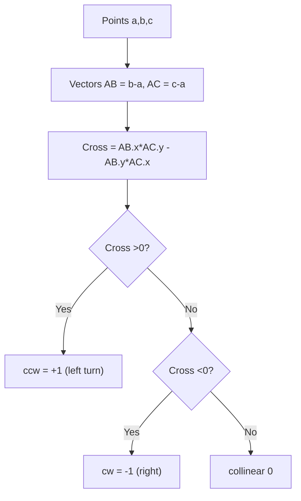
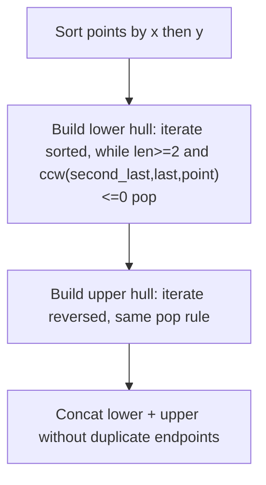

# 기하 - CCW, 볼록 껍질, 선분 교차

## 왜 배워야 할까?

정수 좌표를 가진 대부분의 KOI 기하학은 방향 테스트 `ccw`로 축소됩니다.'ccw'가 정확하면 세그먼트 교차점, 다각형 영역, 볼록 껍질(Graham/Andrew)이 따릅니다.

> 비유: `ccw(a,b,c) = 외적의 부호 (b-a)×(c-a)`.'b'를 바라보며 'a'에 서 있다고 상상해 보세요.`c`가 왼쪽이면 시계 반대 방향(+), 오른쪽 시계 방향(-), 직선 0으로 회전합니다. Hull = 설정된 점 주위로 고무 밴드를 늘립니다. - 외부 레이어에 스냅됩니다.

---

## 1. 핵심 개념과 도식

### 외적


### 볼록 껍질 단조 체인(Andrew)


---

## 2. 순차적 데이터 변화 과정

### 세 가지 경우에 대한 ccw 계산

`a(0,0), b(1,0)`를 취합니다.

* `c1(1,1)` → `AB=(1,0), AC=(1,1)` cross=1*1-0*1=1 >0 → `ccw +1` (AB 왼쪽 c)
* `c2(1,-1)` → 교차=1*(-1)-0*1=-1 <0 → cw -1
* `c3(2,0)` → 교차=0 → 동일선상

테이블:

|c |교류 |십자가 |CCW |
|---|----|---------|-----|
|(1,1)|1,1|1|+1|
|(1,-1)|1,-1|-1|-1|
|(2,0)|2,0|0|0|

### 점에 대한 볼록 껍질 연습 `[(0,0),(1,1),(2,2),(0,3),(3,0),(1,2)]` 정렬 `[(0,0),(0,3),(1,1),(1,2),(2,2),(3,0)]` 대기 x 및 y 올바른 순서로 정렬:`[(0,0),(0,3),(1,1),(1,2),(2,2),(3,0)]' 실제로는 x 0 2포인트입니다.

낮은 선체 반복 빌드:

|나 |포인트 |전에 스택 |ccw(마지막-2,마지막-1,포인트) |액션 |이후에 스택 |
|---|-------|---------------|-------------|---------|------------|
|0|(0,0)|[]|—|푸시|[ (0,0)]|
|1|(0,3)|[(0,0)]|—|푸시|[ (0,0),(0,3)]|
|2|(1,1)|[(0,0),(0,3)]|ccw (0,0)-(0,3)-(1,1): cross= (0,3)×(1,1) =0*1-3*1=-3 <0 → pop |pop (0,3)|[(0,0)] 다음 푸시 (1,1)→[(0,0),(1,1)]|
|3|(1,2)|[(0,0),(1,1)]|ccw (0,0)-(1,1)-(1,2): 교차1*2-1*1=1>0 유지 |푸시|[(0,0),(1,1),(1,2)]|
|4|(2,2)|[(0,0),(1,1),(1,2)]|ccw (1,1)-(1,2)-(2,2): 교차0*0?벡터 (0,1),(1,0) 교차=0*0-1*1=-1<0 팝 (1,2) |→[(0,0),(1,1)] 그런 다음 ccw (0,0)-(1,1)-(2,2): cross0을 확인하십시오.(1,1)×(2,2)=0 동일선상 ≤0 팝?동일 선상 내부를 제거하기 위해 ≤0을 사용하는 경우 pop (1,1) →[(0,0)] push (2,2) →[(0,0),(2,2)]|
|5|(3,0)|[(0,0),(2,2)]|ccw (0,0)-(2,2)-(3,0): cross2*0-2*3=-6<0 pop (2,2) →[(0,0)] push (3,0) →[(0,0),(3,0)] lower = [(0,0),(3,0)]|

상부 선체를 역순으로 정렬하면 `(3,0),(0,3)`을 포함하는 상부 체인이 생성되고 최종 선체 `[(0,0),(3,0),(0,3)]???`가 생성됩니다. 올바른 포함이 필요할 수 있습니다.이 작은 예는 교차 기호에 따른 팝 결정을 보여줍니다.

### ccw를 통한 세그먼트 교차: `p1-p2` 및 `p3-p4` 세그먼트는 `ccw(p1,p2,p3)*ccw(p1,p2,p4) ≤0` 및 `ccw(p3,p4,p1)*ccw(p3,p4,p2) ≤0`에 동일 선상 중첩을 위한 경계 상자를 추가하여 교차합니다.

---

## 3. 구현

### C++ - ccw, 헐, 세그먼트 교차점

```cpp
# include <bits/stdc++.h>
using namespace std;
struct Point{ long long x,y; bool operator<(const Point& o) const{ if(x!=o.x) return x<o.x; return y<o.y; } bool operator==(const Point& o) const{ return x==o.x && y==o.y; } };

// ccw returns 1 if ccw, -1 if cw, 0 if collinear; cross product value also useful
long long cross(const Point& a,const Point& b,const Point& c){
    // (b-a) x (c-a)
    return (b.x-a.x)*(c.y-a.y) - (b.y-a.y)*(c.x-a.x);
}
int ccw(const Point& a,const Point& b,const Point& c){
    long long cr=cross(a,b,c);
    if(cr>0) return 1;
    if(cr<0) return -1;
    return 0;
}

// Andrew monotone chain, returns hull in CCW without duplicate last point, minimal strict hull (removes collinear interior)
vector<Point> convex_hull(vector<Point> pts){
    sort(pts.begin(), pts.end());
    pts.erase(unique(pts.begin(), pts.end()), pts.end());
    int n=pts.size();
    if(n<=1) return pts;
    vector<Point> lower, upper;
    for(auto &p: pts){
        while(lower.size()>=2 && ccw(lower[lower.size()-2], lower.back(), p) <= 0) lower.pop_back();
        lower.push_back(p);
    }
    for(int i=n-1;i>=0;--i){
        auto &p=pts[i];
        while(upper.size()>=2 && ccw(upper[upper.size()-2], upper.back(), p) <= 0) upper.pop_back();
        upper.push_back(p);
    }
    lower.pop_back(); upper.pop_back();
    lower.insert(lower.end(), upper.begin(), upper.end());
    return lower;
}

bool onSegment(const Point& a,const Point& b,const Point& c){
    // c collinear and within bounding box of a-b
    return min(a.x,b.x)<=c.x && c.x<=max(a.x,b.x) && min(a.y,b.y)<=c.y && c.y<=max(a.y,b.y);
}
bool segmentsIntersect(const Point& p1,const Point& p2,const Point& q1,const Point& q2){
    int d1=ccw(p1,p2,q1), d2=ccw(p1,p2,q2);
    int d3=ccw(q1,q2,p1), d4=ccw(q1,q2,p2);
    if(d1==0 && onSegment(p1,p2,q1)) return true;
    if(d2==0 && onSegment(p1,p2,q2)) return true;
    if(d3==0 && onSegment(q1,q2,p1)) return true;
    if(d4==0 && onSegment(q1,q2,p2)) return true;
    return (d1!=d2 && d3!=d4);
}

long long polygonArea2(const vector<Point>& poly){ // 2*area absolute
    long long s=0;
    int n=poly.size();
    for(int i=0;i<n;i++){ int j=(i+1)%n; s+= poly[i].x*poly[j].y - poly[j].x*poly[i].y; }
    return llabs(s);
}

int main(){
    ios::sync_with_stdio(false);
    cin.tie(nullptr);
    int n; if(!(cin>>n)) return 0;
    vector<Point> pts(n);
    for(int i=0;i<n;i++) cin>>pts[i].x>>pts[i].y;
    auto hull=convex_hull(pts);
    cout<<"hull size "<<hull.size()<<"\n";
    for(auto &p: hull) cout<<p.x<<" "<<p.y<<"\n";
    cout<<"area2 "<<polygonArea2(hull)<<"\n";
    if(n>=4){
        cout<<"segments 0-1 vs 2-3 intersect "<<segmentsIntersect(pts[0],pts[1],pts[2],pts[3])<<"\n";
    }
    return 0;
}

```
### Python - 동일한 논리

```python
import sys

class Point:
    __slots__=('x','y')
    def __init__(self,x,y): self.x=x; self.y=y
    def __lt__(self,other): return (self.x,self.y)<(other.x,other.y)
    def __eq__(self,other): return self.x==other.x and self.y==other.y

def cross(a,b,c):
    return (b.x-a.x)*(c.y-a.y) - (b.y-a.y)*(c.x-a.x)
def ccw(a,b,c):
    cr=cross(a,b,c)
    return 1 if cr>0 else (-1 if cr<0 else 0)

def convex_hull(pts):
    pts=sorted(pts, key=lambda p:(p.x,p.y))
    # unique
    uniq=[]
    seen=set()
    for p in pts:
        key=(p.x,p.y)
        if key not in seen:
            seen.add(key); uniq.append(p)
    pts=uniq
    n=len(pts)
    if n<=1: return pts
    lower=[]
    for p in pts:
        while len(lower)>=2 and ccw(lower[-2], lower[-1], p) <=0:
            lower.pop()
        lower.append(p)
    upper=[]
    for p in reversed(pts):
        while len(upper)>=2 and ccw(upper[-2], upper[-1], p) <=0:
            upper.pop()
        upper.append(p)
    lower.pop(); upper.pop()
    return lower+upper

def on_segment(a,b,c):
    return min(a.x,b.x)<=c.x<=max(a.x,b.x) and min(a.y,b.y)<=c.y<=max(a.y,b.y)
def segments_intersect(p1,p2,q1,q2):
    d1=ccw(p1,p2,q1); d2=ccw(p1,p2,q2)
    d3=ccw(q1,q2,p1); d4=ccw(q1,q2,p2)
    if d1==0 and on_segment(p1,p2,q1): return True
    if d2==0 and on_segment(p1,p2,q2): return True
    if d3==0 and on_segment(q1,q2,p1): return True
    if d4==0 and on_segment(q1,q2,p2): return True
    return d1!=d2 and d3!=d4

def polygon_area2(poly):
    s=0; n=len(poly)
    for i in range(n):
        j=(i+1)%n
        s+= poly[i].x*poly[j].y - poly[j].x*poly[i].y
    return abs(s)

def solve():
    import sys
    data=list(map(int, sys.stdin.read().split()))
    if not data: return
    n=data[0]; idx=1
    pts=[]
    for i in range(n):
        if idx+1>=len(data): break
        pts.append(Point(data[idx], data[idx+1])); idx+=2
    hull=convex_hull(pts)
    out=[f"hull size {len(hull)}"]
    for p in hull: out.append(f"{p.x} {p.y}")
    out.append(f"area2 {polygon_area2(hull) if hull else 0}")
    if n>=4:
        out.append(f"segments intersect {segments_intersect(pts[0],pts[1],pts[2],pts[3])}")
    sys.stdout.write("\n".join(out))

if __name__=="__main__":
    solve()

```
---

## 4. 복잡도 분석

### 시간복잡도

* **cross/ccw**: 상수 'O(1)' 산술(6개의 곱셈/뺄셈).
* **볼록 껍질 단조 체인**: `O(n log n)` 정렬이 지배적입니다.하단 및 상단 스캔은 각각 `n` 포인트를 반복하고, 각 포인트는 한 번 푸시되고 최대 한 번 팝됩니다. → 각 요소가 이동한 `O(1)`은 정렬 후 선체 구성을 위해 `O(n)`을 상각합니다.그래서 총계는 `O(n log n)`입니다.
증명: while 루프의 팝은 전체적으로 스택 크기를 줄입니다.총 푸시 수 =n, 총 팝 수 ≤n → O(n).
* **세그먼트 교차**: 4 ccw 호출 → `O(1)`.
* **다각형 영역**: `O(h)`를 1회 통과합니다(여기서 `h`=선체 크기 ≤n).

`n=200k`의 경우 `n log n`은 ~200k*18=3.6M 비교를 잘 정렬합니다.선체 선형 스캔은 무시할 수 있습니다.

### 공간복잡도

* **선체 저장**: 포인트 `O(n)`을 입력하고, 최악의 경우 선체는 `n`까지(선체의 모든 지점) → `O(n)`.추가 하위/상위 벡터는 각각 최대 'n'이지만 동시 피크 ~ '2n'이 아닌 순차적입니다.
* **추가 행렬 없음**: 점 배열에 대한 모든 작업입니다.
* **보조 스택**: 하위/상위 벡터 자체가 선체 후보를 보유함 → `O(n)`.
* **Long Long Safety**: 최대 `1e9`까지 좌표, 최대 `(1e9)*(1e9)*2 ≒2e18`까지의 교차곱은 64비트 부호 있는(9e18)에 적합합니다.`1e12`까지 좌표인 경우 cross가 64비트 오버플로될 수 있으므로 `__int128`을 사용하세요.

---

## 5. 직접 풀어보기

**문제 1.** `a(0,0) b(4,0) c(2,2)` 및 `d(2,1)` 선체 점: ccw pop 논리를 통해 선체에 있는 점을 결정합니다.

<details><summary>풀이</summary>
정렬됨: (0,0),(2,1),(2,2),(4,0).하부 선체: (0,0)->(2,1)->(4,0) ccw?(0,0)-(2,1)-(4,0): 교차 2*0 -1*4=-4 cw 팝?대기 선체는 낮은 경계를 유지해야 합니다.예상되는 선체 정점 (0,0),(4,0),(2,2) 어쩌면 (2,1) 선 아래의 (0,0)-(2,2)-(4,0) 내부??포함을 확인하세요.하부 선체가 터지는 것은 내부 점 제거를 나타냅니다.
</details>

**문제 2.** 'A(0,0)-B(2,2)' 세그먼트와 'C(0,2)-D(2,0)' 세그먼트가 교차합니까?CCW 테스트를 계산합니다.

<details><summary>풀이</summary>
ccw(A,B,C): (2,2) 대 (0,2): 교차 2*2 -2*0=4>0 ccw=+1.ccw(A,B,D): D(2,0): 교차2*0-2*2=-4 cw -1.따라서 AB는 CD에 걸쳐 있습니다(반대 기호).ccw(C,D,A): C(0,2)D(2,0) A(0,0): 벡터 DC 2,-2?계산 등은 +1을 제공합니까?대칭적으로 반대입니다.두 쌍 모두 스트래들 → 참과 교차합니다(대각선은 (1,1)에서 교차합니다).
</details>

---

## 6. KOI 적용

- **BOJ 2162 선분 그룹, 2167?실제로는 2162 + 2163?2162**: 라인 그룹화 + 결합 찾기 그룹화를 위해 ccw를 통한 세그먼트 교차.
- **BOJ 1708 볼록 명령, 17069?1027?**: 순수한 볼록 껍질 - 1708에는 단조로운 체인이 필요합니다.`n 최대 400k`에는 O(n log n) 선체가 필요합니다.
- **BOJ 16895?**: 크기에 대한 선체 후 면적 계산.
- **BOJ 2261 가장 많은 두 점**: 대체 기하학이지만 선체가 전제조건입니다.
- **패턴**: n개의 큰 기하학이 "외부 경계/선체/외부 점"을 ​​묻는 경우 → Andrew."세그먼트가 교차합니까/다각형에 점이 포함되어 있습니까?"라고 묻는 경우 → ccw suite.경계 상자를 통해 동일 선상의 겹침을 처리해야 합니다. 대부분의 WA는 onSegment 확인이 누락되어 발생합니다.