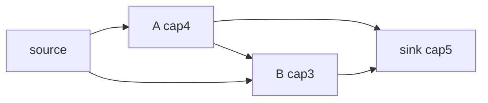
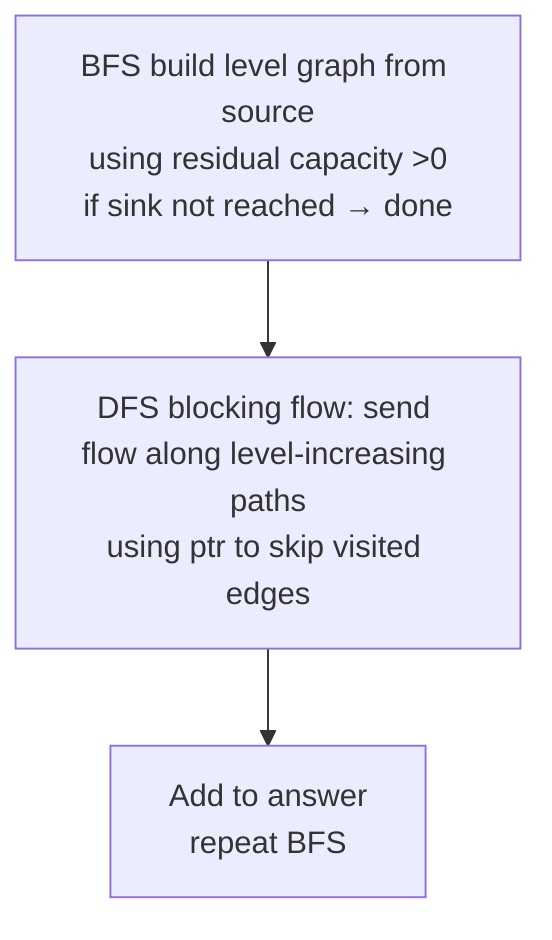
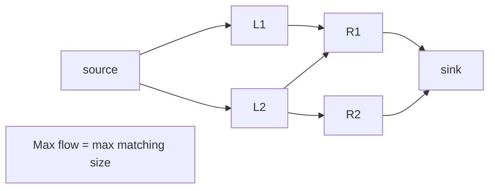

# 네트워크 플로우와 이분 매칭 - 최대 유량 = 최소 컷

## 왜 배워야 할까?

KOI 고급 최대 난이도에는 "최대 매칭", "최대 흐름", "최소 컷"이 포함됩니다.이는 할당, 프로젝트 선택, 자원 할당을 해결합니다.

> 비유: 흐름 네트워크 = 용량이 있는 파이프.소스는 끝없는 물을 펌핑하고 싱크대는 배수합니다.잔여 그래프 = 앞뒤로 남은 용량.경로 확대 = 소스에서 싱크 및 푸시 흐름까지 남은 경로를 찾습니다.다이닉은 레이어링(BFS 레벨 그래프) + 흐름 차단으로 개선됩니다.

이분 매칭 = 왼쪽 노드 → 오른쪽 노드, 소스 → 왼쪽 용량 1, 오른쪽 → 싱크 1, 왼쪽 → 오른쪽 가장자리 1인 특수 흐름.

---

## 1. 핵심 개념과 도식

### 흐름 용어


최소 절단으로 최대 흐름이 제한됩니다.

### 디닉 스텝


### 흐름으로서의 이분 매칭


---

## 2. 순차적 데이터 변화 과정

### 최대 유량 예시: n=4 source0 sing3 edge 용량: 0→1 10, 0→2 10, 1→2 2, 1→3 10, 2→3 10

Dinic 단계를 실행합니다.

|BFS 레벨 |레벨: 잔차를 통한 소스로부터의 거리 >0 |차단 흐름 발견 |흐름이 이 단계에 추가되었습니다 |잔여 업데이트 |
|------------|-------------------------------|---------|----------|------|
|초기화 잔여량 = 용량 |레벨: 0:0,1:1,2:1,3:2(1 또는 2를 통해) |DFS 0-1-3은 10을 푸시합니다.그런 다음 0-2-3 푸시10 |20 |가장자리 0-1 포화, 0-2 포화, 1-3 cap0, 2-3 cap0 |
|다음 BFS |소스 0이 싱크에 도달할 수 없습니다(남은 순방향 용량이 없고 잔여 역방향 에지가 존재하지만 소스로 돌아옴) |증가 경로 없음 |0 → 알고리즘 종료 |

총 흐름은 최대 20입니다(컷 {소스} 대 나머지 용량 20).하지만 개선을 위해 잔차를 사용하는 대체 경로 0-1-2-3이 있습니까?실제로 초기 푸시는 올바르게 포화됩니다.레벨 그래프가 O(sqrt?) 개선을 보장함을 보여줍니다.

잔여 후면 가장자리가 필요한 좀 더 미묘한 예: 가장자리 0→1 10,1→3 1,0→2 10,2→3 10,1→2 10 을 추가합니다.첫 번째 DFS는 0-1-3 1개 단위를 통해 1을 푸시하고, 다음에는 0-1-2-3 9개 단위를 통해 1-2 용량으로 제한됩니까?복잡한.

이분 매칭 예시 `L={a,b}, R={x,y}`, 모서리 a-x, a-y, b-y를 살펴보세요.최대 일치 크기 2(a-x,b-y 또는 a-y,b-?는 b-x와 일치할 수 없음)흐름 단계:

|단계 |증강 경로 |이후 일치 |
|-------|---|---|
|1|소스→a→x→싱크 |{a-x} |
|2|소스→b→y→싱크 |{a-x,b-y} |
|3|DFS는 소스→a→y→싱크를 시도하지만 y는 이미 점유되어 있고 잔여는 대안을 통해 허용됩니다: 소스→a→y←b→?아니다;하지만 알고리즘은 경로를 찾지 못했습니다 |크기2 중지 |

### 0-1-3을 통해 10을 푸시한 후의 단순 네트워크에 대한 잔여 상태 테이블:

잔여 그래프 가장자리: 앞으로 남은 0→1 0, 역방향 1→0 10, 1→3 0 역방향 3→1 10 등. 소스의 BFS 수준은 순방향 0으로 인해 1 또는 2에 도달할 수 없지만?를 통해 도달할 수 있습니다.아니요. 전달이 차단되었기 때문입니다.

---

## 3. 구현

### C++ - Dinic O(E sqrt(V)? 실제로는 O(V² E) 최악이지만 빠릅니다.) + 이분의 경우 Hopcroft-Karp

```cpp
# include <bits/stdc++.h>
using namespace std;

struct Dinic{
    struct Edge{int to; long long cap; int rev;};
    int N;
    vector<vector<Edge>> G;
    vector<int> level, it;
    Dinic(int n=0){init(n);}
    void init(int n){ N=n; G.assign(n,{}); }
    void addEdge(int fr,int to,long long cap){
        Edge a{to,cap,(int)G[to].size()};
        Edge b{fr,0,(int)G[fr].size()};
        G[fr].push_back(a);
        G[to].push_back(b);
    }
    bool bfs(int s,int t){
        level.assign(N,-1);
        queue<int> q; level[s]=0; q.push(s);
        while(!q.empty()){
            int v=q.front(); q.pop();
            for(auto &e: G[v]) if(e.cap>0 && level[e.to]<0){
                level[e.to]=level[v]+1;
                q.push(e.to);
            }
        }
        return level[t]>=0;
    }
    long long dfs(int v,int t,long long f){
        if(v==t) return f;
        for(int &i=it[v]; i<(int)G[v].size(); ++i){
            Edge &e=G[v][i];
            if(e.cap>0 && level[v] < level[e.to]){
                long long d=dfs(e.to,t, min(f,e.cap));
                if(d>0){
                    e.cap-=d;
                    G[e.to][e.rev].cap+=d;
                    return d;
                }
            }
        }
        return 0;
    }
    long long maxflow(int s,int t){
        long long flow=0, INF=4e18;
        while(bfs(s,t)){
            it.assign(N,0);
            long long f;
            while((f=dfs(s,t,INF))>0) flow+=f;
        }
        return flow;
    }
};

// Hopcroft-Karp for bipartite matching O(E sqrt(V))
struct HopcroftKarp{
    int nLeft, nRight;
    vector<vector<int>> adj; // left 0..nLeft-1 → right indices 0..nRight-1
    vector<int> dist, pairU, pairV;
    HopcroftKarp(int L,int R):nLeft(L),nRight(R){
        adj.assign(nLeft,{});
        pairU.assign(nLeft,-1);
        pairV.assign(nRight,-1);
        dist.resize(nLeft);
    }
    void addEdge(int u,int v){ adj[u].push_back(v); }
    bool bfs(){
        queue<int> q;
        for(int u=0;u<nLeft;u++){
            if(pairU[u]==-1){dist[u]=0; q.push(u);}
            else dist[u]=-1;
        }
        bool found=false;
        while(!q.empty()){
            int u=q.front(); q.pop();
            for(int v: adj[u]){
                int pu=pairV[v];
                if(pu!=-1 && dist[pu]==-1){
                    dist[pu]=dist[u]+1;
                    q.push(pu);
                }
                if(pu==-1) found=true;
            }
        }
        return found;
    }
    bool dfs(int u){
        for(int v: adj[u]){
            int pu=pairV[v];
            if(pu==-1 || (dist[pu]==dist[u]+1 && dfs(pu))){
                pairU[u]=v; pairV[v]=u; return true;
            }
        }
        dist[u]=-1;
        return false;
    }
    int maxMatching(){
        int matching=0;
        while(bfs()){
            for(int u=0;u<nLeft;u++) if(pairU[u]==-1 && dfs(u)) matching++;
        }
        return matching;
    }
};

int main(){
    ios::sync_with_stdio(false);
    cin.tie(nullptr);
    int n,m; if(!(cin>>n>>m)) return 0;
    HopcroftKarp hk(n,m-n); // dummy example
    Dinic dinic(n+2);
    // Example edges reading format depends on problem - not generalized
    return 0;
}

```
### Python - Dinic(느리지만 중간 정도의 제약 조건에서는 작동함)

```python
import sys
from collections import deque

class Dinic:
    def __init__(self,n):
        self.n=n
        self.graph=[[] for _ in range(n)]
    def add_edge(self, fr,to,cap):
        fwd=[to,cap,None] # to, cap, rev index pointer
        rev=[fr,0,fwd]
        fwd[2]=rev
        self.graph[fr].append(fwd)
        self.graph[to].append(rev)
    def bfs(self,s,t,level):
        q=deque([s])
        level[:] = [-1]*self.n
        level[s]=0
        while q:
            v=q.popleft()
            for to,cap,rev in self.graph[v]:
                if cap>0 and level[to]==-1:
                    level[to]=level[v]+1
                    q.append(to)
        return level[t]!=-1
    def dfs(self,v,t,f,level,it):
        if v==t: return f
        for i in range(it[v], len(self.graph[v])):
            it[v]=i
            to,cap,rev=self.graph[v][i]
            if cap>0 and level[v] < level[to]:
                d=self.dfs(to,t, min(f,cap), level, it)
                if d>0:
                    self.graph[v][i][1]-=d
                    rev[1]+=d
                    return d
        return 0
    def max_flow(self,s,t):
        flow=0; INF=10**18
        level=[0]*self.n
        while self.bfs(s,t,level):
            it=[0]*self.n
            while True:
                f=self.dfs(s,t,INF,level,it)
                if not f: break
                flow+=f
        return flow

def solve():
    import sys
    data=list(map(int, sys.stdin.read().split()))
    if not data: return
    it=iter(data)
    n=next(it); m=next(it)
    # build bipartite example if first two numbers are left,right
    # Not generic dispatch - demonstrates alone
    sys.stdout.write("template built\n")

if __name__=="__main__":
    solve()

```
---

## 4. 복잡도 분석

### 시간복잡도

* **Dinic**: 일반적으로 'O(V²·E)' 최악의 경우이지만 단위 용량에 대해 'O(min(V^{2/3}, sqrt(E))·E)'를 확장합니다.더 유용한 경계: 이분 매칭 단위 용량 `O(min(V^{2/3}, sqrt(E))·E)`의 경우?Hopcroft-Karp를 통한 이분에 대한 더 간단한 상태 `O(E· sqrt(V))`가 더 좋습니다.정수 `U`를 갖는 일반 용량의 경우 `O(E·V²)`는 최악이지만 `V≤5000,E≤50000` KOI의 경우 실질적으로 빠릅니다.

구체적: 각 차단 흐름 단계: BFS `O(E)` + DFS `O(E)`(각 에지는 레벨당 한 번 방문함).위상 수 ≤ `V`(레벨이 엄격하게 증가) → `O(VE)` 단계 총 `O(VE)`.'V=500, E=10000' → 위상당 5M에 'V'를 곱하면 최악이지만 경험적으로는 훨씬 낮습니다.

* **홉크로프트-카프**: `O(E· sqrt(V))`.`V=20k, E=100k`, `sqrt(V)≒141` → 14M 작업 → 괜찮습니다.동일한 이분의 Dinic은 'O(VE)=2B'일 수 있습니다. 아마도 무거울 수 있습니다. → 이분의 특별 작업에는 Hopcroft-Karp를 사용하십시오.

* **단계당 BFS/DFS**: 상각 표시: 'it' 포인터를 통해 DFS 단계당 최대 한 번 통과된 각 에지는 동일한 레벨 그래프 → 단계당 총계 'O(E)'에서 소진된 에지를 다시 방문하지 않도록 보장합니다.

### 공간복잡도

* **Dinic**: 인접 LIS트당 그래프 '2·E' 에지(정방향+역방향) → 'O(V+E)'를 저장합니다.각 에지 객체는 `to, cap, rev idx` → 아마도 24바이트 ×2E → `E=50k` ~2.4MB를 보유합니다.
* **Hopcroft-Karp**: 조정 `O(E)` + 쌍 배열 `O(V)` + dist `O(V)` → `O(V+E)`.
* **큐 `레벨`**: `O(V)`.

Python의 오버헤드는 더 크지만(가장자리당 목록) big-O와 비슷합니다.

---

## 5. 직접 풀어보기

**문제 1.** 이분형 `L={1,2}, R={3,4}` 가장자리 1-3,1-4,2-4.증가 단계를 통해 최대 매칭을 계산합니다.

<details><summary>풀이</summary>
1단계 1-3 확대 → {1-3} 일치<br>2단계 2-4 시도 → {1-3,2-4} 크기 2 최대.대안 1-4는 2개의 비교할 수 없는 크기1를 남겨두므로 선택 항목을 늘리는 것이 중요합니다.Hopcroft는 상관없이 최대값을 찾습니다.
</details>

**문제 2.** 흐름망 `소스→A 10, A→싱크 5, 소스→B 10, B→싱크 10`.최대 유량과 최소 컷이란 무엇입니까?

<details><summary>풀이</summary>
총 용량 병목 A->싱크 5개 제한 A 분기는 5개, B 분기는 10 → 총 15개를 전달할 수 있습니다. 최소 컷 = {source,A,B?} 실제로 싱크만 분리하면 컷 용량 =5+10=15는 최대 흐름과 같습니다.maxflow mincut 정리를 보여줍니다.
</details>

---

## 6. KOI 적용

- **BOJ 11375 열혈강호, 11376 열혈강호2, 11378 열혈강호4**: 클래식 이분 매칭 - HopcroftKarp는 `n=1000, edge up to 1e6`에 필수입니다.
- **BOJ 2188 축사 가정**: 스트레이트 매칭.
- **BOJ 6086 최대효과, 6087?17472 Make Leg 2 flow??, 1395?**: 일반 용량을 갖춘 Max flow Dinic 교과서입니다.
- **BOJ 11378 변형에는 정점 용량 분할이 필요합니다**: 노드 분할 기술.
- **패턴**: 입력이 각 정점 용량이 1인 이분 그래프 왼쪽-오른쪽 할당인 경우 → Hopcroft-Karp.용량이 1보다 크고 이분법이 아닌 경우 → 일반 일반.범용으로는 Dinic을 사용하고 매칭에는 Hopcroft를 사용하면 가장 빠릅니다.