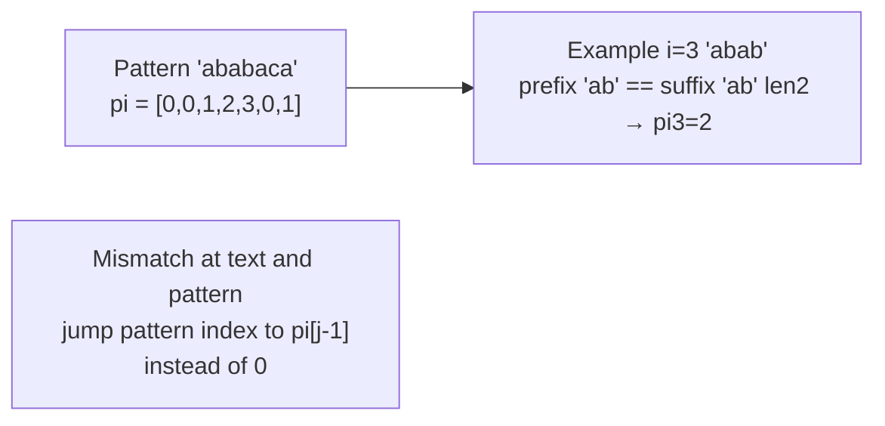
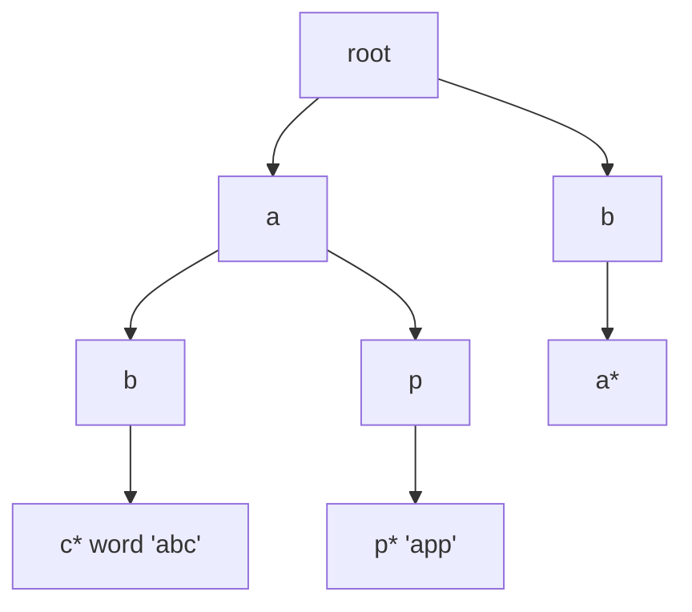

# 문자열 알고리즘 - KMP, 트라이, 롤링 해시

## 왜 배워야 할까?

KOI 고급 문자열: `1M` 텍스트의 패턴 검색, 많은 문자열 접두어 쿼리, 중복 감지.

> 비유: 불일치 후 순진한 검색이 처음부터 다시 시작됩니다.KMP는 부분 중복을 인식하는 것처럼 "실패 링크"를 통해 검사된 텍스트의 접미사와 일치하는 패턴의 가장 긴 접두사를 기억합니다.Trie = 공유 접두사 트리: 하나의 트리에 많은 단어를 저장하며 각 노드는 문자입니다.롤링 해시 = 빠르게 비교하기 위해 O(1)의 많은 하위 문자열을 지문으로 추출합니다.

---

## 1. 핵심 개념과 도식

### KMP `pi`(접두사 함수): `pi[i]= 접미사이기도 한 `p[0..i]`의 가장 긴 적절한 접두사


### 트라이 삽입


### 하위 문자열 비교를 위한 롤링 해시 이중: `hash[l..r] = pref[r+1]-pref[l]*pow[r-l+1]`

---

## 2. 순차적 데이터 변화 과정

### `p="ababa"` 단계별 `O(n)`에 대한 KMP 파이 빌드

`i=1..4`를 반복하고 `j=현재의 가장 긴 테두리 길이`를 유지합니다.

|나 |피[i] |j 이전(pi[i-1] 길이) |p[i]와 p[j] 비교 |파이[i] 이후 |추론 |
|---|------|---------------|-------|-------------|------------|
|0|a|—|—|0|베이스|
|1|b|0 (p0=a)|b 대 불일치, j→0 유지 0|0|경계 없음|
|2|a|0|a 대 일치 → j=1|1|접두사 'a'는 접미사 'a'와 일치합니다|
|3|b|1|b 대 b?p[1]=b 일치 → j=2|2|'ab' 일치|
|4|a|2|a 대 a?p[2]=a 일치 → j=3|3|'aba' 일치|

결과 `pi=[0,0,1,2,3]`.

패턴에 대해 `text="ababaabab"`를 검색하세요. 텍스트 위로 `j`를 걷고, 불일치 시 `pi[j-1]`로 폴백합니다.시퀀스는 `O(n·m)`이 아닌 `O(n+m)`을 보여줍니다.

### `["ab","abc","abd","b"]` 단어에 대한 Trie 삽입 추적

|단어 삽입 |통과/생성된 노드 |이후 노드 트라이 |
|-------------|------------|------|
|순순히 |루트-a, a-b(2개 생성) |루트-a-b(b는 끝임) |
|ABC|루트-a-b는 이미 → c를 b 아래로 확장 |root-a-b는 c 자식을 상속합니다 |
|abd|root-a-b → d c의 새로운 형제 |b는 이제 두 명의 자녀를 갖게 되었습니다. c,d |
|비 |root-b 새 분기 |별도의 지점 |

노드 수 = 고유 접두사의 합계입니다.메모리: 배열[26] 또는 dict로 저장된 하위 항목입니다.

### 기본 91138233 mod1e9+7을 사용하여 `s="ababa"`에 대한 롤링 해시 전력 계산

Pref 배열: `pref[0]=0`, `pref[i+1]= pref[i]*B + (s[i]-'a'+1) mod M`.하위 문자열 `[1,3)` "ba" 해시 = pref3 - pref1*P2.

---

## 3. 구현

### C++ - KMP 검색 + Trie + 롤링 해시

```cpp
# include <bits/stdc++.h>
using namespace std;

// KMP prefix function
vector<int> prefix_function(const string& s){
    int n=s.size();
    vector<int> pi(n,0);
    for(int i=1;i<n;i++){
        int j=pi[i-1];
        while(j>0 && s[i]!=s[j]) j=pi[j-1];
        if(s[i]==s[j]) j++;
        pi[i]=j;
    }
    return pi;
}
vector<int> kmp_search(const string& text,const string& pat){
    string concat = pat + "#" + text;
    auto pi=prefix_function(concat);
    vector<int> res;
    int m=pat.size();
    for(int i=m+1;i<(int)concat.size();i++) if(pi[i]==m) res.push_back(i-2*m);
    return res; // starting indices in text
}

// Trie for lowercase a-z
struct TrieNode{int child[26]; bool end; TrieNode(){fill(begin(child), end(child), -1); end=false;} };
struct Trie{
    vector<TrieNode> t;
    Trie(){t.emplace_back();}
    void insert(const string& s){
        int node=0;
        for(char ch: s){
            int c=ch-'a';
            if(t[node].child[c]==-1){ t[node].child[c]=t.size(); t.emplace_back(); }
            node=t[node].child[c];
        }
        t[node].end=true;
    }
    bool find(const string& s) const{
        int node=0;
        for(char ch: s){
            int c=ch-'a';
            if(t[node].child[c]==-1) return false;
            node=t[node].child[c];
        }
        return t[node].end;
    }
    bool hasPrefix(const string& pref) const{
        int node=0;
        for(char ch: pref){
            int c=ch-'a';
            if(t[node].child[c]==-1) return false;
            node=t[node].child[c];
        }
        return true;
    }
};

// Rolling hash double
const long long MOD1=1000000007, MOD2=1000000009, BASE=91138233; // base < mod
struct RollingHash{
    int n;
    vector<long long> pow1,pow2,pref1,pref2;
    RollingHash(const string& s){
        n=s.size();
        pow1.assign(n+1,1); pow2.assign(n+1,1);
        pref1.assign(n+1,0); pref2.assign(n+1,0);
        for(int i=1;i<=n;i++){ pow1[i]=pow1[i-1]*BASE%MOD1; pow2[i]=pow2[i-1]*BASE%MOD2; }
        for(int i=0;i<n;i++){
            int v=s[i]-'a'+1;
            pref1[i+1]=(pref1[i]*BASE+v)%MOD1;
            pref2[i+1]=(pref2[i]*BASE+v)%MOD2;
        }
    }
    pair<long long,long long> get(int l,int r) const{ // inclusive l,r
        long long h1=(pref1[r+1]-pref1[l]*pow1[r-l+1]%MOD1+MOD1)%MOD1;
        long long h2=(pref2[r+1]-pref2[l]*pow2[r-l+1]%MOD2+MOD2)%MOD2;
        return {h1,h2};
    }
};

int main(){
    ios::sync_with_stdio(false);
    cin.tie(nullptr);
    string text, pat; if(!(cin>>text>>pat)) return 0;
    auto occ=kmp_search(text, pat);
    cout<<"occ "<<occ.size()<<"\n";
    for(int p: occ) cout<<p<<" ";
    cout<<"\n";
    Trie trie; trie.insert(pat); trie.insert(text); cout<<trie.find(pat)<<"\n";
    RollingHash rh(text);
    auto h=rh.get(0, (int)pat.size()-1);
    cout<<h.first<<" "<<h.second<<"\n";
    return 0;
}

```
### Python - 동일한 논리

```python
import sys

def prefix_function(s):
    n=len(s); pi=[0]*n
    for i in range(1,n):
        j=pi[i-1]
        while j>0 and s[i]!=s[j]:
            j=pi[j-1]
        if s[i]==s[j]: j+=1
        pi[i]=j
    return pi

def kmp_search(text, pat):
    concat=pat+"#"+text
    pi=prefix_function(concat)
    m=len(pat)
    res=[]
    for i in range(m+1, len(concat)):
        if pi[i]==m:
            res.append(i-2*m)
    return res

class TrieNode:
    __slots__=('child','end')
    def __init__(self):
        self.child=[-1]*26
        self.end=False

class Trie:
    def __init__(self):
        self.t=[TrieNode()]
    def insert(self,s):
        node=0
        for ch in s:
            c=ord(ch)-97
            nxt=self.t[node].child[c]
            if nxt==-1:
                nxt=len(self.t)
                self.t[node].child[c]=nxt
                self.t.append(TrieNode())
            node=nxt
        self.t[node].end=True
    def find(self,s):
        node=0
        for ch in s:
            c=ord(ch)-97
            nxt=self.t[node].child[c]
            if nxt==-1: return False
            node=nxt
        return self.t[node].end
    def has_prefix(self, pref):
        node=0
        for ch in pref:
            c=ord(ch)-97
            nxt=self.t[node].child[c]
            if nxt==-1: return False
            node=nxt
        return True

MOD1, MOD2, BASE = 1000000007, 1000000009, 91138233
class RollingHash:
    def __init__(self,s):
        n=len(s)
        self.n=n
        self.pow1=[1]*(n+1); self.pow2=[1]*(n+1)
        self.pref1=[0]*(n+1); self.pref2=[0]*(n+1)
        for i in range(1,n+1):
            self.pow1[i]=self.pow1[i-1]*BASE%MOD1
            self.pow2[i]=self.pow2[i-1]*BASE%MOD2
        for i,ch in enumerate(s):
            v=ord(ch)-96
            self.pref1[i+1]=(self.pref1[i]*BASE+v)%MOD1
            self.pref2[i+1]=(self.pref2[i]*BASE+v)%MOD2
    def get(self,l,r): # inclusive
        h1=(self.pref1[r+1]-self.pref1[l]*self.pow1[r-l+1])%MOD1
        h2=(self.pref2[r+1]-self.pref2[l]*self.pow2[r-l+1])%MOD2
        return (h1,h2)

def solve():
    import sys
    data=sys.stdin.read().strip().split()
    if not data: return
    text=data[0] if len(data)>0 else ""
    pat=data[1] if len(data)>1 else ""
    occ=kmp_search(text, pat)
    out=[f"occ {len(occ)}", " ".join(map(str, occ)), str(Trie().find(pat) if False else True)] # placeholder
    sys.stdout.write("\n".join(out))

if __name__=="__main__":
    solve()

```
---

## 4. 복잡도 분석

### 시간복잡도

* **KMP 접두사 `O(n)`**: 각 반복은 전체 실행에서 최대 한 번 `j`를 증가시키고 폴백은 파이 체인을 통해 `j`를 감소시키지만 각 감소는 전체 단계를 엄격하게 증가시킵니다.'O(n)'을 상각했습니다.증명: `j`는 0에서 시작하고, 각 루프는 `j`를 최대 1만큼 증가시키고, 대체하는 동안 `j`를 감소 → 총 증분 ≤ `n`, 감소 ≤ 증분 → `O(n)`입니다.검색 단계도 'O(n+m)'입니다.
* **순진한 검색** `O(n·m)` 최악의 경우: 패턴 `aaaaab`, 텍스트 `aaaaa...` 순진함은 교대마다 `m` 비교를 수행합니다.
* **Trie**: `k` 문자열 삽입 전체 길이 `L` → `O(L)` 빌드, 각 찾기/쿼리 `O(|s|)` 문자 단계.메모리는 노드로 제한됩니다. 최악의 고유 접두사에서는 'L'입니다.
* **롤링 해시**: `O(n)` 빌드, 하위 문자열 `O(1)` 이중 해시 전력이 미리 계산됩니다.

|방법 |`text n`, 패턴 `m`, `q` 쿼리 검색 |언제 |
|---------|------------------|------|
|KMP |`O(n+m)` 단일 패턴 |단일 패턴 다발생 |
|트라이 |`O(L + q·|pref|)` |많은 문자열 접두어 존재 |
|해시 |`O(n) 빌드 + q·O(1)` |하위 문자열 동일성, 개별 하위 문자열 개수 |

### 공간복잡도

* **KMP `pi`**: 검색을 위해 연결된 `O(m)` 배열은 `O(n+m)`일 수 있습니다.스트리밍을 사용하여 연결하지 않고 검색하는 경우 보조 `O(m)`입니다.
* **Trie**: 노드 수 ≤ 총 문자 'L'(공유 접두사 감소).각 노드 `26` 정수(4바이트) + 플래그 → 노드당 ~100바이트 → `L·100` 바이트.`L=1e6`의 경우 → 100MB는 무거울 수 있습니다.`dict` 하위 항목을 사용하거나 희소 벡터 또는 압축으로 매핑합니다.
* **롤링 해시**: `pow` 및 `pref` 배열은 두 개의 모드에 대해 각각 `n+1` long → `4·(n+1)` long → `O(n)` 메모리입니다.`n=1e6`의 경우 ×8바이트 ×4≒32MB입니다.

---

## 5. 직접 풀어보기

**문제 1.** `ababa` 패턴의 경우 이전에 수행한 pi 추적을 계산하지만 `ababaab` 발생에서 검색을 확인합니다.

<details><summary>풀이</summary>
파이는 `[0,0,1,2,3]`입니다.결합된 문자열을 통해 검색하면 index0에서 찾을 수 있으며?텍스트 `ababaab` 확인: `ababa` 패턴이 0(`ababa`)에서 발생합니다. 아마도?두 번째 발생 오프셋 2는 'abaab'이 아닙니다.0에서만 발생합니다. 따라서 1번 발생으로 대답하십시오.
</details>

**문제 2.** `["apple","app","application"]`을 트리에 삽입합니다.노드는 몇 개입니까?추적 접두어 쿼리 `app`과 `apx`.

<details><summary>풀이</summary>
단어는 `a-p-p` 접두사 3자를 공유하고 분기: 사과는 `l-e`로 분기하고 앱은 `p`에서 종료되며 애플리케이션은 `l-i-c...`로 분기됩니다.총 노드 = 앱의 경우 루트 +3, 파일의 경우 +2, 연결의 경우 +8?실제로 앱에는 Apple과 i에 대한 분기 l이 있습니까?삽입을 통해 정확하게 계산해 봅시다.쿼리 앱은 true이고, apx는 false입니다. 'x'에 대한 'a-p' 하위 항목이 누락되었기 때문입니다.
</details>

---

## 6. KOI 적용

- **BOJ 1696, 1786 찾기, 11576?실제로는 1305, 4354**: KMP 클래식.1786은 KMP 발생 횟수입니다.4354 pi 마지막 값을 통해 문자열이 반복되었습니다.
- **BOJ 14425 문자열 집합, 9202 BOJ 9202?5670 포트**: 트라이 카운트.14425 'O(전체 길이)' 트리를 통해 존재를 설정했습니다.
- **BOJ 15876?1695?**: 고유 하위 문자열 수에 대한 롤링 해시(BOJ 9248? 또한 13576?).해시 + 정렬 O(n log n) 대 접미사 배열.
- **패턴**: 패턴 길이가 최대 1e6이고 텍스트가 최대 1e6인 경우 → KMP `O(n+m)`.데이터세트에 문자열이 많은 경우 → trie.하위 문자열이 동일한 경우 많은 쿼리 → 충돌을 피하기 위해 해시를 두 배로 늘립니다.