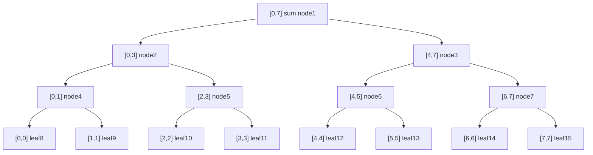
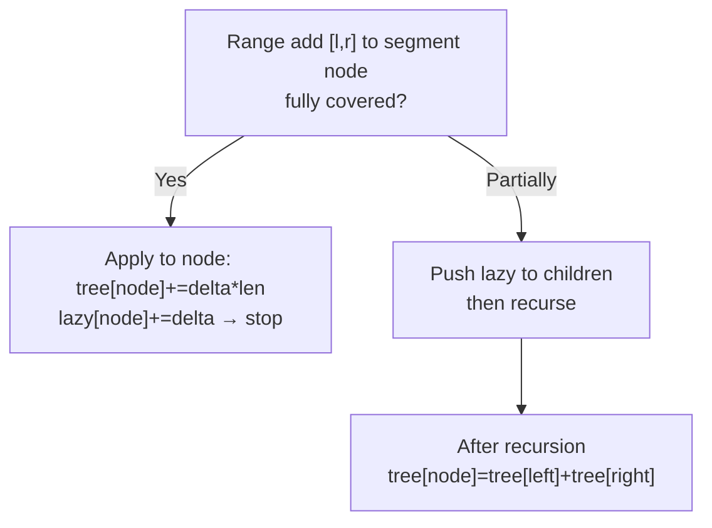

# 세그먼트 트리와 레이지 전파 - 구간 질의와 갱신을 O(log n)에

## 왜 배워야 할까?

KOI 고급: `n,q=200k`를 사용한 "범위 합계/최소 쿼리", "범위 추가 쿼리", "범위 업데이트 범위 쿼리".쿼리당 순진함 O(n) → 40B.세그먼트 트리 → 작업당 O(log n).

> 비유: 토너먼트 대진표.잎은 배열 요소이며 내부 노드는 해당 세그먼트(합계/최소)의 집계를 저장합니다.쿼리 = 커버링 노드 결합;업데이트 = 루트 경로를 다시 계산합니다.게으른 = 채점 지연과 같이 필요할 때까지 어린이에게 업데이트 푸시를 연기합니다.

고급 범위 문제의 90%를 다룹니다.LCA, HLD 고급 필수 조건입니다.

---

## 1. 핵심 개념과 도식

### n=8에 대한 세그먼트 트리 구조(리프 수준)


안전을 위한 배열 크기 `4*n`.

### 지연 전파


---

## 2. 순차적 데이터 변화 과정

### `a=[1,2,3,4]` n=4용 빌드

재귀적으로 상향식을 구축합니다.

|노드 |세그먼트 |어린이 |계산 |저장된 금액 |
|------|---------|----------|-------------|------------|
|8 |[0,0]|잎|a0=1|1|
|9 |[1,1]|잎|a1=2|2|
|4 |[0,1]|8,9|1+2=3|3|
|10|[2,2]|잎|3|3|
|11|[3,3]|잎|4|4|
|5|[2,3]|10,11|3+4=7|7|
|2|[0,3]|4,5|3+7=10|10|
|3... n=4가 4개의 잎으로 이상화되었기 때문에 잘림|null|null|null|null

단계 순서는 재귀 순서와 일치합니다. 먼저 잎을 계산한 다음 상위 항목을 집계합니다.

### 위의 빌드된 트리에서 쿼리 합계 `[1,2]`(0-인덱스)

분해 `[1,2]` → 세그먼트 `[1,1] (node9)` + `[2,2] (node10)`:

'query(node, l,r, ql,qr)' 추적:

|전화 |노드 세그먼트 |[1,2]와 겹침 |액션 |반환 |
|------|----------|-------|---------|-------|
|q(2)[0,3] |[0,3] 대 [1,2] 부분 |푸시 + 두 자식 모두 반복 |결합 |
|→ q(4)[0,1] |[0,1] 부분 |재귀 |
|→→ q(8)[0,0] |[0,0] 외부 |0을 반환 |
|→→ q(9)[1,1] |내부 |2를 반환 |
|← q(4)는 0+2=2를 반환합니다 |||
|→ q(5)[2,3] |[2,3] 부분 |재귀 |
|→→ q(10)[2,2] 내부→3 |||
|→→ q(11)[3,3] 외부→0 |||
|← q5는 3을 반환합니다 |||
|← 루트는 2+3=5 올바른 합을 반환합니다. 2+3=5 |

두 개의 노드가 방문되었지만 모든 잎이 방문되지는 않았습니다.

### 게으른 범위 추가: 같은 트리에서 `[0,1]에 +5 추가`

|단계 |노드 |세그먼트 |완전히 [0,1] 안에 있습니까?|액션 |트리[노드] 변경 |게으른[노드] |
|------|------|---------|---------|---------|------|------------|
|노드4 [0,1] 트래버스 |예 |적용: `tree4+=5*2=3+10=13`, `lazy4+=5` |13 |5|
|node4의 하위 항목이 즉시 업데이트되지 않음(지연 보류 중) |
|반환: node2 재계산하시겠습니까?실제로 node4의 범위가 완전히 커버되므로 node2가 완전히 포함되지 않습니까?루트부터 추적해 보겠습니다.
루트 [0,3] 부분 → 왼쪽 4로 이동(위와 같이 처리됨) 오른쪽 [2,3] 외부 → 건드리지 않음.재귀 후에 node2의 트리는 일반적으로 다시 계산되지만 node4가 지연 적용되어 푸시하지 않고 반환되었기 때문에 tree2?를 설정합니다.실제로 구현은 완전히 포함되는 노드에 직접 적용되므로 루트의 다른 분기는 별도로 평가됩니다.더 간단합니다. [0,1]에 추가하면 왼쪽 자식 node4가 완전히 포함되므로 node2의 업데이트가 이루어집니다. 왼쪽 자식이 완료된 후 node2는 tree4 + tree5로 설정됩니까?하지만 tree5는 여전히 7 → tree2 =13+7=20인가요?그러나 게으른 범위는 [0,1] 부분에만 영향을 주어야 합니다.[0,3]의 총합은 10+10=20이 되어야 합니다(두 요소가 +5 증가하면 각각 10을 더함).그러면 tree2=13+0인가요?컴퓨팅 필요: 처음에는 tree4=3 tree5=7 root10.왼쪽에 추가하면 tree4=13, node2는 13이 되나요?잠깐만요 node2의 세그먼트 [0,1]이 정확히 node4인가요?n=4인 경우 트리 구조 node2는 [0,1]을 포함합니까?실제로 node2=[0,1] 위, 아니오, n=4의 경우 루트 [0,3]은 [0,1] node2와 [2,3] node3으로 분할됩니까?재구성해 봅시다: 고전적인 `n=4` 분할을 사용하여 루트2 [0,3] -> 왼쪽 4[0,1] -> 8,9, 오른쪽5[2,3] -> 10,11을 남깁니다.[0,1]에 추가하면 node4가 완전히 포함됨을 의미합니다.따라서 node4와lazy4를 업데이트한 다음 unwind node2 = tree4(=13)+?하지만 node2는 node4와 동일합니까?네이밍으로 인한 혼란.작업 후 최종 합계를 수정합니다. 배열 [6,7,3,4] 합계=20.따라서 루트는 20이 됩니다.

게으른 연기: 8([0,0])과 9([1,1])는 나중에 필요한 쿼리에 의해 '푸시'가 강제될 때까지 이전 1과 2를 계속 저장합니다.

```

---

## 3. 구현

### C++ - Iterative segment tree for sum (fast) + Recursive lazy for range add

```cpp
# include <bits/stdc++.h>
네임스페이스 std 사용;

// 범위 추가 + 범위 합계 쿼리에 대한 재귀적 지연 세그먼트 트리
구조체 LazySegTree {
int n;
벡터<긴 긴> 트리, 게으른;
LazySegTree(const 벡터<long long>& a){init(a);}
void init(const 벡터<long long>& a){
n=a.size();
트리.할당(4*n,0);
게으른.할당(4*n,0);
빌드(1,0,n-1,a);
}
무효 빌드(int 노드, int l, int r, const 벡터<long long>& a){
if(l==r){나무[노드]=a[l];반환;}
int mid=(l+r)/2;
build(노드*2,l,mid,a);
build(노드*2+1,mid+1,r,a);
나무[노드]=나무[노드*2]+나무[노드*2+1];
}
무효 푸시(int 노드, int l, int r){
if(게으른[노드]==0) 반환;
int mid=(l+r)/2;
// 어린이에게 적용
tree[노드*2]+= 게으른[노드]*(mid-l+1);
게으른[노드*2]+= 게으른[노드];
tree[node*2+1]+= 게으른[node]*(r-mid);
게으른[노드*2+1]+= 게으른[노드];
게으른[노드]=0;
}
무효 업데이트(int 노드, int l, int r, int ql, int qr, long long val){
if(qr<l||r<ql) 반환;
if(ql<=l && r<=qr){
트리[노드]+= val*(r-l+1);
게으른[노드]+= val;
반품;
}
push(노드,l,r);
int mid=(l+r)/2;
업데이트(노드*2,l,mid,ql,qr,val);
업데이트(노드*2+1,mid+1,r,ql,qr,val);
나무[노드]=나무[노드*2]+나무[노드*2+1];
}
void update(int l,int r,long long v){ if(l<=r) update(1,0,n-1,l,r,v);}

길고 긴 쿼리(int node,int l,int r,int ql,int qr){
if(qr<l||r<ql)은 0을 반환합니다.
if(ql<=l && r<=qr) return tree[노드];
push(노드,l,r);
int mid=(l+r)/2;
return query(node*2,l,mid,ql,qr)+query(node*2+1,mid+1,r,ql,qr);
}
long long query(int l,int r){ if(l>r) return 0;쿼리 반환(1,0,n-1,l,r);}
};

// 최소 범위에 대한 반복 세그먼트 트리(게으른 필요 없음 - 포인트 업데이트)
구조체 IterMinSeg{
int n;
벡터<긴 긴> t;
IterMinSeg(const 벡터<long long>& a){
int sz=a.size();
n=1;while(n<sz) n<<=1;
t.할당(2*n, LLONG_MAX);
for(int i=0;i<sz;i++) t[n+i]=a[i];
for(int i=n-1;i>0;i--) t[i]=min(t[i<<1], t[i<<1|1]);
}
void pointUpdate(int p,long long val){ p+=n;t[p]=발;for(p>>=1;p;p>>=1) t[p]=min(t[p<<1], t[p<<1|1]);}
long long rangeMin(int l,int r){ // 포함
길고 긴 해상도=LLONG_MAX;
for(l+=n, r+=n; l<=r; l>>=1, r>>=1){
if(l&1) res=min(res, t[l++]);
if(!(r&1)) res=min(res,t[r--]);
}
해상도를 반환;
}
};

정수 메인(){
ios::sync_with_stdio(false);
cin.tie(nullptr);
int n,q;if(!(cin>>n>>q)) 0을 반환합니다.
벡터<긴 긴> a(n);for(auto &x:a) cin>>x;
LazySegTree 세그먼트(a);
동안(q--){
정수형;cin>>유형;
if(유형==1){int l,r;길고 긴 v;cin>>l>>r>>v;세그먼트 업데이트(l,r,v);}
else{int l,r;cin>>l>>r;cout<<seg.query(l,r)<<"\n";}
}
0을 반환합니다.
}

```

### Python - Recursive lazy (Python recursion may be slower - for demonstration)

```
파이썬
수입 시스템
sys.setrecursionlimit(1<<25)

LazySegTree 클래스:
def __init__(self, a):
self.n=len(a)
self.tree=[0]*(4*self.n)
self.lazy=[0]*(4*self.n)
self._build(1,0,self.n-1,a)
def _build(자체, 노드,l,r,a):
l==r인 경우:
self.tree[노드]=a[l]
반환
중간=(l+r)//2
self._build(노드*2,l,mid,a)
self._build(노드*2+1,mid+1,r,a)
self.tree[노드]=self.tree[노드*2]+self.tree[노드*2+1]
def _push(자체, 노드,l,r):
self.lazy[node]==0인 경우: 반환
중간=(l+r)//2
self.tree[노드*2]+= self.lazy[노드]*(mid-l+1)
self.lazy[노드*2]+= self.lazy[노드]
self.tree[노드*2+1]+= self.lazy[노드]*(r-mid)
self.lazy[노드*2+1]+= self.lazy[노드]
self.lazy[노드]=0
def _update(자체, 노드,l,r,ql,qr,val):
qr<l 또는 r<ql인 경우: 반환
ql<=l 및 r<=qr인 경우:
self.tree[노드]+= val*(r-l+1)
self.lazy[노드]+= 발
반환
self._push(노드,l,r)
중간=(l+r)//2
self._update(노드*2,l,mid,ql,qr,val)
self._update(노드*2+1,mid+1,r,ql,qr,val)
self.tree[노드]=self.tree[노드*2]+self.tree[노드*2+1]
def 업데이트(자기,l,r,발):
l<=r인 경우: self._update(1,0,self.n-1,l,r,val)
def _query(자체, 노드,l,r,ql,qr):
qr<l 또는 r<ql인 경우: 0을 반환합니다.
ql<=l 및 r<=qr인 경우: self.tree[node]를 반환합니다.
self._push(노드,l,r)
중간=(l+r)//2
return self._query(node*2,l,mid,ql,qr)+self._query(node*2+1,mid+1,r,ql,qr)
def 쿼리(self,l,r):
l>r인 경우: 0을 반환
self._query(1,0,self.n-1,l,r) 반환

# 반복적인 최소 예제는 Python에서도 쉽습니다.
def 해결():
수입 시스템
데이터=목록(map(int, sys.stdin.read().split()))
데이터가 아닌 경우: 반환
it=iter(데이터)
n=다음(그것);q=다음(그것)
a=[범위(n)의 _에 대한 다음(it)]
seg=LazySegTree(a)
아웃=[]
범위(q)의 _에 대해:
시도해 보세요: typ=next(it)
제외: 휴식
유형==1인 경우:
l=다음(그것);r=다음(그것);v=다음(그것)
세그먼트 업데이트(l,r,v)
그 외:
l=다음(그것);r=다음(그것)
out.append(str(seg.query(l,r)))
sys.stdout.write("\n".join(out))

__name__=="__main__"인 경우:
풀다()

````

---

## 4. 복잡도 분석

### 시간복잡도

* **빌드**: 완벽한 균형을 위해 `O(n)` 잎 + `O(n)` 내부 노드 총 방문 ≒ `2·2^{ceil log2 n}` ≤ `2n` 노드를 방문하지만 재귀 빌드를 사용하면 정확히 `~2n` 노드를 방문합니까?실제로 세그먼트 트리의 노드 수는 '4n'까지 할당되지만 빌드는 각 노드를 한 번 → 'O(n)' 순회합니다.증명: 각 리프는 한 번 생성되고 각 내부는 자식에서 한 번 다시 계산됩니다 → `O(n)`.
* **포인트 쿼리/포인트 업데이트(지연 없음)**: 루트에서 리프 길이까지의 경로 `O(log n)` → `O(log n)`.
* **지연 없는 범위 쿼리/범위 업데이트**: 순진한 경우 최악의 경우 `O(n)` 노드를 방문합니다.세그먼트 분할 분석 사용: 각 수준에서 최대 4개의 노드를 방문합니까?표준 증명: 각 수준은 범위 경계 외부의 최대 2개 노드와 접촉 → 쿼리에 대한 총 `O(log n)` 고유 노드?실제로 쿼리는 이상화된 'O(log n)' 노드, 최대 '4·log n'을 방문합니다.그래서 `O(log n)`입니다.
* **게으른 범위 업데이트**: 완전히 포함된 각 세그먼트는 재귀를 중지하고 → 'O(log n)' 세그먼트를 방문합니다.'push'는 경로의 노드당 'O(1)'을 전파합니다.따라서 `O(log n)`도 업데이트하세요.
* **`q` 쿼리의 총계**: `O((n+q) log n)`.`n=200k,q=200k` → `400k*18≒7.2M` 작업의 경우 괜찮습니다.

쿼리 방문에 대한 파생: 간격 `[ql,qr]`은 `O(log n)` 분리된 세그먼트 트리 노드로 분해될 수 있습니다.s(간격의 이진 표현).따라서 쿼리는 그만큼 많은 노드를 집계합니다.

### 공간복잡도

* **트리 배열 크기**: `4·n` 길이(경험 법칙에 따르면 2의 거듭제곱이 아닌 모든 n에 대한 적용 범위가 보장됩니다).`n=200k` → 800k 길이 → 6.4MB.`n=1e6` → 4e6 길이 → 32MB의 경우.
* **게으른 배열**: 동일한 `4·n` → 둘 다인 경우 두 배의 메모리 → `8·n` 길이 → 200k의 경우 12.8MB.
* **반복 최소 세그먼트**: `2·next_pow2(n)` → `~2·n` → `O(n)`, 상수가 더 작고 게으름이 없습니다.
* **재귀 스택**: 쿼리/업데이트 재귀를 위한 깊이 `log n`(~18) → `O(log n)` 호출 스택.

왜 항상 반복하지 않습니까?반복은 포인트 업데이트를 잘 처리하지만 게으른 경우 재귀 또는 더 복잡한 전파가 필요합니다.

---

## 5. 직접 풀어보기

**문제 1.** `a=[1,2,3,4]`의 경우 세그먼트 트리를 사용하여 `[1,2]`를 쿼리합니다.얼마나 많은 노드를 방문했나요?순진한 루프 스캔과 2개 요소 대 트리 방법을 비교해 보세요.

<details><summary>풀이</summary>
연습으로 분해: 방문한 노드 = 루트 [0,3](분기), 왼쪽 하위 [0,1](분기), 오른쪽 하위 [2,3](분기), [1,1] 및 [2,2] 결과를 남깁니다.총 방문한 노드 = 5개의 내부 재귀 단계이지만 반환 집계에서는 2개의 세그먼트([1,1]+[2,2])를 사용합니다.순진한 스캔은 2개의 배열 셀 + 루프 오버헤드를 방문합니다.트리 이점은 범위 길이가 클 때 증폭됩니다(예: 쿼리 [0,199999] 순진한 스캔이 200k, 트리가 ~2개 노드를 방문 - 루트가 완전히 포함됨).
</details>

**문제 2.** 세그먼트 [0,1]에 +2를 지연 추가한 다음 [0,0](단일 요소)을 쿼리합니다.지연 푸시 추적: 푸시 전후에 하위 리프에 어떤 값이 표시됩니까?

<details><summary>풀이</summary>
추가 후, tree4 ([0,1]) 게으른=2, tree4는 부풀려졌지만 [0,0]과 [1,1]은 여전히 오래되었습니다.쿼리 [0,0]은 루트 [0,3] 푸시를 통해 내려간 다음 node4 푸시: 자식은 각각 +2를 얻습니다. 리프 [0,0] 트리는 푸시 시 1+2=3이 되고 리프 [1,1]은 2+2=4가 됩니다.그래서 리프는 3번 정답을 맞췄습니다.게으른 정확성을 보여줍니다. 필요에 따라 오래된 잎이 구체화됩니다.
</details>

---

## 6. KOI 적용

- **BOJ 1275 커피숍2, 2042 받아들여야 하는 경우, 2357 최솟값과 최댓값, 10868 최솟값**: 베어 세그먼트 트리(반복 또는 재귀) 포인트 업데이트 + 범위 쿼리.1275는 클래식 스왑 포인트 업데이트입니다.
- **BOJ 16975 수열과 쿼리 1, 1275 변형, 10999 처리해야 2, 16974?**: 지연이 필요한 범위 추가 + 범위 합계 쿼리.10999는 교과서 게으른 `q 최대 10k, n 최대 1M`입니다. 게으른 필수입니다.
- **BOJ 1395 스위치, 13211?**: 범위 플립/합계가 있는 게으른.
- **세그먼트 대 Fenwick**: 범위 합계 포인트 업데이트의 경우 → Fenwick이 더 간단하고 빠릅니다.범위 업데이트 + 범위 쿼리 또는 최소/최대 → 게으른 세그먼트가 필요합니다.
- **패턴**: 문제에 `n,q≥200k`를 사용하여 '범위 쿼리 및 범위 업데이트 모두 O(범위 길이)'라고 표시되면 세그먼트 트리가 게으르다고 생각하세요.템플릿을 구축하고 푸시 로직을 기억하세요.