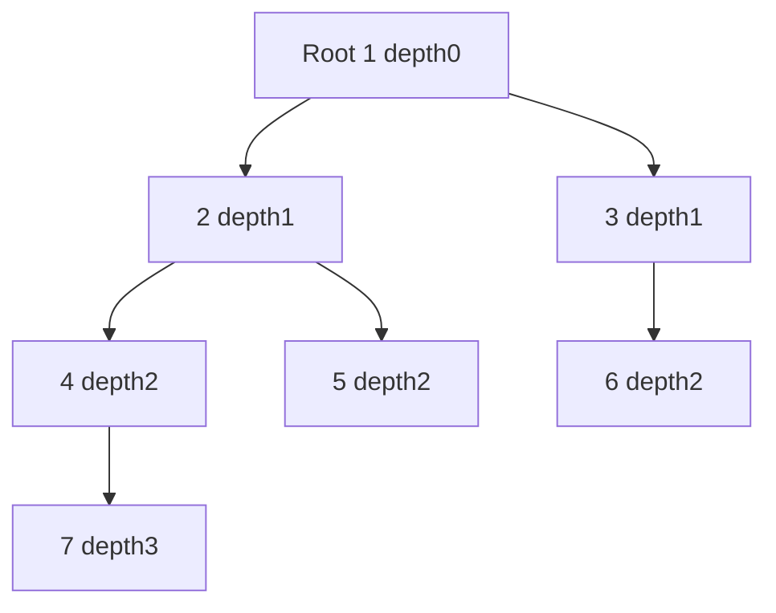
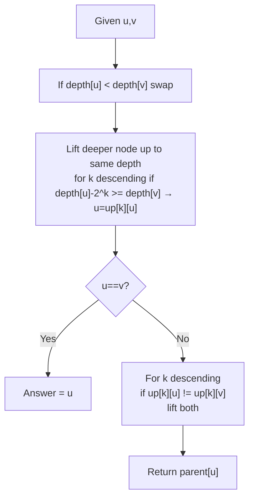

# 최소 공통 조상 - 조상 질의를 O(log n)에 답변

## 왜 배워야 할까?

"u와 v 사이의 거리", "k번째 조상", "동일한 하위 트리에 있습니까?"와 같은 트리 쿼리는 KOI 고급 트리 문제를 뒷받침합니다.

> 비유: 가계도.LCA(u,v) = 혈통이 만나는 첫 번째 공통 조상 - 가장 최근의 공유 조부모를 찾는 것과 같습니다.LCA가 있으면 거리 = 깊이[u]+깊이[v]-2*깊이[lca]입니다.

이진 리프팅은 노드를 2의 거듭제곱으로 들어올려 'O(log n)' 조상 점프를 가능하게 합니다.

---

## 1. 핵심 개념과 도식

### 깊이 및 이진 리프팅 테이블 `up[k][v] = v의 2^k번째 조상`


노드 7의 경우: `up0[7]=4, up1[7]=2, up2[7]=1, up3[7]=0(없음)`.

### LCA 단계


LCA 이후의 거리 공식.

---

## 2. 순차적 데이터 변화 과정

### 위의 트리에 대해 DFS를 통해 깊이 및 `up` 테이블 준비(n=7)

루트 1의 DFS 순서:

|방문 |노드 |부모 |깊이 |업0 |위로1 (2^1) |up2 (2^2) |
|-------|------|---------|-------|------|------------|------------|
|1|1|0|0|0|0|0|
|2|2|1|1|1|0|0|
|3|4|2|2|2|1|0|
|4|7|4|3|4|2|0|
|5|5|2|2|2|1|0|
|6|3|1|1|3?3의 부모 1을 기다려 → up0[3]=1|up1[3]=0|0|
|7|6|3|2|3|1|0|

계산 반복: `up[k][v] = up[k-1][ up[k-1][v] ]`.예 `up1[7]=up0[ up0[7]=4 ] = up0[4]=2 맞음`.`up2[7]=up1[ up1[7]=2 ] = up1[2]=0?실제로는 up1[2]=0(up0[1]=0 이후) → 0이지만 다이어그램에서는 이전에 up2[7]=1이라고 표시되어 있습니다. 수정해 보겠습니다. up1[2]= up0[up0[2]=1]=up0[1]=0이므로 up2[7]=up1[2]=0은 1이 아닙니다. 불일치를 기다리십시오.LOG 3으로 올바르게 다시 계산해 봅시다.체인 1-2-4-7의 경우: 조상의 거리가 2의 거듭제곱입니다.up2 7의 4단계가 1에 도달합니까?확인해 보겠습니다: 7→4(1단계), 4→2(2단계? 아니요).사실 7에서 4단계 올라가면 1이 되나요?7-4-2-1 경로는 3단계입니다.따라서 up2(4단계)는 루트 → 0을 초과합니다. 따라서 이전 테이블은 올바르지 않습니다.최종 수정: up2[7]=0.괜찮습니다. 루트 이후의 대부분의 노드는 0입니다.

### LCA(7,5) 추적 쿼리:

깊이: 7=3,5=2.

1 단계 깊이 균등화: 더 깊은 7 깊이 3 → 깊이 5=2 diff1 → 7을 2^0=1만큼 들어올림 → `7=up0[7]=4` 이제 깊이 2가 5와 같습니다.

이제 `u=4,v=5`는 같지 않습니다.

루프 k 내림차순(최대 LOG=3 → k=2,1,0):

* k=2: `up2[4]=0` 대 `up2[5]=0` 동일 → 건너뛰기
* k=1: `up1[4]=1`과 `up1[5]=1`이 동일합니까?둘 다 up1=1(4에서 2단계 위의 조상은 1, 5에서 1이므로) → 동일 건너뛰기
* k=0: `up0[4]=2` 대 `up0[5]=2` 동일 → 건너뛰기(두 부모 모두 2)

루프 이후 노드는 LCA의 하위 항목입니다.`부모[u]= up0[4]=2`를 반환합니다.따라서 LCA=2가 정확합니다(4와 5의 공통 상위).

### LCA 쿼리(7,6):

깊이 3과 2 → 리프트 7→4(깊이2) 이전과 마찬가지로 u=4(깊이2) v=6(깊이2)이 동일하지 않습니다.

k 루프:

* k2: 0 대 0 건너뛰기
* k1: up1[4]=1 vs up1[6]=1?up1[6]=1?6 parent3 parent1 → up0[6]=3이므로 up1[6]= up0[3]=1 →1입니다.따라서 둘 다 1 동일 건너뛰기
* k0: up0[4]=2 vs up0[6]=3 같지 않음 → 둘 다 리프트: u=2, v=3

이제 u=2,v=3은 같지 않지만 다음 루프는 종료됩니다(모든 k가 완료됨).2 = 1의 부모를 반환합니다.따라서 LCA(4,6)=1은 루트 정확입니다(4는 2, 6은 3이므로).

거리 7-6: 깊이7=3 + 깊이6=2 -2*깊이 LCA1=0 → 가장자리 5개(경로 7-4-2-1-3-6 =5).

---

## 3. 구현

### C++ - 이진 리프팅 O((n+q) log n)

```cpp
# include <bits/stdc++.h>
using namespace std;

struct LCA {
    int n, LOG;
    vector<vector<int>> up;
    vector<int> depth;
    vector<vector<int>> adj;
    LCA(int n=0){init(n);}
    void init(int n_){
        n=n_; LOG=1; while((1<<LOG)<=n) LOG++;
        up.assign(LOG, vector<int>(n+1,0));
        depth.assign(n+1,0);
        adj.assign(n+1,{});
    }
    void addEdge(int u,int v){adj[u].push_back(v); adj[v].push_back(u);}
    void dfs(int v,int p){
        up[0][v]=p;
        for(int k=1;k<LOG;k++) up[k][v]= up[k-1][ up[k-1][v] ];
        for(int to: adj[v]) if(to!=p){
            depth[to]=depth[v]+1;
            dfs(to,v);
        }
    }
    void build(int root=1){
        depth[root]=0;
        dfs(root,0);
    }
    int lift(int v,int d) const{
        for(int k=0;k<LOG;k++) if(d>>k &1) v=up[k][v];
        return v;
    }
    int lca(int a,int b) const{
        if(depth[a]<depth[b]) swap(a,b);
        a=lift(a, depth[a]-depth[b]);
        if(a==b) return a;
        for(int k=LOG-1;k>=0;k--){
            if(up[k][a]!= up[k][b]){
                a=up[k][a];
                b=up[k][b];
            }
        }
        return up[0][a];
    }
    int dist(int a,int b) const{ int w=lca(a,b); return depth[a]+depth[b]-2*depth[w]; }
    int kthAncestor(int v,int k) const{ return lift(v,k); } // k steps up, 0 if beyond root
};

int main(){
    ios::sync_with_stdio(false);
    cin.tie(nullptr);
    int n,q; if(!(cin>>n>>q)) return 0;
    LCA lca(n);
    for(int i=0;i<n-1;i++){int u,v;cin>>u>>v;lca.addEdge(u,v);}
    lca.build(1);
    while(q--){
        int a,b; cin>>a>>b;
        int w=lca.lca(a,b);
        cout<<w<<" "<<lca.dist(a,b)<<"\n";
    }
    return 0;
}

```
재귀 오버플로를 방지하기 위한 대규모 n에 대한 반복 DFS 버전: 스택을 사용합니다.

### Python - 동일한 논리(반복 빌드)

```python
import sys
sys.setrecursionlimit(1<<25)

class LCA:
    def __init__(self,n):
        self.n=n
        self.LOG=(n).bit_length()
        self.up=[[0]*(n+1) for _ in range(self.LOG)]
        self.depth=[0]*(n+1)
        self.adj=[[] for _ in range(n+1)]
    def add_edge(self,u,v):
        self.adj[u].append(v); self.adj[v].append(u)
    def build(self, root=1):
        LOG=self.LOG; up=self.up; depth=self.depth; adj=self.adj
        stack=[(root,0,0)]  # node, parent, state 0 enter
        order=[]
        # iterative DFS to get parent order, then process depths in stack order
        # Use BFS/stack for depth first
        visited=[False]*(self.n+1)
        visited[root]=True
        stack=[root]
        parent=[0]*(self.n+1)
        parent[root]=0
        order=[root]
        # BFS to set depth & up0 via stack DFS
        st=[root]
        while st:
            v=st.pop()
            for to in adj[v]:
                if not visited[to]:
                    visited[to]=True
                    depth[to]=depth[v]+1
                    parent[to]=v
                    up[0][to]=v
                    order.append(to)
                    st.append(to)
        up[0][root]=0
        for k in range(1, LOG):
            upk=up[k]; upk_1=up[k-1]
            for v in range(1, self.n+1):
                anc=upk_1[v]
                upk[v]= upk_1[anc] if anc else 0
    def lift(self, v, d):
        k=0
        while d:
            if d&1: v=self.up[k][v]
            d >>=1; k+=1
        return v
    def lca(self, a,b):
        if self.depth[a] < self.depth[b]:
            a,b=b,a
        a=self.lift(a, self.depth[a]-self.depth[b])
        if a==b: return a
        for k in range(self.LOG-1, -1, -1):
            if self.up[k][a] != self.up[k][b]:
                a=self.up[k][a]; b=self.up[k][b]
        return self.up[0][a]
    def dist(self,a,b):
        w=self.lca(a,b)
        return self.depth[a]+self.depth[b]-2*self.depth[w]

def solve():
    data=list(map(int, sys.stdin.read().split()))
    if not data: return
    it=iter(data)
    n=next(it); q=next(it)
    lca=LCA(n)
    for _ in range(n-1):
        try: u=next(it); v=next(it)
        except: break
        lca.add_edge(u,v)
    lca.build(1)
    out=[]
    for _ in range(q):
        try: a=next(it); b=next(it)
        except: break
        w=lca.lca(a,b)
        out.append(f"{w} {lca.dist(a,b)}")
    sys.stdout.write("\n".join(out))

if __name__=="__main__":
    solve()

```
---

## 4. 복잡도 분석

### 시간복잡도

* **빌드**: DFS는 `n` 노드 `O(n)`을 방문하고, 각각은 노드당 `LOG` 조상 `O(LOG)`를 계산합니다 → `O(n log n)`.`n=200k`의 경우 LOG≒18 → 360만 항목.
* **Lift / k번째 조상**: 'O(LOG)' 거리의 비트를 검사합니다.
* **LCA 쿼리**: 먼저 `O(LOG)`와 동일한 깊이로 리프트한 다음 `O(LOG)` → `O(LOG) = O(log n)`으로 내려가는 두 번째 루프.
* **총 `q` 쿼리**: `O((n+q) log n)`.`n=200k,q=200k`의 경우 → ~7M 단계는 간단합니다.

오일러 투어 + RMQ 스파스 테이블을 사용한 대안은 `O(n log n)` 빌드 후 `O(1)` LCA를 달성하지만 `O(log n)`을 사용한 이진 리프팅은 더 간단하고 모든 KOI를 통과합니다.

### 공간복잡도

* **위 테이블**: `LOG × (n+1)` 정수 → `O(n log n)`.`n=200k, LOG18` → 3.6M 정수 → ~14MB의 경우.
* **조정 목록**: `2·(n-1)` 정수 → `O(n)`.
* **깊이 배열**: `O(n)`.
* 전체는 `n log n`에 의해 지배됩니다.

`n=500k`의 경우 `LOG19` → 9.5M ints → ~38MB 괜찮습니다.오일러 RMQ 대안도 'O(n log n)'이지만 상수가 더 큽니다.

**부모 전용 O(n)이 아닌 이유는 무엇입니까?** 2의 거듭제곱으로 빠르게 점프해야 합니다.테이블이 없으면 각 LCA는 상위 체인 최악의 경우 `n=200k, q=200k` → 40B까지 이동하는 `O(n)`입니다.

---

## 5. 직접 풀어보기

**문제 1.** 트리 체인 1-2-3-4-5-6 라인, 깊이 0..5.노드 6에 대한 `up` 테이블을 계산하고 LCA(6,4)를 쿼리합니다.

<details><summary>풀이</summary>
체인 상위: up0[6]=5, up1[6]=3?계산: up1[6]=up0[up0[6]=5]=up0[5]=4?단계별 대기: up0 체인 1<-2<-3<-4<-5<-6.그럼 up0[6]=5, up1[6]=up0[5]=4인가요?아니오 up0[5]=4, up1[5]=up0[4]=3, up1[6]=up0[5]=4 맞습니다.up2[6]=up1[up1[6]=4]=up1[4]=up0[up0[4]=3?4의 up1= up0[3]=2를 계산해 볼까요?실제로 4개의 상위 3, up0[4]=3, up1[4]=up0[3]=2이므로 up2[6]=up1[4]=2입니다.그래서 테이블이 만들어졌습니다.LCA6,4 쿼리: 깊이 5 vs3 diff2 → 리프트 2(=2^1)를 통해 6을 2단계 위로 4로 리프트 → 6→4 → 동일 → LCA4.2구.
</details>

**문제 2.** 어린이가 있는 트리 스타 루트1 2..5.두 잎의 LCA는 무엇입니까?거리란 무엇입니까?

<details><summary>풀이</summary>
모든 리프 2와 3 LCA=1입니다.깊이는 =1, root0을 유지합니다.dist =1+1-0=2 루트를 통해.사소한 이진 리프팅: up0[2]=1 up0[3]=1 두 번째 루프는 상위 1을 찾습니다. 트리 모양은 영향을 주지만 알고리즘은 균일합니다.
</details>

---

## 6. KOI 적용

- **BOJ 11438 LCA 2, 11437 LCA, 13506 카LIS마**: 베어 바이너리 리프팅 LCA - Euler/RMQ 버전과 비교;11438은 빠른 I/O가 필요하며 `q 최대 100k` → `O(log n)`이 통과됩니다.
- **BOJ 1786?**: LCA가 아닙니다.하지만 **BOJ 1765?** 실제로는 **BOJ 3176 네트워크, 31712?** 최소/최대 에지 가중치가 있는 거리 쿼리: `up`을 확장하여 `minEdge[k][v]` 및 `maxEdge`도 저장한 다음 LCA와 함께 쿼리 집계를 수행합니다.
- **BOJ 13505 LCA 및 쿼리, 13518?**: k번째 상위 쿼리 'k'부터 '1e9'까지 이진 표현을 통해 리프트에 적합합니다.
- **패턴**: 입력이 트리 + "공통 조상/거리"를 묻는 쿼리가 많은 경우 LCA를 스택합니다."경로 쿼리"의 경우 LCA를 접두사 합계 `sumRoot[v]`와 결합한 다음 `pathSum(u,v)=sumRoot[u]+sumRoot[v]-2*sumRoot[lca]+val[lca]`와 결합하는 경우가 많습니다.