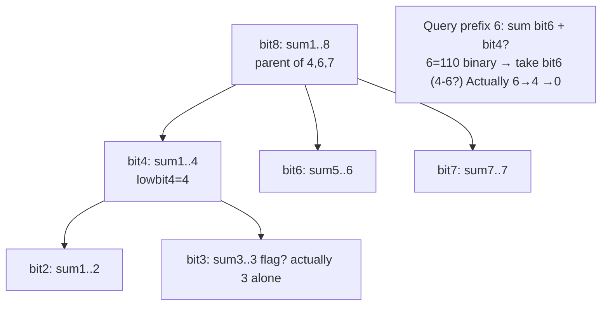
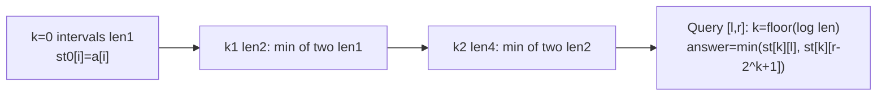
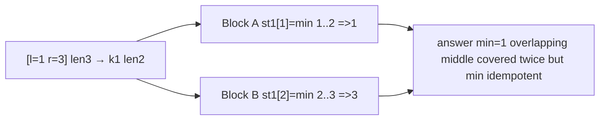

# 펜윅 트리와 스파스 테이블 - 빠른 prefix와 RMQ

## 왜 배워야 할까?

Fenwick(이진 인덱스 트리)은 작은 코드/메모리로 `O(log n)`에서 `접두사 합계` + `포인트 업데이트`를 처리하며 합계/카운트에 대한 세그먼트 트리를 능가합니다.희소 테이블은 `O(n log n)` 빌드 후 `O(1)` 쿼리를 사용하여 `정적` 범위 최소/최대/GCD를 처리합니다. `q` 거대에 대해 탁월하며 업데이트가 없습니다.

> 비유: Fenwick = 각 항목이 '낮은 비트' 범위의 요소를 담당하는 소형 원장입니다.업데이트는 낮은 비트를 추가하여 전파됩니다.희소 테이블 = 2의 거듭제곱 길이 간격에 대해 미리 계산된 답변;쿼리 [l,r] = 이를 덮는 두 블록을 겹칩니다.

KOI 고급: 반전 횟수, 주문 통계, 오프라인 쿼리가 필요할 때 Fenwick을 사용하세요.RMQ가 정적이고 빠르면 Sparse를 사용하세요.

---

## 1. 핵심 개념과 도식

### Fenwick `bit[i] = 범위의 합 (i - lowbit(i) +1 .. i)`, `lowbit(x)=x & -x`


보다 구체적으로, 펜윅에 대해 'n=8' 인덱스는 1부터 인덱스됩니다:

- `비트1` = a1
- `비트2` = a1+a2
- `비트3` = a3
- `bit4` = a1..4
-`bit5` = a5
- `비트6` = a5+a6
- `bit7` = a7
- `bit8` = a1..8

`add(pos, delta)` 업데이트: `for(;pos<=n;pos+=lowbit(pos)) bit[pos]+=delta`

쿼리 `sum(1..pos)`: `for(;pos>0;pos-=lowbit(pos)) ans+=bit[pos]`

### 희소 테이블 `st[k][i] = 최소 간격 [i, i + 2^k -1]`, 빌드 `st[k][i]=min(st[k-1][i], st[k-1][i+2^{k-1}])`


---

## 2. 순차적 데이터 변화 과정

### `a=[1,2,3,4,5]`에 대한 Fenwick 연산(1-인덱스 값)

요소당 `add`를 통해 빌드한 후 초기 `비트`:

`add(i, a[i])` 증분을 시뮬레이션합니다.

`bit=[0,0,0,0,0,0]`(1-인덱스)을 시작합니다.

* add(1,1): 인덱스 1→2→4 업데이트 (`1+1=2,2+2=4`): bit1=1, bit2=1, bit4=1
* add(2,2): 2→4 업데이트: 비트2=1+2=3, 비트4=1+2=3
* add(3,3): 업데이트 3→4: 비트3=3, 비트4=3+3=6
* add(4,4): 업데이트 4: 비트4=6+4=10
* add(5,5): 5→6→8 업데이트?n=5, 5 lowbit1을 기다립니다 → pos5→6 범위를 벗어남 중지(6>5) 실제로 6은 n을 초과하므로 5에서 중지하므로 최종 항목은 다음과 같습니다.
모두 추가한 후: `bit[1]=1, bit2=3, bit3=3, bit4=10, bit5=5`

접두사 쿼리를 확인하세요.

* sum(1..3): `res=bit3(3)+bit2(3)=6` → 대기 비트 2는 a1+a2=3을 유지하고 비트 3은 a3=3을 유지 → 6 정확(1+2+3=6).구현 합계는 `pos=3 → ans+=bit3=3 → pos=2 → ans+=bit2=3 → pos=0`입니다.
* sum(1..5): `pos5→5=bit5(5)→pos4→+bit4(10)=15` 총 15개를 수정합니다.

`add(3, -1)` 업데이트(3에서 2로 a3 감소): `pos3→4`: 비트3=2, 비트4=9.이제 sum(1..3) = bit3(2)+bit2(3)=5 올바른 새 배열 [1,2,2,4,5] 첫 번째 3에 대해 합계 5가 맞나요?실제로 1+2+2=5 일치합니다.

### `a=[2,1,3,5,4]` n=5에 대한 스파스 테이블 빌드

`lg` 테이블을 미리 계산합니다.행 작성:

|케이 |길이=2^k |st[k][i] 값 |
|---|---------|----|
|0 len1|1|[2,1,3,5,4] |
|1 len2|2|i0:min(2,1)=1, i1:min1,3=1, i2:min3,5=3, i3:min5,4=4 (i3은 n-2까지 유효) |
|2 len4|4|i0:min(st1.0=1, st1.2=3)=1, i1:min1,4=1 |

`min [1,3]` 쿼리(0부터 인덱스가 포함된 `a1=1,a2=3,a3=5` → 1).len=3 → k=1 (2^1=2).중첩은 `st1[1]=1`을 통해 `[1,2]`를 포함하고 `st1[2]=3`을 통해 `[2,3]`을 포함합니다. → min=1이 정확합니다.멱등성 연산(최소, 최대, GCD)에 대해서는 중복 이중 계산이 허용되지만 합계는 허용되지 않습니다.

쿼리 분해 시각화:


---

## 3. 구현

### C++ - 펜윅 및 스파스 테이블

```cpp
# include <bits/stdc++.h>
using namespace std;

// Fenwick 1-indexed
struct Fenwick{
    int n;
    vector<long long> bit;
    Fenwick(int n=0){init(n);}
    void init(int n_){ n=n_; bit.assign(n+1,0);}
    void add(int idx,long long delta){
        for(; idx<=n; idx+= idx&-idx) bit[idx]+=delta;
    }
    long long sumPrefix(int idx) const{
        long long s=0;
        for(; idx>0; idx-= idx&-idx) s+=bit[idx];
        return s;
    }
    long long rangeSum(int l,int r) const{ // inclusive 1-indexed
        return sumPrefix(r)-sumPrefix(l-1);
    }
    // find smallest idx such that prefix sum >= k (order statistics) - needs bit built for frequencies
    int kth(long long k) const{ // 1-indexed k
        int idx=0;
        int pw = 1<< (31 - __builtin_clz(n)); // highest power of two <= n
        for(int step=pw; step>0; step>>=1){
            int nxt=idx+step;
            if(nxt<=n && bit[nxt] < k){ k-=bit[nxt]; idx=nxt; }
        }
        return idx+1;
    }
};

// Sparse Table for RMQ min
struct SparseMin{
    int n, LOG;
    vector<vector<int>> st;
    vector<int> lg;
    SparseMin(const vector<int>& a){
        n=a.size();
        LOG=1; while((1<<LOG)<=n) LOG++;
        st.assign(LOG, vector<int>(n));
        st[0]=a;
        for(int k=1;k<LOG;k++){
            for(int i=0;i + (1<<k) <= n; i++){
                st[k][i]=min(st[k-1][i], st[k-1][i + (1<<(k-1))]);
            }
        }
        lg.assign(n+1,0);
        for(int i=2;i<=n;i++) lg[i]=lg[i/2]+1;
    }
    int queryMin(int l,int r) const{ // inclusive 0-indexed
        int k=lg[r-l+1];
        return min(st[k][l], st[k][r - (1<<k) +1]);
    }
};

int main(){
    ios::sync_with_stdio(false);
    cin.tie(nullptr);
    int n,q; if(!(cin>>n>>q)) return 0;
    vector<long long> a(n+1);
    for(int i=1;i<=n;i++) cin>>a[i];
    Fenwick fw(n);
    for(int i=1;i<=n;i++) fw.add(i,a[i]);
    vector<int> b(n);
    for(int i=0;i<n;i++) b[i]=(int)a[i+1];
    SparseMin sp(b);
    while(q--){
        int type; cin>>type;
        if(type==1){int p; long long v; cin>>p>>v; long long delta=v-a[p]; a[p]=v; fw.add(p,delta);}
        else if(type==2){int l,r; cin>>l>>r; cout<<fw.rangeSum(l,r)<<"\n";}
        else{int l,r; cin>>l>>r; cout<<sp.queryMin(l-1,r-1)<<"\n";}
    }
    return 0;
}

```
### Python - 동일한 논리

```python
import sys

class Fenwick:
    def __init__(self,n):
        self.n=n
        self.bit=[0]*(n+1)
    def add(self, idx, delta):
        n=self.n; bit=self.bit
        while idx<=n:
            bit[idx]+=delta
            idx+= idx&-idx
    def sum_prefix(self, idx):
        s=0
        bit=self.bit
        while idx>0:
            s+=bit[idx]
            idx-= idx&-idx
        return s
    def range_sum(self,l,r):
        return self.sum_prefix(r)-self.sum_prefix(l-1)
    def kth(self, k): # find smallest idx with prefix >= k
        idx=0
        pw=1 << (self.n.bit_length()-1)
        bit=self.bit
        while pw:
            nxt=idx+pw
            if nxt<=self.n and bit[nxt] < k:
                k-=bit[nxt]
                idx=nxt
            pw >>=1
        return idx+1

class SparseMin:
    def __init__(self,a):
        self.n=len(a)
        import math
        self.LOG=self.n.bit_length()
        self.st=[a[:]]
        j=1
        while (1<<j) <= self.n:
            prev=self.st[-1]
            cur=[0]*(self.n - (1<<j) +1)
            step=1<<(j-1)
            for i in range(len(cur)):
                cur[i]= prev[i] if prev[i] < prev[i+step] else prev[i+step]
            self.st.append(cur)
            j+=1
        self.lg=[0]*(self.n+1)
        for i in range(2,self.n+1):
            self.lg[i]=self.lg[i//2]+1
    def query_min(self,l,r): # inclusive 0-indexed
        k=self.lg[r-l+1]
        a=self.st[k][l]
        b=self.st[k][r - (1<<k) +1]
        return a if a<b else b

def solve():
    import sys
    data=list(map(int, sys.stdin.read().split()))
    if not data: return
    it=iter(data)
    try:
        n=next(it); q=next(it)
    except: return
    a=[0]*(n+1)
    for i in range(1,n+1):
        try: a[i]=next(it)
        except: break
    fw=Fenwick(n)
    for i in range(1,n+1): fw.add(i,a[i])
    b=[a[i] for i in range(1,n+1)]
    sp=SparseMin(b)
    out=[]
    for _ in range(q):
        try: typ=next(it)
        except: break
        if typ==1:
            p=next(it); v=next(it); delta=v-a[p]; a[p]=v; fw.add(p,delta)
        elif typ==2:
            l=next(it); r=next(it); out.append(str(fw.range_sum(l,r)))
        else:
            l=next(it); r=next(it); out.append(str(sp.query_min(l-1,r-1)))
    sys.stdout.write("\n".join(out))

if __name__=="__main__":
    solve()

```
---

## 4. 복잡도 분석

### 시간복잡도

**펜윅**

* `add(idx, delta)`: `idx += lowbit(idx)` → 단계 수 = 바이너리 증분 경로의 1비트 수 → `O(log n)`을 반복합니다.`n=200k`의 경우 18단계 이하입니다.
* `sumPrefix(idx)`: `idx -= lowbit(idx)` → `O(log n)` 단계도 가능합니다.
* `rangeSum(l,r) = sum(r)-sum(l-1)` → `2·O(log n)` → `O(log n)`.
* `n`으로 빌드하면 → `O(n log n)`이 순진하게 추가됩니다.`bit[i]+=a[i];를 통해 `O(n)`으로 빌드할 수도 있습니다.j=i+lowbit(i) → bit[j]+=bit[i]` 선형 패스 - 더 빠르지만 `n=200k`(200k*18=3.6M ops trivial)에는 필요하지 않습니다.

총 `q` 쿼리: `O((n+q) log n)`.`q=200k`의 경우 → ~3.6M 내부 루프 추가 → 0.02초 C++.

**희소 테이블**

* 빌드: `LOG = Floor(log n)+1` 행, 각 행 `n` 요소는 `O(1)` 결합 → `O(n log n)`.`n=200k`의 경우 `n·log≒200k*18=3.6M` 정수 → 빠릅니다.
* `min(l,r)` 쿼리: `k=lg[len]` `O(1)` 계산, 두 개의 액세스 + 쿼리당 비교 → `O(1)`.`q=200k`의 경우 → 200k는 비교 → 사소한 것입니다.

|구조 |빌드 |업데이트 |쿼리 |언제 |
|------------|-------|---------|-------|------|
|펜윅 |O(n log n) / O(n) 최적화 |O(log n)점 |O(log n) 접두사 합계 |업데이트가 필요합니다 |
|스파스 |O(n 로그 n) |— 아니오(정적) |오(1) |정적 RMQ, 많은 쿼리 |

Fenwick은 동일한 비트 구조를 통해 O(log n)의 임의 'min'(반전 불가능)에 응답할 수 없습니다. 이를 위해서는 세그먼트 트리가 필요합니다.

### 공간복잡도

* **Fenwick `비트` 배열**: 크기 `n+1` → `O(n)` 길이.`n=200k`의 경우: 200k*8=1.6MB.
* **희소 `st`**: `LOG × n` 정수는 최악이지만 최적화된 모양 삼각형: sum_{k} (n - 2^k +1) ≒ `n·log n`.`n=200k`의 경우 로그 18 → 360만 정수 → ~14MB입니다.`n=1e6`의 경우 `n log n` ~20M → 80MB는 무거울 수 있지만 512MB 이내라면 괜찮습니다.
* **로그 테이블**: `lg size n+1` → `O(n)` 정수.

Fenwick 메모리가 효율적인 이유와 segtree 4n 비교: fenwick 1n과 seg 4n;fenwick 코드는 더 짧고 상수 수가 적습니다. 작업이 적합할 때 선호됩니다(sum, xor, mod sum과 같은 반전 가능).

---

## 5. 직접 풀어보기

**문제 1.** `n=5, a=[1,2,3,4,5]` fenwick은 처음에 빌드되었습니다.`add(2,10)`을 수행합니다(위치 2에 10을 추가).어떤 비트 인덱스가 변경되는지 시뮬레이션하고 이후에 sum(1..3)을 쿼리합니다.

<details><summary>풀이</summary>
터치된 인덱스: pos2 (+10): bit2는 3+10=13이 되고, 다음 pos4 (2+2) bit4 10+10=20, 다음 pos8 >n 중지됩니다.따라서 bit2=13, bit4=20 기타 변경 사항은 없습니다.새로운 합1..3 = 비트3(3)+비트2(13)??잠깐만요 sum(3)=bit3(3)+bit2(13?) 실제로 bit2는 이제 13, bit3 3 → sum3 =3+3?다시 계산해 봅시다: sum3 = bit3 + bit2 =3+13=16?하지만 순진한 새 배열 [1,12,3,4,5] sum1..3=1+12+3=16이 일치합니다!업데이트 후 펜윅의 정확성을 표시합니다.
</details>

**문제 2.** 희소 `a=[5,3,8,1,9]`, 최소 `1..3`(0 인덱스 값 3,8,1 →1) 및 `0..4`(→1) 쿼리.겹치는 블록을 표시합니다.

<details><summary>풀이</summary>
len 3→k1 (2): 블록 [1,2] min 3 및 [2,3] min1 → min 1. 겹치지만 최소 멱등성입니다.전체 0..4 len5→k2 (4): 블록 [0,3] min1 및 [1,4] min1 →1.단일 k 계산, 두 번의 액세스.
</details>

---

## 6. KOI 적용

- **BOJ 2042, 1275?그러나 fenwick 변형 2042에서는 fenwick을 허용하고 1275 스왑에서는 fenwick 포인트를 사용합니다**: n,q가 세그먼트보다 최대 1e6보다 간단한 경우 범위 합계 포인트 업데이트에 fenwick을 사용합니다.
- **BOJ 2357, 10868, 11659 RMQ vs fenwick**: 정적일 때 스파스 사용: BOJ 19590?실제로 10868분 쿼리는 정적 → 희소 O1 쿼리가 세그 로그를 능가합니다.2357 최소 및 최대 모두 정적 - 스파스 두 번입니다.
- **반전 횟수(BOJ 1517 핏 소트)**: Fenwick classic - 더 큰 값을 압축하고 반복하고 쿼리 횟수를 확인합니다.
- **BOJ 2243 사탕상자, 12837 가계부, 11658?**: `kth` 펜윅 검색 `O(log n)`을 통한 주문 통계입니다.
- **패턴**: 문제에 '정적 배열, 많은 RMQ min'이 표시되고 업데이트가 없는 경우es → 희박한 `O1`.` 포인트 업데이트 + 접두사 합계` → fenwick.'범위 업데이트가 필요'한 경우 → 두 개의 BIT가 있는 fenwick을 사용하거나 게으른 세그먼트로 전환하세요.