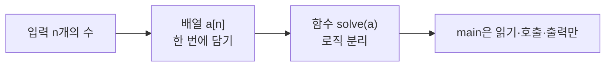
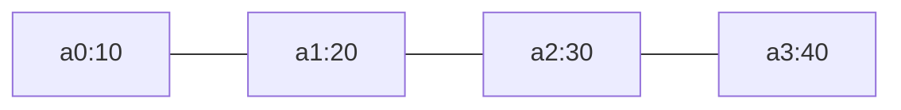
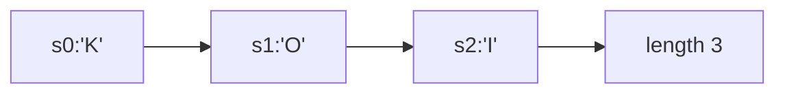
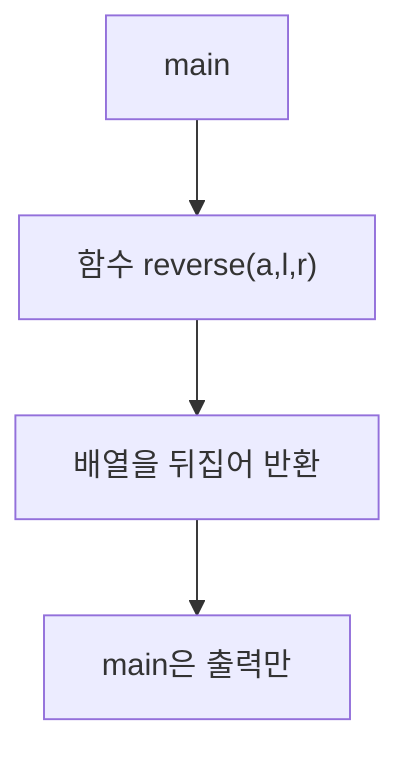
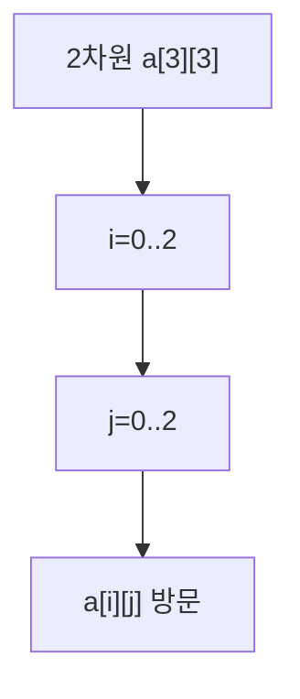

# 배열, 문자열, 함수 - 데이터를 담고 로직을 나누는 법

## 왜 배열과 함수인가?

하나의 값은 변수 하나면 된다. 하지만 KOI 입력은 `n`개의 수, 한 줄의 문자열, 격자 전체다.

> 비유: 배열은 번호가 매겨진 기차 칸이다. 0번 칸부터 `n-1`번 칸까지 순서대로 손님이 탄다. 문자열은 문자들의 기차, 함수는 라벨이 붙은 기계다. 재료를 넣으면 결과가 나온다.



---

## 1. 배열 - 번호로 바로 꺼내기

배열은 같은 타입을 연속된 칸에 담는다. `a[i]`는 시작 주소에서 `i`만큼 떨어진 곳이라 `O(1)`에 접근한다.

| 구분 | 선언 | 접근 | 특징 |
|---|---|---|---|
| 정적 배열 | `int a[5]` | `a[2]` | 크기 고정 |
| 벡터 | `vector<int> a(n)` | `a[2]` | 크기 가변, KOI 표준 |

```cpp
int n; cin >> n;
vector<int> a(n);
for (int i = 0; i < n; i++) cin >> a[i];
cout << a[0] << ' ' << a[n-1] << '\n'; // 첫·마지막
```



> KOI에서는 `vector<int> a(n)`으로 받고 `a[i]`로 쓴다. `a[n]`을 넘는 접근은 바로 런타임 에러다.

---

## 2. 문자열 - 문자들의 배열

문자열은 `char`의 배열이다. `s.length()`, `s[i]`, `s.substr()`로 다룬다.

| 연산 | 코드 | 비용 |
|---|---|---|
| 길이 | `s.size()` | `O(1)` |
| 접근 | `s[i]` | `O(1)` |
| 뒤집기 | `reverse(s.begin(), s.end())` | `O(n)` |

```cpp
string s; cin >> s;
for (char c : s) cout << c << ' ';
cout << '\n' << s.size() << '\n';
```



---

## 3. 함수 - 일을 나누는 기계

함수는 **입력(매개변수) → 처리 → 출력(반환값)** 기계다. `main`이 길어지면 함수로 나눈다.



```cpp
// 배열 뒤집기 함수
void reverseArray(vector<int>& a) {
    int l = 0, r = a.size() - 1;
    while (l < r) swap(a[l++], a[r--]); // 양 끝에서 좁혀오기
}

// 회문 판정 함수
bool isPalindrome(const string& s) {
    for (int i = 0; i < s.size()/2; i++)
        if (s[i] != s[s.size()-1-i]) return false;
    return true;
}
```

> 함수는 `solve()`처럼 이름을 짓고, `main`에서는 `solve()`만 호출하면 디버깅이 쉬워진다.

---

## 4. 2차원 배열과 반복

격자는 2차원 배열이다. `a[i][j]`로 접근하고 이중 반복문으로 순회한다.



```cpp
int n, m; cin >> n >> m;
vector<vector<int>> a(n, vector<int>(m));
for (int i = 0; i < n; i++)
    for (int j = 0; j < m; j++) cin >> a[i][j];
```

---

## 5. 자주 하는 실수

| 실수 | 결과 |
|---|---|
| `a[n]` 접근 | 범위 초과, 쓰레기 값 |
| `string`에서 `cin >> s` 후 `getline` | 개행 남아 빈 줄 읽힘 |
| 함수가 `vector`를 값으로 받음 | 복사로 느려짐, `&` 참조로 받기 |

---

## 6. 직접 손으로 풀어 보기

**문제 1.** `a=[10,20,30,40]`, `reverseArray(a)` 후 배열은?

<details><summary>풀이</summary>
l=0,r=3 swap 10,40 → [40,20,30,10], l=1,r=2 swap 20,30 → [40,30,20,10] 종료.
</details>

**문제 2.** `s="abba"`는 회문인가?

<details><summary>풀이</summary>
i=0: a==a, i=1: b==b → 끝까지 같으므로 true. `isPalindrome`은 true 반환.
</details>

---

## 보충: Python 구현과 복잡도 증명

### Python - 배열과 함수

```python
def reverse_array(a):
    l, r = 0, len(a)-1
    while l < r:
        a[l], a[r] = a[r], a[l]
        l += 1; r -= 1

def is_palindrome(s):
    return s == s[::-1]

def solve():
    import sys
    data = sys.stdin.read().split()
    if not data: return
    n = int(data[0])
    a = list(map(int, data[1:1+n]))
    reverse_array(a)
    print(*a)

if __name__ == "__main__":
    solve()
```

**Time / Space supplement:** 배열 접근 `O(1)`, 순회 `O(n)`, 뒤집기 `O(n)` 시간 `O(1)` 추가 공간. 함수 호출 오버헤드는 `O(1)`이다.
