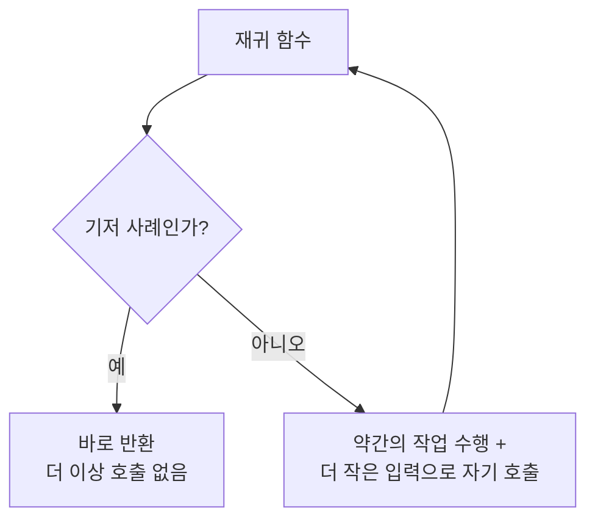
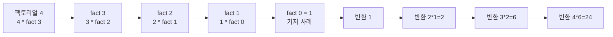
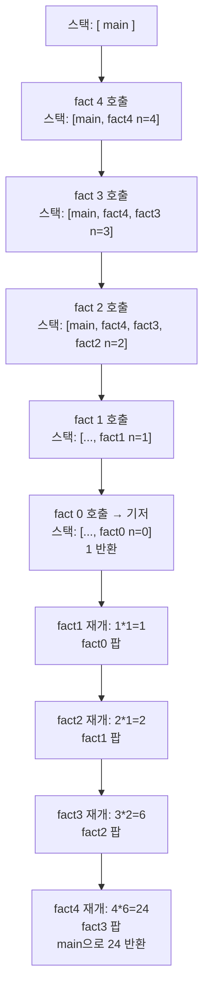
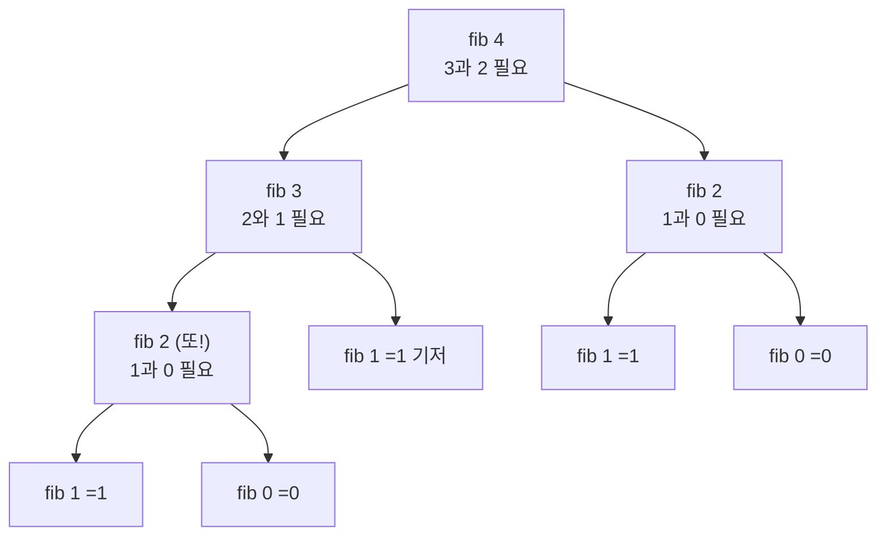

# 재귀 - 자기 자신을 호출하는 함수

## 왜 배워야 할까?

재귀는 반복하는 두 번째 방법이다(첫 번째는 `for`문). 루프 카운터 대신, 함수가 **더 작은 문제로 자기 자신을 호출**하다가 가장 작은 경우에 도달하면 멈춘다.

> 비유: 러시아 마트료시카 인형. 바깥 인형을 열면 안에 더 작은 동일한 인형이 들어 있다. 가장 작은 단단한 인형(기저 사례)까지 계속 열다가, 다시 닫으면서 답을 바깥으로 전달한다.

KOI에서는 재귀가 모든 곳에 쓰인다: DFS, 백트래킹, 분할 정복, 트리 순회. 재귀가 약하면 그 장들 전체가 무너진다.

---

## 1. 핵심 개념과 도식

### 재귀는 두 부분으로 이루어진다





| 부분 | 역할 | 빠뜨리면 |
|------|------|----------|
| 기저 사례 | 재귀를 멈춘다. `if (n==0) return 1;` | 무한 재귀 → 스택 오버플로 |
| 재귀 사례 | 문제를 축소한다. `return n * fact(n-1);` | 기저 사례에 도달하지 못함 |

---

## 2. 순차적 데이터 변화 과정

### 예제: `factorial(4)` 단계별 - 호출 스택의 성장과 해제

최초 호출: `main`에서 `factorial(4)`



### # 상태 표

| 단계 | 호출 | 매개변수 n | 동작 | 스택 깊이 | 반환값 |
|------|------|------------|------|-----------|--------|
| 1 | fact(4) | 4 | 4 * fact(3) - 대기 | 2 | pending |
| 2 | fact(3) | 3 | 3 * fact(2) - 대기 | 3 | pending |
| 3 | fact(2) | 2 | 2 * fact(1) - 대기 | 4 | pending |
| 4 | fact(1) | 1 | 1 * fact(0) - 대기 | 5 | pending |
| 5 | fact(0) | 0 | **기저**: 1 반환 | 6 | 1 |
| 6 | fact(1) | 1 | 재개: 1 * 1 = 1 | 5 | 1 |
| 7 | fact(2) | 2 | 재개: 2 * 1 = 2 | 4 | 2 |
| 8 | fact(3) | 3 | 재개: 3 * 2 = 6 | 3 | 6 |
| 9 | fact(4) | 4 | 재개: 4 * 6 = 24 | 2 | **24** |

**성장 단계**(1~5)는 프레임을 쌓고, **해제 단계**(6~9)는 팝하면서 계산한다.

### 예제 2: 피보나치 - 겹치는 호출 트리

`fib(4)`에서 `fib(n) = fib(n-1) + fib(n-2)`, 기저 `fib(0)=0, fib(1)=1`



이 그림이 문제를 보여준다: `fib(2)`가 **두 번** 계산된다. 이것이 단순 재귀가 느린 이유이며, 이후 DP/메모이제이션의 동기가 된다.

---

## 3. 구현

### C++ - 팩토리얼, 피보나치, 배열 합 (모두 재귀)

```cpp
# include <bits/stdc++.h>
using namespace std;

// 1. 팩토리얼: n! 
long long factorial(int n) {
    if (n == 0) return 1;          // 기저 사례
    return n * factorial(n - 1);   // 재귀 사례
}

// 2. 피보나치 (단순 - 이해용, 큰 n에는 부적합)
long long fib(int n) {
    if (n == 0) return 0;          // 기저 0
    if (n == 1) return 1;          // 기저 1
    return fib(n - 1) + fib(n - 2);
}

// 3. 재귀 배열 합: a[idx..끝] 합
long long arrSum(const vector<int>& a, int idx) {
    if (idx == (int)a.size()) return 0; // 기저: 끝을 넘어섬
    return a[idx] + arrSum(a, idx + 1); // a[idx] + 나머지 합
}

int main() {
    ios::sync_with_stdio(false);
    cin.tie(nullptr);
    int n;
    if (!(cin >> n)) return 0;
    cout << "factorial(" << n << ") = " << factorial(n) << "\n";
    cout << "fib(" << n << ") = " << fib(n) << "\n";
    vector<int> a(n);
    for (int i = 0; i < n; i++) a[i] = i + 1; // 1..n
    cout << "sum 1..n = " << arrSum(a, 0) << "\n";
    return 0;
}

```

### Python - 동일한 로직

```python
import sys
sys.setrecursionlimit(10000)

def factorial(n: int) -> int:
    if n == 0:
        return 1  # 기저 사례
    return n * factorial(n - 1)

def fib(n: int) -> int:
    if n == 0:
        return 0
    if n == 1:
        return 1
    return fib(n - 1) + fib(n - 2)

def arr_sum(a, idx=0):
    if idx == len(a):
        return 0  # 기저: 끝을 넘어섬
    return a[idx] + arr_sum(a, idx + 1)

def solve() -> None:
    data = sys.stdin.read().strip().split()
    if not data:
        return
    n = int(data[0])
    print(f"factorial({n}) = {factorial(n)}")
    print(f"fib({n}) = {fib(n)}")
    a = list(range(1, n + 1))
    print(f"sum 1..n = {arr_sum(a, 0)}")

if __name__ == "__main__":
    solve()

```

---

## 4. 복잡도 분석

### 시간복잡도

**팩토리얼 / 배열 합**: 점화식 `T(n) = T(n-1) + O(1)`, `T(0)=O(1)`

전개:

```
T(n) = T(n-1) + c
     = T(n-2) + c + c
     = ...
     = T(0) + n*c = O(n)

```

| n | 호출 횟수 | 연산 | 증가 |
|---|-----------|------|------|
| 5 | 6 (0..5) | ~5 | 선형 |
| 10 | 11 | ~10 | O(n) |
| 1000 | 1001 | ~1000 | 선형 |

**단순 피보나치**: `T(n) = T(n-1) + T(n-2) + O(1)` → `T(n) = Θ(φ^n)` (φ≈1.618, 지수). 재귀 트리의 노드 수 ≈ 2*F(n+1)-1, `F(n) ≈ φ^n / √5`. 따라서 `fib(40)`은 이미 약 3억 호출.

그래서 KOI에서는 `n≈35` 초과 피보나치에 단순 재귀를 **절대** 쓰지 않고 메모이제이션한다.

### 공간복잡도

재귀는 **호출 스택**을 사용한다. 각 프레임은 `n`, 반환 주소 등을 저장 → 프레임당 `O(1)`.

*   **팩토리얼 / 배열 합**: 최대 스택 깊이 = `n+1` (n부터 0까지) → `O(n)` 추가 공간. 반복문은 `O(1)`이므로 재귀는 공간을 명확성과 교환.
*   **단순 피보나치**: 깊이 우선 실행에서 최대 깊이는 `n` (가장 왼쪽 경로) 지수적 총 호출에도 불구하고 → `O(n)` 스택, 시간 `O(φ^n)`.

증명: 스택 깊이 = 재귀 트리 높이 = `n`. 전체 메모리 = 깊이 × 프레임 크기 = `O(n)`.

KOI 주의: `n = 200,000`이면 재귀 `factorial`은 스택 오버플로. 반복문으로 전환하거나 스택을 늘려야 한다.

---

## 5. 직접 풀어보기

**문제 1.** `factorial(5)`는 무엇을 출력하나? `if (n==0)` 검사는 몇 번 실행되나?

<details><summary>풀이</summary>
호출: fact5 → fact4 → fact3 → fact2 → fact1 → fact0. `n==0` 검사는 6번 수행(호출마다 1번). 6번째(fact0)만 참. 반환 체인: 1 →1 →2 →6 →24 →120.
</details>

**문제 2.** 문자열 `s`를 뒤집어 출력하는 재귀 함수 `stringReverse(s, idx)`를 반복문 없이 작성하라. 시간/공간은?

<details><summary>풀이</summary>

```cpp
void rev(const string& s, int i){
    if(i==s.size()) return;
    rev(s, i+1);
    cout << s[i]; // 재귀 해제 후 출력
}

```
"abc" 추적: rev0→rev1→rev2→rev3(기저). 해제 시 c, b, a 출력 → "cba". 시간 O(n), 공간 O(n) 호출 스택. 호출 전후 출력 위치에 따라 순서가 바뀜!
</details>

---

## 6. KOI 적용

- **입문 KOI / BOJ 10872 팩토리얼, 10870 피보나치**: 직접 재귀 문제.
- **BOJ 1780 종이의 개수, 2630 색종이 만들기**: 분할 정복을 통한 재귀 - 동일한 스택 원리.
- **DFS/백트래킹**: `dfs(v)`가 `dfs(next)` 호출 - 전체 그래프 탐색이 팩토리얼처럼 펼쳐진 재귀.
- **BOJ 2747, 2748**: 함정: 단순 fib 재귀는 TLE - 메모이제이션(`dp[n] = fib(n-1)+fib(n-2)` 저장)으로 전환.
- **패턴**: 답 `f(n)`을 `f(더 작은 값)`으로 정의할 수 있으면 재귀를 먼저 시도. 그 다음 "깊이가 너무 큰가? 겹치는 호출이 있는가?" 질문. 예라면 반복 DP로 전환.