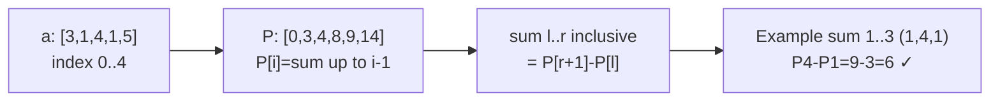
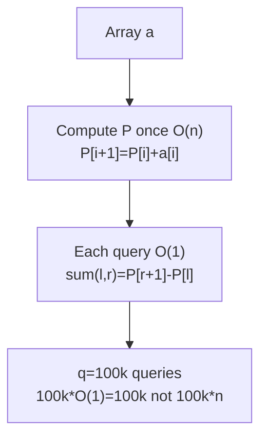
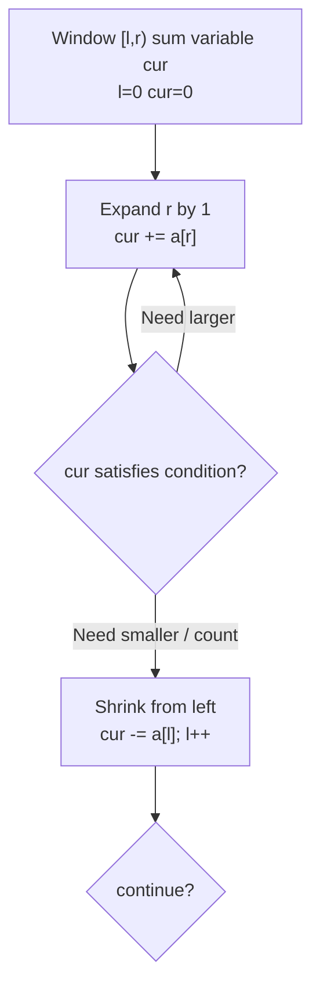
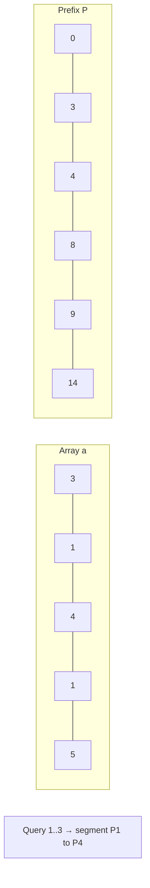

# 누적 합과 슬라이딩 윈도우 - 구간 질의를 O(1)에 답변

## 왜 배워야 할까?

KOI는 "a[l]에서 a[r]까지의 합", "K로 합산된 하위 배열 수", "합계 ≥ S인 최소 길이"를 반복적으로 묻습니다.쿼리당 순진한 루프는 각각 O(n)입니다. q=100k이면 10B 작업입니다.

> 비유: 영수증의 누계입니다.누군가가 "항목 5..10의 총계"를 물을 때마다 30개의 항목을 추가하는 대신 각 항목 뒤 하단에 누적 합계를 미리 계산합니다. 즉, 접두사[10] - 접두사[4] = 즉시 대답합니다.슬라이딩 윈도우 = 두 손가락이 배열을 따라 슬라이딩하여 처음부터 다시 계산하지 않고 현재 윈도우의 합계를 유지합니다.

---

## 1. 핵심 개념과 도식

### 접두사 합계 `P[i] = a[0]+...+a[i-1]`, `P[0]=0`(크기 n+1)




### 슬라이딩 윈도우 - 양수 하위 배열 합계 제약 조건


* **정적 배열** + **많은 쿼리**에는 접두사 사용
* 숫자가 양수인 경우 "하위 배열 합계 == K"와 같은 **연속 조건**에 대해 슬라이딩 창을 사용합니다(단조 합계는 두 개의 포인터를 허용함).

---

## 2. 순차적 데이터 변화 과정

### `a=[3,1,4,1,5]`에 대한 접두사 건물

|나 |a[i] |계산 `P[i+1]=P[i]+a[i]` |P 이후 |
|---|------|------------------|---------|
|- |- |P0=0 초기 |`[0, ?, ?, ?, ?, ?]` |
|0 |3 |P1=0+3=3 |`[0,3, ?, ?, ?, ?]` |
|1 |1 |P2=3+1=4 |`[0,3,4, ?, ?, ?]` |
|2 |4 |P3=4+4=8 |`[0,3,4,8, ?, ?]` |
|3 |1 |P4=8+1=9 |`[0,3,4,8,9, ?]` |
|4 |5 |P5=9+5=14 |`[0,3,4,8,9,14]` |

이제 O(1)을 쿼리합니다.

* `합(0,2)` = 3+1+4 = `P3-P0=8-0=8` ✓
* `합(1,3)` = 1+4+1 = `P4-P1=9-3=6` ✓
* `sum(2,2)` = 4 = `P3-P2=8-4=4` ✓


### 2D 접두사(완전성을 위해 KOI 고급) `사각형의 합`

2D 그리드 `a[i][j]`의 경우 `P[i+1][j+1] = a[i][j] + P[i][j+1] + P[i+1][j] - P[i][j]`(포함-제외).그러면 `sum(x1,y1,x2,y2) = P[x2+1][y2+1] - P[x1][y2+1] - P[x2+1][y1] + P[x1][y1]`입니다.

### 슬라이딩 윈도우 연습: 양수 배열 `a=[2,3,1,2,4,3]`에 대해 합이 `S=7`인 최소 창 길이

우리는 r을 제외한 윈도우 `[l, r)`, 변수 `cur = sum of window`를 유지합니다.

|단계 |`엘` |`r` |창 `[l,r)` |`cur` |`cur ≥7?` |액션 |최고의 길이 |
|------|-------|------|---|-------|------------|---------|-------------|
|1 |0|0|[]|0|아니요|r 0→1 (+2)|무한|확장
|2 |0|1|[2]|2|아니요|r1 확장→2 (+3)|무한|
|3 |0|2|[2,3]|5|아니오|r2 확장→3 (+1)|무한|
|4 |0|3|[2,3,1]|6|아니오|r3→4 (+2)|무한|확장
|5 |0|4|[2,3,1,2]|8|예|축소 l0→1 (-2) →7|len 4|
|6 |1|4|[3,1,2]|6|아니오|r4→5 (+4)|len4|확장
|7 |1|5|[3,1,2,4]|10|예|줄이기 l1→2 (-3)=7|len4 → min(4,4)=4|
|8 |2|5|[1,2,4]|7|예|축소 l2→3 (-1)=6|len3 → **새로운 최고 3** `[1,2,4]`|
|9 |3|5|[2,4]|6|아니오|r5→6 (+3)=9|len2 확장?대기 창 [3,6)=[2,4,3]=9|
|10 |3|6|[2,4,3]|9|예|줄이기 l3→4 (-2)=7|len3 →
|11 |4|6|[4,3]|7|예|축소 l4→5 (-4)=3|len2 → **새로운 최고 2** `[4,3]`|
|12 |5|6|[3]|3|no|확장 r==n 완료 |최종 **2**|

결과: 최소 길이 '2'.각 인덱스는 창에 한 번 진입하고(r이 n번 이동) 한 번 종료되고(l이 n번 이동) → 전체가 `2n` 이동합니다.

---

## 3. 구현

### C++ - 접두사(1D/2D), 슬라이딩 윈도우, 차이 배열

```cpp
# include <bits/stdc++.h>
using namespace std;

// 1D prefix: build P size n+1, query sum [l,r] inclusive
vector<long long> buildPrefix(const vector<int>& a) {
    int n = a.size();
    vector<long long> P(n+1, 0);
    for (int i=0;i<n;i++) P[i+1]=P[i]+a[i];
    return P;
}
inline long long rangeSum(const vector<long long>& P,int l,int r){
    return P[r+1]-P[l]; // inclusive
}

// 2D prefix for grid HxW
vector<vector<long long>> buildPrefix2D(const vector<vector<int>>& a){
    int H=a.size(), W=a[0].size();
    vector<vector<long long>> P(H+1, vector<long long>(W+1,0));
    for(int i=0;i<H;i++) for(int j=0;j<W;j++)
        P[i+1][j+1]=a[i][j]+P[i][j+1]+P[i+1][j]-P[i][j];
    return P;
}
long long rectSum(const vector<vector<long long>>& P,int x1,int y1,int x2,int y2){
    // inclusive coordinates
    return P[x2+1][y2+1]-P[x1][y2+1]-P[x2+1][y1]+P[x1][y1];
}

// Difference array: range add [l,r] by val in O(1), then finalize O(n)
// Classic KOI trick for many range increments
void rangeAdd(vector<long long>& diff,int l,int r,long long val){
    diff[l]+=val;
    if(r+1 < (int)diff.size()) diff[r+1]-=val;
}
vector<long long> finalizeDiff(const vector<long long>& diff){
    vector<long long> a(diff.size());
    long long cur=0;
    for(size_t i=0;i<diff.size();i++){cur+=diff[i]; a[i]=cur;}
    return a;
}

// Sliding window: minimum length subarray with sum >= S (all a[i]>0)
int minLenGeS(const vector<int>& a, long long S){
    int n=a.size();
    int ans=n+1;
    long long cur=0;
    int l=0;
    for(int r=0;r<n;r++){
        cur+=a[r];
        while(cur>=S){
            ans=min(ans,r-l+1);
            cur-=a[l++];
        }
    }
    return ans==n+1?-1:ans;
}

int main(){
    ios::sync_with_stdio(false);
    cin.tie(nullptr);
    int n,q; cin>>n>>q;
    vector<int> a(n); for(int &x:a)cin>>x;
    auto P=buildPrefix(a);
    while(q--){
        int l,r; cin>>l>>r;
        cout<<rangeSum(P,l,r)<<"\n";
    }
    // demo sliding window would be separate problem
    return 0;
}

```
### Python - 동일한 논리

```python
import sys

def build_prefix(a):
    n = len(a)
    P = [0]*(n+1)
    for i in range(n):
        P[i+1] = P[i] + a[i]
    return P

def range_sum(P,l,r):
    return P[r+1]-P[l]  # inclusive

def build_prefix_2d(a):
    H=len(a); W=len(a[0]) if H else 0
    P=[[0]*(W+1) for _ in range(H+1)]
    for i in range(H):
        for j in range(W):
            P[i+1][j+1]=a[i][j]+P[i][j+1]+P[i+1][j]-P[i][j]
    return P

def rect_sum(P,x1,y1,x2,y2):
    return P[x2+1][y2+1]-P[x1][y2+1]-P[x2+1][y1]+P[x1][y1]

# difference array range add
def range_add(diff,l,r,val):
    diff[l]+=val
    if r+1 < len(diff):
        diff[r+1]-=val

def finalize_diff(diff):
    cur=0
    a=[]
    for d in diff:
        cur+=d
        a.append(cur)
    return a

def min_len_ge_S(a,S):
    n=len(a)
    cur=0; l=0; ans=n+1
    for r in range(n):
        cur+=a[r]
        while cur >= S:
            ans=min(ans, r-l+1)
            cur-=a[l]; l+=1
    return -1 if ans==n+1 else ans

def solve():
    data=list(map(int, sys.stdin.read().split()))
    if not data: return
    it=iter(data)
    try:
        n=next(it); q=next(it)
    except StopIteration:
        return
    a=[next(it) for _ in range(n)]
    P=build_prefix(a)
    out=[]
    for _ in range(q):
        try:
            l=next(it); r=next(it)
        except: break
        out.append(str(range_sum(P,l,r)))
    sys.stdout.write("\n".join(out))

if __name__=="__main__":
    solve()

```
---

## 4. 복잡도 분석

### 시간복잡도

**건물 접두어**: 단일 패스 `n` 추가:

```
T_build(n)= n * O(1) = O(n)

```
**각 쿼리**: 두 개의 배열을 읽고 `P[r+1]-P[l]` → `O(1)`을 뺍니다.

`q` 쿼리의 합계: `O(n + q)` 대 순진한 `O(n·q)`.

구체적: `n=500k, q=100k`.순진한 = 500k*100k = 50B → TLE.접두사 = 500k +100k =600k → 0.001초

**2D 접두사**: 'Building O(H·W)', 각 직사각형은 4개의 읽기로 'O(1)'을 쿼리합니다.쿼리별 순진한 스캔 직사각형 평균 영역 'H·W/4' → 거대함.

**차이 배열**: `k` 범위 추가는 각각 `O(1)` → `O(k)`, 최종 접두사는 `O(n)` → `O(n+k)` 대 순진한 추가 `O(length)` 총 `O(k·n)`을 전달합니다.

**슬라이딩 윈도우**(양수): 각 요소는 `r++`을 통해 한 번 창에 들어가고 `l++`를 통해 한 번 떠납니다.따라서 총 증분 = `2n` → `O(n)` 시간입니다.'O(n²)'가 아닙니다.

상각을 통한 증명: `r`은 `n` 단계만 증가합니다.`l`만 증가합니다: 최대 `n` 단계.전체 루프 본문은 `≤2n`회 실행됩니다.while이 중첩되어 있더라도 총 내부 반복 횟수는 `n`입니다.

### 공간복잡도

* **1D 접두사 `P`**: 크기 `n+1` → `O(n)` 추가.덮어쓸 수 있다면 'a' 옆에 빌드할 수 있지만 쿼리에 응답하기 위해 'P'를 유지합니다.보조(입력 이상의 추가) = `O(n)`.
* **2D 접두어**: `(H+1)(W+1)` → `O(H·W)`.`500×500` 그리드의 경우 → 251k 길이 → ~2MB.`2000×2000` → 4M → 32MB의 경우 여전히 512MB 이내입니다.
* **슬라이딩 윈도우**: `l,r,cur` 변수만 사용 → `O(1)` 추가(`O(n)` 입력은 계산되지 않음).실제 메모리 `O(1)` 보조.

중요한 이유: `n=1e6`, `long long P`(8바이트 ×1e6)에는 접두어에 `8MB`가 필요합니다.허용됩니다.'n=1e5×1e5'에 대한 2D 접두사 수행 불가능(10B 항목 필요) → 잘못된 접근 방식을 나타냅니다.

---

## 5. 직접 풀어보기

**문제 1.** `a=[2,4,1,5]`가 주어지면 `P`를 빌드하고 접두사 공식을 사용하여 `sum(1,2)=4+1=5`를 계산합니다.또한 `[1,2]` 범위에 `+3`을 추가하여 최종적으로 변형된 배열을 생성하는 차이 배열을 표시합니다.

<details><summary>풀이</summary>
P: [0,2,6,7,12].sum1-2 = P3-P1=7-2=5 정확합니다.<br>
차이 초기화 [0,0,0,0].범위추가(1,2,+3): 차이=[0,3,0,-3].최종화: cur0=0→0, cur1=3→3, cur2=3→3, cur3=0→0 → 첨가 배열 [0,3,3,0].a: [2,7,4,5]에 적용됩니다.수동으로 확인하세요: a1 4+3=7, a2 1+3=4 정확합니다.이제 추가 후 접두사를 다시 작성하면 그에 따라 P'가 제공됩니다.
</details>

**문제 2.** `a=[1,1,1,1,1]`, `S=3`.슬라이딩 윈도우 단계를 추적하고 최소 길이를 찾습니다.

<details><summary>풀이</summary>
단계: 현재 진행 1→2→3(r=2)은 축소를 유발합니다: cur3≥3 best len3.Shrink l0→1 cur2<3 Expand r3 cur3 best min(3,3)=3 .. 전체적으로 best 남아 3. 3개의 창의 합은 3이 됩니다. 실제로 최소 길이 3. 배열에 다양한 긍정이 있는 경우 창 길이가 달라집니다.모두 동일하게 안정 3을 보여줍니다.
</details>

---

## 6. KOI 적용

- **BOJ 11659 수용 합 4, 11441 합법**: 1D 접두사 순수.off-by-one TLE를 피하기 위해 `P[0]=0` 인덱싱을 기억하세요.
- **BOJ 11660 의무 합 5**: 2D 접두사 교과서 - KOI 중급 표준.`O(HW+q)` vs 순진한 `O(q·HW)`.
- **BOJ 2559 수열, 1806 부분합, 2003 수들의 합 2**: "합이 ≥ S인 최소 길이" 또는 "하위 배열 개수 합==M"에 대한 슬라이딩 창(양수에만 해당).숫자에 음수가 포함된 경우 접두사 + 해시맵이 필요합니다(다른 패턴 - BOJ 2143).
- **BOJ 10986 나머지 합, 1394**: 접두사 + 모듈러 산술.
- **BOJ 19951 태상이의 훈련소 생활, 11658 접촉 + 처리 업데이트**: 범위 업데이트를 위한 차이 배열(1D) 및 2D diff/Fenwick 확장.KOI는 많은 "v를 [l,r]에 추가"한 다음 최종 쿼리할 때 차이를 사용합니다.
- **패턴**: If 문에 **정적** 배열 → 접두사에 대한 합계/카운트 범위 쿼리에 `q`가 표시됩니다.`양성이 있는 하위 배열 연속 조건`이라고 표시된 경우 → 슬라이딩 윈도우.`범위가 추가`되면 많은 → diff.