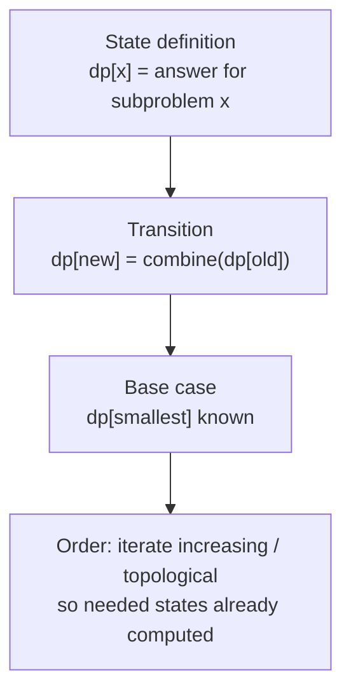
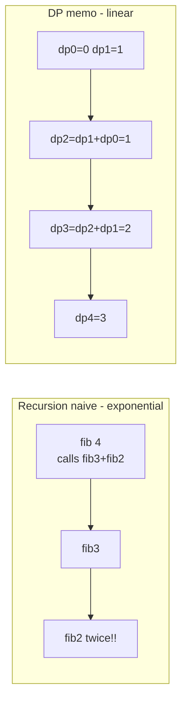
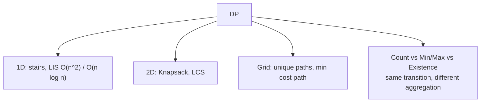
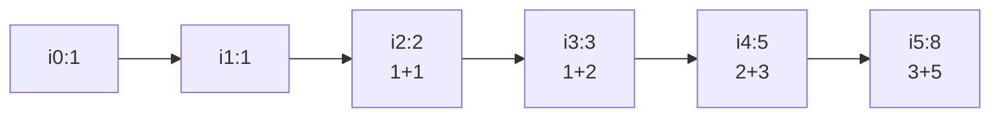

# 동적 계획법 중급 - 메모이제이션부터 상향식까지

## 왜 배워야 할까?

많은 KOI 문제는 기하급수적으로 많은 가능성(경로, 하위 집합)에 대해 "최대/최소/개수"를 요구합니다.무차별 탐색 `O(2^n)`은 시간 초과가 납니다. DP는 겹치는 부분 문제를 축소합니다: 각 상태를 한 번 계산하고 재사용합니다.

> 비유: 계단 만들기.'i' 단계에 도달하려면 'i-1' 또는 'i-2'에서 올 수 있습니다.`i` 도달 비용 = `최소(i-1 도달 비용, i-2 도달 비용) + i 단계 비용`.따라서 바닥부터 올라가면서 비용 배열을 채우게 됩니다. 각 단계는 이미 해결한 더 작은 단계를 사용하여 해결됩니다.

KOI의 중급 문제 중 40%는 DP입니다."상태 정의 → 전환 → 기본 → 순서"를 마스터하는 것이 기본에서 고급으로의 관문입니다.

---

## 1. 핵심 개념과 도식

### 4단계 레시피


### 예: DP로서의 피보나치 대 재귀 트리 축소


유형 분류:


---

## 2. 순차적 데이터 변화 과정

### A. 계단 오르기: `n=5` 단계, `1` 또는 `2` 단계를 오를 수 있음, `dp[i]=i 단계에 도달하는 방법 수`

반복: i≥2인 경우 `dp[0]=1`(지상 1방향), `dp[1]=1`, `dp[i]=dp[i-1]+dp[i-2]`

빌드 순서 i=0→5:

| i | dp[i] 계산 | 이후 dp 배열 |
|---|------|---|
|0 |기본 1 |`[1, ?, ?, ?, ?, ?]` |
|1 |기본 1 |`[1,1, ?, ?, ?, ?]` |
|2 |dp0+dp1 =1+1=2 |`[1,1,2, ?, ?, ?]` |
|3 |dp1+dp2=1+2=3 |`[1,1,2,3, ?, ?]` |
|4 |dp2+dp3=2+3=5 |`[1,1,2,3,5, ?]` |
|5 |dp3+dp4=3+5=8 |`[1,1,2,3,5,8]` 답변 8 |


### B. 0/1 배낭 작은 예: `items: (w=2,v=3),(3,4),(4,5)` 용량 `W=5`

`dp[j]=용량 j로 달성 가능한 최대 값`.dp[0..5]=0으로 초기화합니다.

항목을 하나씩 처리합니다(재사용을 방지하려면 0/1에 대해 j **뒤로** 반복).

항목 1 w2 v3:

| j | DP 이전 |취하는 경우: dp[j-w]+v = dp[0/1/3]+3 |이후 dp(최대) |
|---|------------|---------|---|
|5|0|dp3+3=0+3=3→3|3|
|4|0|dp2+3=0+3=3→3|3|
|3|0|dp1+3=0+3=3→3|3|
|2|0|dp0+3=0+3=3→3|3|
|1|0|j<w 건너뛰기|0|
|0|0|건너뛰기|0|
항목 1 이후의 결과: `[0,0,3,3,3,3]`

항목 2 w3 v4(이전 반복의 dp 사용):

| j | DP 이전 |take = dp[j-3]+4 |이후 |
|---|---------|------|-------|
|5|3|dp2=3+4=7 → 최대(3,7)=7|7|
|4|3|dp1=0+4=4 →4|4|
|3|3|dp0=0+4=4 →4|4|
|2|3|j<3 건너뛰기|3|
결과: `[0,0,3,4,4,7]`

항목3 w4 v5:

| j | 이전 |take=dp[j-4]+5 |이후 |
|---|------|---|-------|
|5|7|dp1=0+5=5 → 유지7|7|
|4|4|dp0=0+5=5 →5|5|
|3|4|건너뛰기|4|
결과 최종: `[0,0,3,4,5,7]` 답변 dp[5]=7(항목 2+1 가중치5 값7)

행별로 순차적인 `dp` 변형에 유의하세요. 이는 이해해야 하는 "DP 테이블 채우기 순서"입니다.

### C. LCS 예제 `s1="ABCBDAB" s2="BDCABA"` (2D 테이블 채우기를 표시하기가 더 어렵습니다)

`dp[i][j]=s1[0..i-1] 및 s2[0..j-1]의 LCS`.전환: if `s1[i-1]==s2[j-1]` then `dp[i][j]=dp[i-1][j-1]+1` else `max(dp[i-1][j],dp[i][j-1])`.

`s1="AB" s2="BA"`에 대한 작은 조각:

|i\j |0|1(B)|2(A)|
|---|---|---|---|
|0||0|0|
|1(A)|0|0 (A≠B 최대 0,0) →0 |1 (A==A dp0,0+1=1) →1|
|2(B)|0|1 (B==B 1) →1 |1 (B≠A 최대 1,1 →1)|

Answer는 셀별로 성장합니다.`dp[i-1][j-1]`은 이미 계산되어야 하므로 행 순서가 중요합니다.

---

## 3. 구현

### C++ - 네 가지 기본 DP 유형

```cpp
# include <bits/stdc++.h>
using namespace std;

// 1. Stairs climbing: number of ways (mod not needed small n)
long long stairs(int n){
    if(n<=1) return 1;
    vector<long long> dp(n+1);
    dp[0]=1; dp[1]=1;
    for(int i=2;i<=n;i++) dp[i]=dp[i-1]+dp[i-2];
    return dp[n];
}

// 2. 0/1 Knapsack: max value, capacity W
int knapsack01(const vector<int>& w, const vector<int>& v, int W){
    int n=w.size();
    vector<int> dp(W+1,0);
    for(int i=0;i<n;i++){
        for(int j=W;j>=w[i];--j){
            dp[j]=max(dp[j], dp[j-w[i]]+v[i]);
        }
    }
    return dp[W];
}

// 3. LCS length
int lcs(const string& a, const string& b){
    int n=a.size(), m=b.size();
    vector<vector<int>> dp(n+1, vector<int>(m+1,0));
    for(int i=1;i<=n;i++) for(int j=1;j<=m;j++){
        if(a[i-1]==b[j-1]) dp[i][j]=dp[i-1][j-1]+1;
        else dp[i][j]=max(dp[i-1][j], dp[i][j-1]);
    }
    return dp[n][m];
}

// 4. LIS O(n log n) with patience / binary search (more advanced but KOI essential)
int lis(const vector<int>& a){
    vector<int> tails;
    for(int x: a){
        auto it=lower_bound(tails.begin(), tails.end(), x);
        if(it==tails.end()) tails.push_back(x);
        else *it=x;
    }
    return tails.size();
}

int main(){
    ios::sync_with_stdio(false);
    cin.tie(nullptr);
    int n,W;
    if(!(cin>>n>>W)) return 0;
    vector<int> w(n), v(n);
    for(int i=0;i<n;i++) cin>>w[i]>>v[i];
    string s1,s2; cin>>s1>>s2;
    cout<<stairs(n)<<" "<<knapsack01(w,v,W)<<" "<<lcs(s1,s2)<<" "<<lis(w)<<"\n";
    return 0;
}

```
### Python - 동일한 논리

```python
import sys
from bisect import bisect_left

def stairs(n):
    if n<=1:
        return 1
    dp=[0]*(n+1)
    dp[0]=dp[1]=1
    for i in range(2,n+1):
        dp[i]=dp[i-1]+dp[i-2]
    return dp[n]

def knapsack01(w,v,W):
    n=len(w)
    dp=[0]*(W+1)
    for i in range(n):
        # iterate backwards for 0/1
        for j in range(W, w[i]-1, -1):
            dp[j]=max(dp[j], dp[j-w[i]]+v[i])
    return dp[W]

def lcs(a,b):
    n,m=len(a),len(b)
    dp=[[0]*(m+1) for _ in range(n+1)]
    for i in range(1,n+1):
        for j in range(1,m+1):
            if a[i-1]==b[j-1]:
                dp[i][j]=dp[i-1][j-1]+1
            else:
                dp[i][j]=max(dp[i-1][j], dp[i][j-1])
    return dp[n][m]

def lis(a):
    tails=[]
    for x in a:
        idx=bisect_left(tails,x)
        if idx==len(tails):
            tails.append(x)
        else:
            tails[idx]=x
    return len(tails)

def solve():
    data=sys.stdin.read().split()
    if not data: return
    # example expects n W items strings - adapt
    it=iter(data)
    n=int(next(it)); W=int(next(it))
    w=[]; v=[]
    for _ in range(n):
        try:
            w.append(int(next(it))); v.append(int(next(it)))
        except: break
    s1=next(it, "")
    s2=next(it, "")
    out=f"{stairs(n)} {knapsack01(w,v,W)} {lcs(s1,s2)} {lis(w)}"
    sys.stdout.write(out)

if __name__=="__main__":
    solve()

```
---

## 4. 복잡도 분석

### 시간복잡도

* **계단 1D**: `n` 상태, 각 상태에는 두 전임자의 `O(1)` 결합 → `O(n)` 시간이 필요합니다.순진한 재귀는 `O(2^n)` 또는 `O(ψ^n)`(재계산된 중복)입니다.DP 개선: `지수적 → 선형`.

증명: 메모하면 `T(n)=T(n-1)+O(1)`이 반복되나요?보다 정확하게는 DP는 `n+1` 항목을 각각 한 번씩 채웁니다 → `n·O(1)=O(n)`.

* **0/1 배낭**: `n` 아이템 × `W` 용량.외부 루프 `n`, 내부 역방향 `W-w_i+1 ≒ W` → `O(n·W)` 시간.이것은 **의사 다항식**입니다. 'log W'가 아닌 'W' 값의 다항식입니다.`n=100, W=100k`의 경우 → 10M 작업 가능.`W=1e9`의 경우 실행 불가능합니다.

유도:

```
    Total = Σ_{i=0}^{n-1} (W) = n·W
    Each transition O(1) max
    

```
* **LCS**: 테이블 `(n+1)·(m+1)` 셀, 각 `O(1)` → `O(n·m)` 시간 및 공간.`n=m=1000` → 1M 셀, ~4MB, ~1M ops → OK.`n=m=5000` → 25M 셀 → 100MB의 경우 MLE 가능 - 최적화된 공간이 필요합니다.

* **LIS**:
* 클래식 `O(n²)`: `dp[i]=1+max(dp[j] for j<i if a[j]<a[i])` → `n` 상태 × `n` 선행 항목 스캔 → `O(n²)`.
* 최적 `O(n log n)`: 매 단계마다 `tails` 및 이진 검색(`lower_bound`) 유지 → `n·O(log n)` → `n=100k`에 대한 KOI 선택.

|문제 |n 범위 |필수 |KOI 선택 |
|---------|---------|----------|------------|
|계단 n=30 |작은 |재귀 작동 |그러나 DP O(n)은 더 안전하다 |
|배낭 W=1e5 |대형 W |DP O(nW) |DP |
|LCS n=1000 |보통 |오(n²) |DP |
|LIS n=100k |대형 |O(n²) TLE |O(n 로그 n) |

### 공간복잡도

* **계단**: `dp 크기 n+1` → `O(n)`.반복에서는 `i-1,i-2`만 사용하므로 마지막 2개(`prev2, prev1`)만 유지하여 `O(1)`로 최적화할 수 있습니다.그러나 명확성/충돌 재구성을 위해 'O(n)'을 유지합니다.
* **배낭**: `dp 크기 W+1` → `O(W)`.`n×W` 테이블 대신 1D 재사용(역방향)을 사용 → `O(n·W)` 메모리를 절약합니다.항목 `O(1)`당 추가.
* **LCS**: 테이블 `(n+1)(m+1)` 정수 → `O(n·m)` 메모리.길이만 필요한 경우 `O(min(n,m))` 두 행으로 최적화할 수 있습니다.시퀀스 재구성을 위해 전체를 유지하십시오.
* **LIS 꼬리**: 최대 `n` 길이 → `O(n)` 최악의 경우(엄격히 증가).종종 `O(ans)` < n.

일반 증명: 공간 = 저장된 상태의 수.전환에 이전 행만 필요한 경우 `O(nW)`가 아닌 `O(W)` 행을 롤링할 수 있습니다.항상 물어보세요. "테이블 전체가 필요한가요, 아니면 이전 조각만 필요한가요?"

---

## 5. 직접 풀어보기

**문제 1.** 계단 `n=4`, 위의 dp는 `5` 방법으로 대답합니다. 실제 경로를 나열하고 dp 반복에 연결합니다.

<details><summary>풀이</summary>
방법: (1+1+1+1), (1+1+2), (1+2+1), (2+1+1), (2+2).5번째. dp: h.반복 추론: 4단계에 도달하기 위한 마지막 이동은 3에서 1(dp3=3방향) 또는 2에서 2(dp2=2방향)였습니다.따라서 3+2=5는 열거형과 일치합니다.반복은 마지막 이동 크기에 따라 경로를 분할합니다. 사례 분석을 통한 증명입니다.
</details>

**문제 2.** 배낭 `w=[1,3,4] v=[15,20,30] W=4` - dp를 단계별로 계산하고 선택한 항목을 식별합니다.

<details><summary>풀이</summary>
초기화 [0,0,0,0,0]
item0 w1: dp=[0,15,15,15,15] (유용한 경우 사용)
item1 w3: j4: dp1+20=35 →dp4=35, j3:0+20=20→20 ⇒ [0,15,15,20,35]
item2 w4: j4:0+30=30 대 35는 35를 유지합니다. ⇒ [0,15,15,20,35]는 35(항목0+1)로 대답합니다.참고 최적은 단일 최고 값이 아닐 수도 있습니다.
</details>

---

## 6. KOI 적용

- **BOJ 2579 우산 오르기, 1463 1로, 1932 정수 삼각**: 입문 중급 1D DP - 문제별로 'dp[i]' 의미를 정의하고, "How did we get to i?"로 재발을 찾습니다.
- **BOJ 12865 평범한 배낭**: 0/1 배낭 순수 `O(nW)` - `W`에서 `100,000`까지 맞는지 확인하세요.역방향 루프는 필수입니다. 그렇지 않으면 무제한 배낭이 됩니다.
- **BOJ 9251 LCS**: 클래식 2D DP - 주문 행 작성 필수.종종 "편집 거리" 변형으로 나타납니다.
- **BOJ 11053 가장 긴 증가하는 부분수열, 12015 가장 긴 증가하는 부분수열 2**: 기준점: `n≤1000` → O(n²) 통과;`n≤1M` → O(n log n) 필수.KOI는 이를 필터링에 사용합니다.
- **BOJ 11066 파일 합치기, 1520 숨겨진 막 길**: 인트로 이후의 간격 DP / DFS+DP 패턴이지만 동일한 상태/전환 규칙을 기반으로 구축되었습니다.
- **패턴**: 문제에 "제약 n이 최대 1000이고 W가 ​​최대 100k인 조합의 최대/최소/개수"라고 표시되면 DP를 의심합니다.코딩하기 전에 인어로 상태 DAG를 그립니다(노드=상태, 가장자리=전환). 그런 다음 토폴로지 순서로 구현합니다.