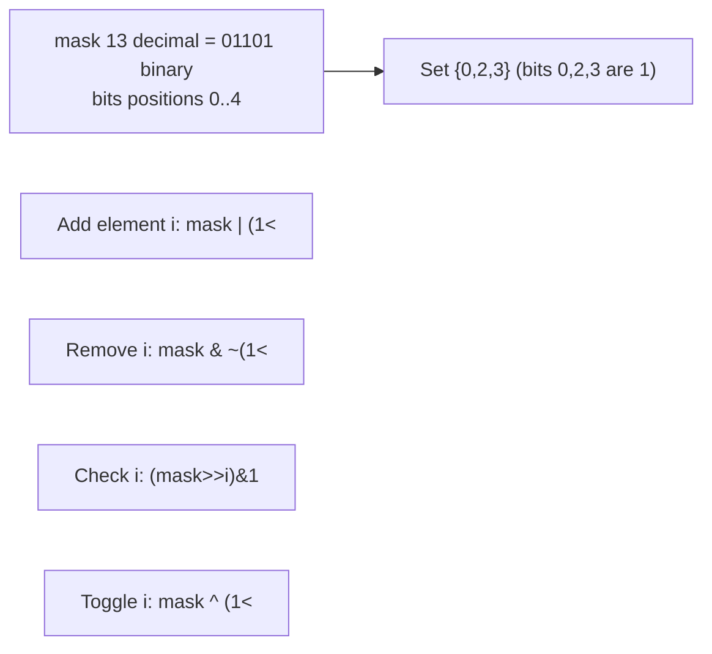
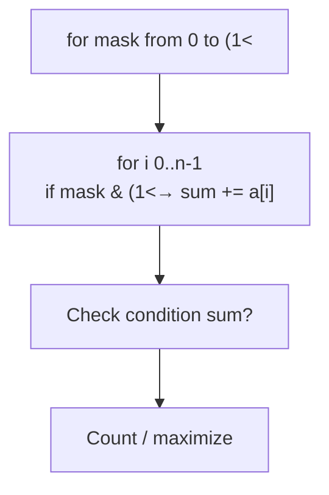
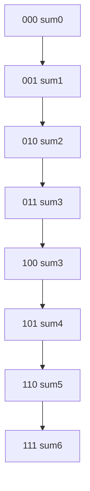

# 비트마스크 - 집합을 정수로 표현

## 왜 배워야 할까?

KOI는 종종 'n ≤ 20'을 가지며 하위 집합에 대해 묻습니다.`2^n` 하위 집합은 비트마스크를 통해 열거될 수 있습니다: `0`에서 `(1<<n)-1`까지의 정수 `마스크`, 여기서 비트 `i` =1은 `i` 요소가 포함됨을 의미합니다.

> 비유: 전등은 `n` 전구의 행을 전환합니다.각 전구 ON/OFF는 조금씩 다릅니다.구성 수 =2^n.어느 전구가 켜져 있는지 확인 = 마스크의 비트 읽기.

무차별 하위 집합, 하위 집합에 대한 DP, TSP 및 최적화에 필수적입니다.

---

## 1. 핵심 개념과 도식

### 설정된 비트


### 하위 집합 열거


서브마스크 열거: `for(sub=mask; ; sub=(sub-1)&mask)`는 마스크의 서브마스크를 반복합니다.

---

## 2. 순차적 데이터 변화 과정

### 예 `a=[1,2,3] n=3` `마스크 0..7` 열거 합계 계산

|마스크(12월) |바이너리(b2b1b0) |하위 집합 요소 |합계 |
|------------|---|----|------|
|0 |000 |{} |0 |
|1 |001 |{1} |1|
|2 |010 |{2} |2|
|3 |011 |{1,2}|3|
|4 |100 |{3}|3|
|5 |101 |{1,3}|4|
|6 |110 |{2,3}|5|
|7 |111 |{1,2,3}|6|

처리 순서는 사전식: 비트 추가에 따른 두 배로 표시됩니다.심상:


### `mask=101 (5)` 바이너리의 서브마스크 열거

서브마스크는 `서브 & 마스크 == 서브`(비트의 하위 집합)인 마스크입니다.`sub=(sub-1)&mask`를 통한 시퀀스:

|반복 |하위 바이너리 |12월 하위 |하위 집합 |
|------------|------------|---------|---------|
|시작 |101|5|{0,2}|
|(5-1)&5 =100&101=100|100|4|{2}|
|(4-1)&5 =011&101=001|001|1|{0}|
|(1-1)&5=000&101=000|000|0|{} 정지|

총 4개의 서브마스크(=2^{popcount(mask)} =2^2=4).효율적인.

### 비트마스크 DP 예: TSP small `n=4` `dist[i][j]`.상태 `dp[mask][last]` = `last`로 끝나는 세트 `mask`를 방문하는 최소 비용.증가하는 마스크를 반복합니다.

LSB 추가가 순서를 나타내는 마스크 진행을 위한 슬라이스: '001,010,011,100,101,110,111'로 열거된 마스크 - 상위 집합 적용 범위를 존중합니다.

---

## 3. 구현

### C++ - 하위 집합 열거, 하위 마스크, TSP DP 비트마스크, 팝카운트 트릭

```cpp
# include <bits/stdc++.h>
using namespace std;

// Count subsets with sum == target (n<=20)
int countSubsets(const vector<int>& a, int target){
    int n=a.size();
    int cnt=0;
    for(int mask=0; mask < (1<<n); ++mask){
        long long sum=0;
        for(int i=0;i<n;i++) if(mask & (1<<i)) sum+=a[i];
        if(sum==target) cnt++;
    }
    return cnt;
}

// Enumerate submasks of mask
vector<int> listSubmasks(int mask){
    vector<int> subs;
    for(int sub=mask; ; sub=(sub-1)&mask){
        subs.push_back(sub);
        if(sub==0) break;
    }
    return subs;
}

// TSP bitmask DP: return min tour cost starting/ending at 0, n<=15
long long tsp(const vector<vector<long long>>& dist){
    int n=dist.size();
    const long long INF=4e15;
    int N=1<<n;
    vector<vector<long long>> dp(N, vector<long long>(n, INF));
    dp[1<<0][0]=0; // start at 0
    for(int mask=0; mask<N; ++mask){
        for(int last=0; last<n; ++last){
            if(!(mask & (1<<last))) continue;
            long long cur=dp[mask][last];
            if(cur==INF) continue;
            for(int nxt=0;nxt<n;nxt++){
                if(mask & (1<<nxt)) continue;
                int nmask=mask | (1<<nxt);
                dp[nmask][nxt]=min(dp[nmask][nxt], cur+dist[last][nxt]);
            }
        }
    }
    long long ans=INF;
    int full=N-1;
    for(int last=1; last<n; ++last){
        ans=min(ans, dp[full][last]+dist[last][0]);
    }
    return ans;
}

int main(){
    ios::sync_with_stdio(false);
    cin.tie(nullptr);
    int n; if(!(cin>>n)) return 0;
    vector<int> a(n); for(int &x:a) cin>>x;
    int target; cin>>target;
    cout<<countSubsets(a,target)<<"\n";
    auto subs=listSubmasks((1<<min(n,4))-1);
    cout<<"submasks count "<<subs.size()<<"\n";
    // TSP demo if matrix given afterwards - omitted
    return 0;
}

```
### Python - 동일한 논리

```python
import sys

def count_subsets(a, target):
    n=len(a)
    cnt=0
    for mask in range(1<<n):
        s=0
        for i in range(n):
            if mask>>i & 1:
                s+=a[i]
        if s==target:
            cnt+=1
    return cnt

def list_submasks(mask):
    subs=[]
    sub=mask
    while True:
        subs.append(sub)
        if sub==0: break
        sub=(sub-1) & mask
    return subs

def tsp(dist):
    n=len(dist)
    INF=10**18
    N=1<<n
    dp=[[INF]*n for _ in range(N)]
    dp[1][0]=0  # start at 0, mask 001
    for mask in range(N):
        for last in range(n):
            if not (mask>>last &1): continue
            cur=dp[mask][last]
            if cur==INF: continue
            for nxt in range(n):
                if mask>>nxt &1: continue
                nmask=mask| (1<<nxt)
                nd=cur+dist[last][nxt]
                if nd < dp[nmask][nxt]:
                    dp[nmask][nxt]=nd
    full=N-1
    ans=INF
    for last in range(1,n):
        ans=min(ans, dp[full][last]+dist[last][0])
    return ans

def solve():
    data=list(map(int, sys.stdin.read().split()))
    if not data: return
    n=data[0]
    a=data[1:1+n]
    target=data[1+n] if len(data)>1+n else 0
    sys.stdout.write(str(count_subsets(a,target))+"\n")
    mask=(1<<min(n,4))-1
    subs=list_submasks(mask)
    sys.stdout.write(f"submasks count {len(subs)}\n")

if __name__=="__main__":
    solve()

```
---

## 4. 복잡도 분석

### 시간복잡도

* **하위 집합 열거 `2^n`**: `마스크 0..(1<<n)-1` → `2^n` 반복을 반복합니다.내부 루프는 `n` 비트를 스캔하여 순진하게 → `O(n·2^n)`을 합산합니다.`n=20`이면 `20·1M=20M` 좋습니다.`n=30`이면 `30·1B=30B`는 불가능합니다.

최적화: DP 반복 증분 사용: `sum[mask]=sum[mask ^ lowbit] + a[idx]` 사전 계산 낮은 비트 -> `O(2^n)` 여전히.종종 우리는 마스크당 모든 비트 `n` -> `O(n2^n)`을 스캔합니다.

* **팝카운트 `k`를 사용하는 고정 마스크의 서브마스크 열거: 서브마스크 수 = `2^k`.`sub=(sub-1)&mask`를 통한 열거는 각각을 정확히 한 번씩 방문 → 총 `O(2^k)`.모든 마스크에 대한 합산: 총 서브마스크 쌍 `(mask, sub)`는 `3^n`입니다(각 요소는 `sub`에 있거나 `mask\sub`에 있거나 마스크에 없을 수 있음) → 모든 마스크에 대해 서브마스크를 반복하는 경우 `O(3^n)`.

* **TSP 비트마스크 DP**: 상태 개수 `N·n = 2^n·n`.상태당 `n` nxt → `O(n²·2^n)`을 시도하도록 전환합니다.`n=15`인 경우 `15²·32768≒7.4M`이 가능합니다.`n=20`의 경우 `400·1M=400M`은 무겁지만 경계선에 있을 수 있습니다.일반적으로 `n ≤ 16`으로 제한됩니다.

|엔 |2^n |n·2^n |TSP O(n²2^n) |실행할 수 있는?|
|---|------|-------|---------------|----------|
|15|32k |50만 |700만 |✅ |
|20|1M |20M|400M|경계선 TLE |
|25|33M|845M|~20B|❌|

증명: `n·2^n`은 초지수적으로 증가합니다. 따라서 하위 집합 열거에 대한 임계값 `n≤20`이 규칙입니다.

### 공간복잡도

* **마스크 정수**: 하나의 `int`(32비트)는 최대 `n=31`을 보유합니다(최대 63에는 64비트 사용).`n>31`의 경우 `long long` 또는 Python int가 필요합니다.
* **하위 집합 합계 열거**: 마스크당 즉시 계산되는 경우 'O(1)' 추가;모든 합계를 저장하려면 `O(2^n)` 배열이 필요합니다 → `n=20`의 경우 1M 정수 4MB.
* **TSP DP 테이블**: `dp[2^n][n]` 항목 → `n·2^n` longs → 메모리 `n·2^n·8` 바이트.`n=15`의 경우: 32768×15×8≒3.9MB.`n=20`의 경우: 1M×20×8≒160MB가 한도를 초과합니다.따라서 DP TSP 테이블의 경우 'n≤16'입니다.
* **서브마스크 목록**: `2^k` 서브마스크 저장 → `O(2^k)` 메모리(저장된 경우);즉시 `O(1)`을 생성합니다.

---

## 5. 직접 풀어보기

**문제 1.** `a=[2,3,5] n=3` 모든 마스크를 나열하고 합계가 5인지 나타냅니다. 마스크는 몇 개입니까?

<details><summary>풀이</summary>
[2,3,5]가 있는 [1,2,3] 아날로그에 대해 위의 표와 같이 마스크됩니다.
5가 아닌 0:0 {}
1:2 {2} 아님
2:3 {3} 아님
3:5 {2,3} → **예**(마스크 011)
4:5 {5} → **예** (100)
5:7 {2,5} 아님
6:8 {3,5} 아님
7:10 {2,3,5} 아님
결과 2 하위 집합: 마스크 3과 4. 개수 2.
</details>

**문제 2.** `mask=1100`(바이너리 12)의 서브마스크를 열거합니다.4개의 서브마스크를 모두 나열하고 포함 속성을 확인합니다.

<details><summary>풀이</summary>
마스크=1100 popcount2 → 서브마스크 4개:
1100 (12) {2,3}
1000 (8) {3}
0100 (4) {2}
0000 (0) {}
`(sub-1)&mask`를 통한 생성: 12→8→4→0 정확합니다.각각을 확인하십시오. 마스크에 비트가 있는 하위 비트만 확인하십시오.0100+와 같은 서브마스크가 누락되었나요?비트가 제한되어 있기 때문에 불가능합니다.
</details>

---

## 6. KOI 적용

- **BOJ 1182 부분수열의 합, 1208 부분수열의 합 2**: 중간 분할 n=40을 20+20 → 2^{20}+2^{20} 기술로 분할한 하위 집합 열거는 비트마스크 계산을 기반으로 합니다.
- **BOJ 16932 모양 만들기 관련 없음;11723 집합**: 정수 비트 연산(`1<<x`)을 통해 직접 비트마스크가 설정되었습니다.
- **BOJ 10971 외판원 순회 2, 13164?**: TSP DP 클래식 비트마스크 DP: `dp[mask][i]` 상태 최소 비용.
- **BOJ 14889 스타트와 링크, 14890?**: 마스크 대 보완을 사용한 파티션 열거.
- **시간 임계값**: 문이 `n ≤ 20`이라고 말하면 → `O(2^n)`을 고려합니다.`n ≤ 34`인 경우 중간에 만나는 `O(2^{n/2})`을 고려하세요.`n ≤ 15`인 경우 TSP DP는 힌트입니다.비트마스크 크기는 즉시 알려줍니다.