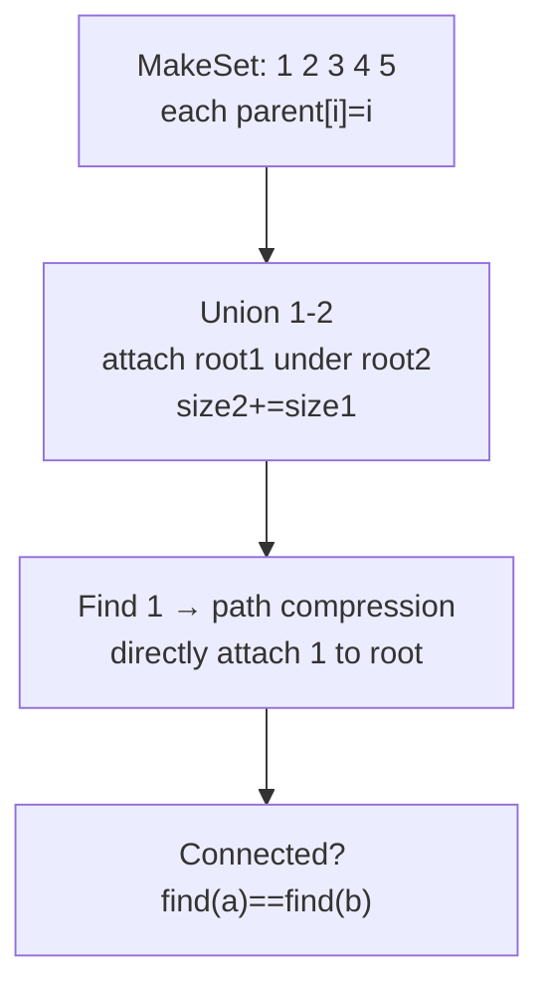
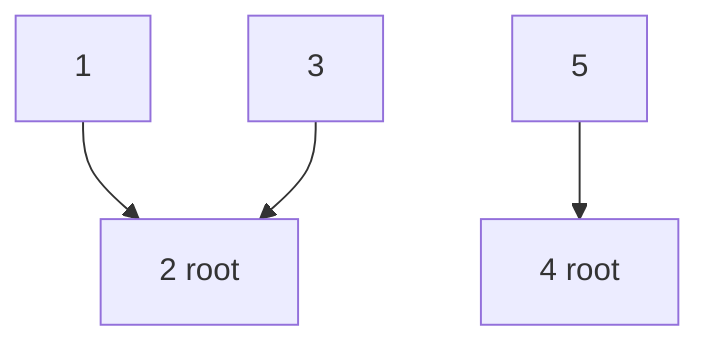
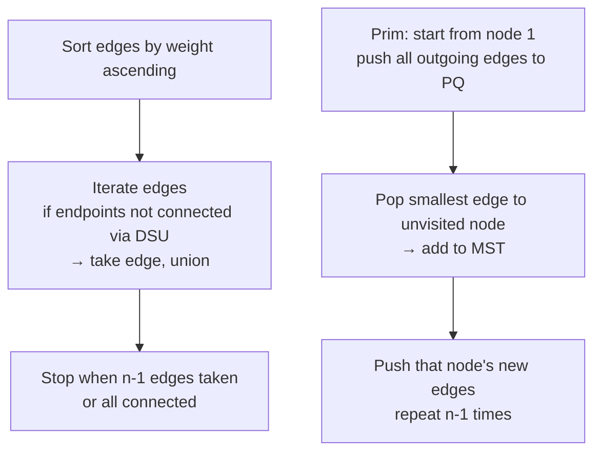
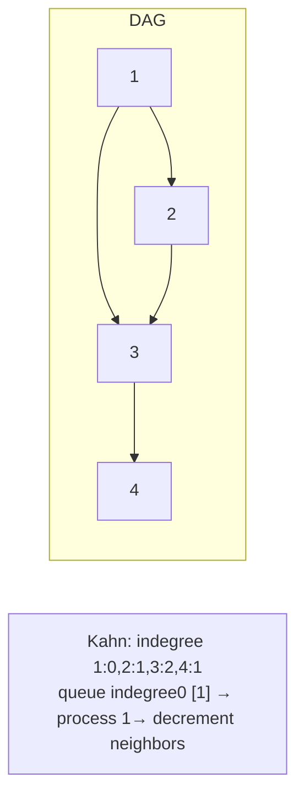
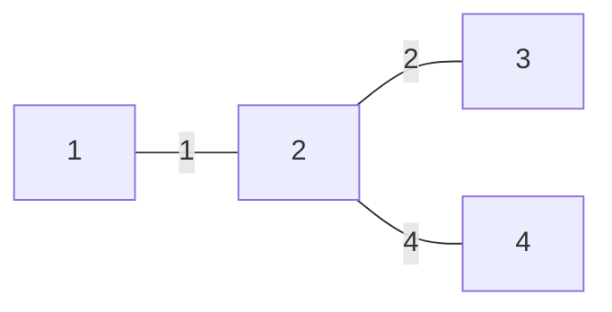

# 유니온 파인드, MST, 위상 정렬 - 그래프 연결과 순서

## 왜 배워야 할까?

그래프에는 연결 답변("당신과 v가 연결되어 있습니까?"), 가장 저렴한 연결("모든 도시를 연결하는 데 필요한 최소 비용") 및 제약 조건에 따른 주문("과정 전제 조건")이 필요합니다.

> 비유: Union-Find = 팀 멤버쉽 관리자.처음에는 모두 혼자입니다.`union(a,b)`는 팀을 병합합니다.'find(x)'는 팀 주장에게 말합니다.MST = 자전거 없이 모든 도시를 연결하는 가장 저렴한 도로 네트워크를 구축합니다.토폴로지 정렬 = 작업 스케줄링: 게임에서 레벨 잠금 해제와 같은 전제 조건을 먼저 수행합니다.

KOI 중간 그래프 문제는 이 세 가지와 Dijkstra 중 하나가 70%입니다.

---

## 1. 핵심 개념과 도식

### 경로 압축 + 크기별 Union을 사용한 Union-Find(Disjoint Set Union - DSU)




### MST: Kruskal(에지 정렬 + DSU) 대 Prim(우선순위 대기열 증가)


### 토폴로지 정렬 - Kahn BFS(차수) 및 DFS


Indegrees: `[1:0, 2:1, 3:2, 4:1]` → 순서 `1,2,3,4`(다른 유효한 순서가 있음).

---

## 2. 순차적 데이터 변화 과정

### DSU 예: `n=5`에 대한 연산: 공용체 1-2, 3-4, 2-3, find(1), find(5)

`parent[]` 및 `size[]`(크기별 결합, 경로 압축)를 추적합니다.

|단계 |운영 |부모[1..5] 이전 |뿌리의 크기 |변경 |이후 부모 |결과 찾기 |
|------|-------------|---------|---------------|---------|---------------|-------------|
|0 |초기화 |`[1,2,3,4,5]` |`[1,1,1,1,1]` |— |`[1,2,3,4,5]` |— |
|1 |노동조합 1-2 |`[1,2,3,4,5]` |사이즈 1,1 → 1→2 부착 |상위1=2 크기2=2 |`[2,2,3,4,5]` |— |
|2 |유니온3-4 |`[2,2,3,4,5]` |사이즈 1,1 → 3→4 |parent3=4 size4=2 |`[2,2,4,4,5]` |— |
|3 |Union2-3 |뿌리 찾기: find1→2, find3→4 뿌리 2와 4 크기2 각각 → ​​2→4 부착 |크기4=4 |부모2=4 |`[2,4,4,4,5]` 그러나 참고 1은 아직 4가 아닌 2를 가리킵니다 |
|4 |찾기(1) |경로 `1→2→4` |압축: parent1=4, parent2=4 |`[4,4,4,4,5]` |루트=4 |
|5 |찾기(5) |혼자 5 |루트 5 |`[4,4,4,4,5]` |root=5(1에 연결되지 않음) |

압축 후 `parent[1]`은 루트 `4`에 직접 연결됩니다. 미래에는 거의 O(1)에 가까운 `O(α(n))`을 찾습니다.

### Kruskal MST 추적: `n=4` 가장자리: `1-2:1, 1-3:3, 2-3:2, 2-4:4, 3-4:5`

정렬됨: (1,2,1)=>, (2,3,2), (1,3,3), (2,4,4), (3,4,5)

|단계 |가장자리(u,v,w) |찾기(u)==찾기(v)?|가져가다?|이후 DSU |MST 합계 |
|------|---------------|------|-------|------------|------------|
|0|정렬 완료|—|—|—|0|
|1|1-2 (1)|1→1,2→2 diff|예 Union1-2|comp{1,2}|1|
|2|2-3 (2)|find2→1, find3→3 diff|yes 합집합(1,2와 3) → root1-3?크기에 따라 |comp{1,2,3}|3|
|3|1-3 (3)|둘 다 루트 1(동일)|아니요(주기)|동일|3|
|4|2-4 (4)|find2→1, find4→4 diff|예 조합|모두 연결됨 {1,2,3,4}|7|
|5|3-4 (5)|건너뛰기는 모서리 3개만 필요함|아니요|—|7|

결과 MST 가장자리: '1-2, 2-3, 2-4' 총 가중치 '7' 최소.


### DAG `1→2, 1→3, 2→3, 3→4`에 대한 위상 정렬 칸 추적

초기 내차수: `[1:0,2:1,3:2,4:1]` 대기열 `[1]`

|단계 |팝 |출력 추가 |이웃 감소 |새로운 학위 |푸시 후 큐 |
|------|-----|---------------|----------|---------------|------|
|0|—|[]|—|[0,1,2,1]|[1]|
|1|1|[1]|2→0, 3→1|[0,0,1,1]|[2]|
|2|2|[1,2]|3→0|[0,0,0,1]|[3]|
|3|3|[1,2,3]|4→0|[0,0,0,0]|[4]|
|4|4|[1,2,3,4]|—|[0,0,0,0]|[] 완료|

유효한 주문: `[1,2,3,4]`.어떤 지점에서 대기열이 비어 있지만 처리된 < n이면 주기가 존재합니다.

---

## 3. 구현

### C++ - DSU, 크루스칼, 칸

```cpp
# include <bits/stdc++.h>
using namespace std;

// DSU
struct DSU {
    vector<int> p, sz;
    DSU(int n=0){init(n);}
    void init(int n){
        p.resize(n+1); sz.assign(n+1,1);
        iota(p.begin(), p.end(), 0);
    }
    int find(int x){
        if(p[x]==x) return x;
        return p[x]=find(p[x]); // path compression
    }
    bool unite(int a,int b){
        a=find(a); b=find(b);
        if(a==b) return false;
        if(sz[a]<sz[b]) swap(a,b);
        p[b]=a; sz[a]+=sz[b];
        return true;
    }
    bool same(int a,int b){return find(a)==find(b);}
};

// Kruskal MST: returns total weight, -1 if disconnected
long long kruskal(int n, vector<array<int,3>>& edges){
    sort(edges.begin(), edges.end(), [](auto &a, auto &b){return a[2]<b[2];});
    DSU dsu(n);
    long long total=0;
    int taken=0;
    for(auto &e: edges){
        int u=e[0], v=e[1], w=e[2];
        if(dsu.unite(u,v)){
            total+=w;
            if(++taken==n-1) break;
        }
    }
    if(taken!=n-1) return -1;
    return total;
}

// Topological sort Kahn: returns order, empty if cycle
vector<int> topoSort(int n, const vector<vector<int>>& adj){
    vector<int> indeg(n+1,0);
    for(int u=1;u<=n;u++) for(int v: adj[u]) indeg[v]++;
    queue<int> q;
    for(int i=1;i<=n;i++) if(indeg[i]==0) q.push(i);
    vector<int> order;
    while(!q.empty()){
        int u=q.front(); q.pop();
        order.push_back(u);
        for(int v: adj[u]){
            if(--indeg[v]==0) q.push(v);
        }
    }
    if((int)order.size()!=n) return {}; // cycle
    return order;
}

int main(){
    ios::sync_with_stdio(false);
    cin.tie(nullptr);
    int n,m; if(!(cin>>n>>m)) return 0;
    vector<array<int,3>> edges;
    vector<vector<int>> adj(n+1);
    for(int i=0;i<m;i++){
        int u,v,w; cin>>u>>v>>w;
        edges.push_back({u,v,w});
        adj[u].push_back(v); // for topo treat w as extra, but example uses directed
    }
    // For MST, use undirected edges; for topo, adjacency as built
    // Demo outputs:
    cout<<"MST "<<kruskal(n, edges)<<"\n";
    auto order=topoSort(n, adj);
    if(order.empty()) cout<<"CYCLE\n";
    else{ for(int x: order) cout<<x<<' '; cout<<"\n";}
    return 0;
}

```
### Python - 동일한 논리

```python
import sys
from collections import deque

class DSU:
    def __init__(self,n):
        self.p=list(range(n+1))
        self.sz=[1]*(n+1)
    def find(self,x):
        if self.p[x]!=x:
            self.p[x]=self.find(self.p[x])
        return self.p[x]
    def unite(self,a,b):
        a=self.find(a); b=self.find(b)
        if a==b:
            return False
        if self.sz[a]<self.sz[b]:
            a,b=b,a
        self.p[b]=a
        self.sz[a]+=self.sz[b]
        return True

def kruskal(n, edges):
    edges=sorted(edges, key=lambda e:e[2])
    dsu=DSU(n)
    total=0; taken=0
    for u,v,w in edges:
        if dsu.unite(u,v):
            total+=w; taken+=1
            if taken==n-1: break
    return -1 if taken!=n-1 else total

def topo_sort(n, adj):
    indeg=[0]*(n+1)
    for u in range(1,n+1):
        for v in adj[u]:
            indeg[v]+=1
    q=deque([i for i in range(1,n+1) if indeg[i]==0])
    order=[]
    while q:
        u=q.popleft()
        order.append(u)
        for v in adj[u]:
            indeg[v]-=1
            if indeg[v]==0:
                q.append(v)
    if len(order)!=n:
        return None
    return order

def solve():
    data=sys.stdin.read().strip().split()
    if not data: return
    it=iter(data)
    n=int(next(it)); m=int(next(it))
    edges=[]; adj=[[] for _ in range(n+1)]
    for _ in range(m):
        try:
            u=int(next(it)); v=int(next(it)); w=int(next(it))
        except: break
        edges.append((u,v,w))
        adj[u].append(v)
    sys.stdout.write(f"MST {kruskal(n, edges)}\n")
    order=topo_sort(n, adj)
    if order is None:
        sys.stdout.write("CYCLE\n")
    else:
        sys.stdout.write(" ".join(map(str, order))+"\n")

if __name__=="__main__":
    solve()

```
---

## 4. 복잡도 분석

### 시간복잡도

**DSU 작업** 크기/순위별 통합 + 경로 압축:

`find`/`unite` 당 상각 시간은 Ackermann의 역 `α(n)` → 우주 내의 모든 `n`에 대해 <5입니다(효과적으로 **O(1)**).

증명 스케치: 순위 기반 분석은 'n' 요소에 대한 'm' 작업의 총 시간이 'O(m α(n))'임을 보여줍니다.KOI의 경우 `n=200k, m=200k` → ~ `200k*5 =1M` → 무시할 수 있습니다.

**크루스칼 MST**:

단계:
1. 모서리 정렬: `O(m log m)` 여기서 `m` = 모서리 수입니다.
2. 각 에지에 대한 DSU 연산: `O(mα(n))`.

전체=`O(m log m)`가 우세하다.`n=10k, m=100k`의 경우 → ~100k*17 1.7M 비교 정렬 → 괜찮습니다.조밀한 `m=n²` 정렬의 경우에는 정렬이 지배적입니다.

PQ를 사용한 **Prim** 대안: 바이너리 힙이 있는 `O((n+m) log n)`.희박한 경우 Kruskal을 사용하고 밀도가 높은 경우 Prim을 사용합니다.

**위상 정렬(칸)**:

* 차수 계산: 각 모서리를 한 번 방문 → `O(n+m)`.
* 큐 처리: 각 노드는 `O(n)` 한 번 큐에서 제거되고, 소스가 `O(m)`을 팝할 때 각 에지는 한 번 완화됩니다.
* 총 `O(n+m)` 선형.

`order.size()!=n`을 통한 주기 감지.DFS 변형도 'O(n+m)'입니다.

### 공간복잡도

* **DSU**: `p` 크기 `n+1`, `sz` 크기 `n+1` → `2·(n+1)` 정수 → `O(n)` 보조 배열.모서리 저장 `O(m)`.
* **Kruskal**: 가장자리 `O(m)` + DSU `O(n)` → `O(n+m)`을 저장합니다.
* **위상 정렬**: `adj` 목록 `O(n+m)`, `indeg` 배열 `O(n)`, `queue` 최대 `O(n)` → `O(n+m)` 총계.

`n=200k, m=500k`의 경우 에지 메모리 ~500k×3 ints≒6MB + 인접 유사 → 512MB 이내.

---

## 5. 직접 풀어보기

**문제 1.** `n=6` 조합: (1-2),(3-4),(2-3).그러면 어떤 노드가 1에 연결됩니까?압축 후 `find(1)` 경로 길이는 얼마입니까?

<details><summary>풀이</summary>
결합 후: 구성요소 {1,2,3,4}가 1-2-3-4 체인을 통해 연결되었습니다.Union2-3 다음 노드 1의 루트는 병합된 구성 요소의 루트입니다(크기 타이 브레이킹에 따라 다름).루트 2가 4 아래로 병합된 다음 1→2→4를 연결한다고 가정합니다.find(1)은 1→2→4(2단계)를 순회한 다음 1→4를 직접 압축하고 future는 O(1)을 찾습니다.1에 연결된 노드: {1,2,3,4}.{5,6}이 아닙니다.연결된 검사 `same(1,3)`은 true를 반환합니다.
</details>

**문제 2.** DAG 가장자리 '1→3, 2→3, 3→4' - 유효한 모든 위상 순서를 나열하고 Kahn이 하나의 특정 순서를 출력할 수 있는 이유를 설명합니다.

<details><summary>풀이</summary>
유효한 주문은 1과 2 뒤에 '3'을 배치하고 3 뒤에는 4를 배치해야 합니다. 따라서 주문은 [1,2,3,4] 및 [2,1,3,4]입니다.대기열 삽입 순서 [1,2]를 사용하는 Kahn은 처음에 1을 먼저 선택합니다(FIFO) → [1,2,3,4].스택을 사용했거나 다른 대기열 순서를 사용했다면 [2,1,3,4]를 얻을 수 있습니다.둘 다 유효합니다.요구 사항은 고유성이 아닌 부분적인 주문 만족일 뿐입니다.사이클 확인: 에지 `4→1`을 추가하면 indegree가 0으로 시작하지 않습니다(아마도 제외). 실제로 1은 indeg1 → 노드 indeg0 없음 → 사이클이 감지되지 않습니다.
</details>

---

## 6. KOI 적용

- **BOJ 1717 집합의 표현, 1976 여행 가자, 2606 바이러스, 1043 거짓말**: Pure DSU 연결성.200k 공용체에서 TLE와 AC 경계의 경우 경로 압축이 **필수**입니다.
- **BOJ 1922 네트워크 연결, 1197 최소 스패닝 트리, 1647 도시 분할 계획**: Kruskal 교과서.무게별로 정렬하는 것을 잊지 마세요.시계 1-인덱스.도시 구분에는 MST 구축 후 'MST 총계 - 최대 가장자리'가 필요합니다.
- **BOJ 1005 ACM Craft, 1766 문제집, 1948 청년경로, 3665 최종 순위**: Kahn topological sort core.문제 세트는 사전순으로 가장 작은 순서(1766)에 대해 우선순위 대기열 변형을 사용합니다.주기 감지 -> -1/인쇄 불가능을 기억하세요.
- **BOJ 4386 해, 6497 전력 만들기난**: 유클리드 거리 모서리가 있는 MST(거리를 통해 모든 'n²' 모서리를 생성하는 것은 무거울 수 있습니다. 정렬 트릭을 사용하세요).
- **패턴**: 문에 "최소 비용으로 모두 연결, 방향 지정 없음"이라고 표시된 경우 → MST Kruskal/Prim."병합 후 x와 y가 연결되어 있습니까?" → DSU."전제조건이라면/ 순서 / 종속성 / DAG" → 토폴로지 정렬. 하이브리드 문제가 많습니다(예: MST 다음 topo).