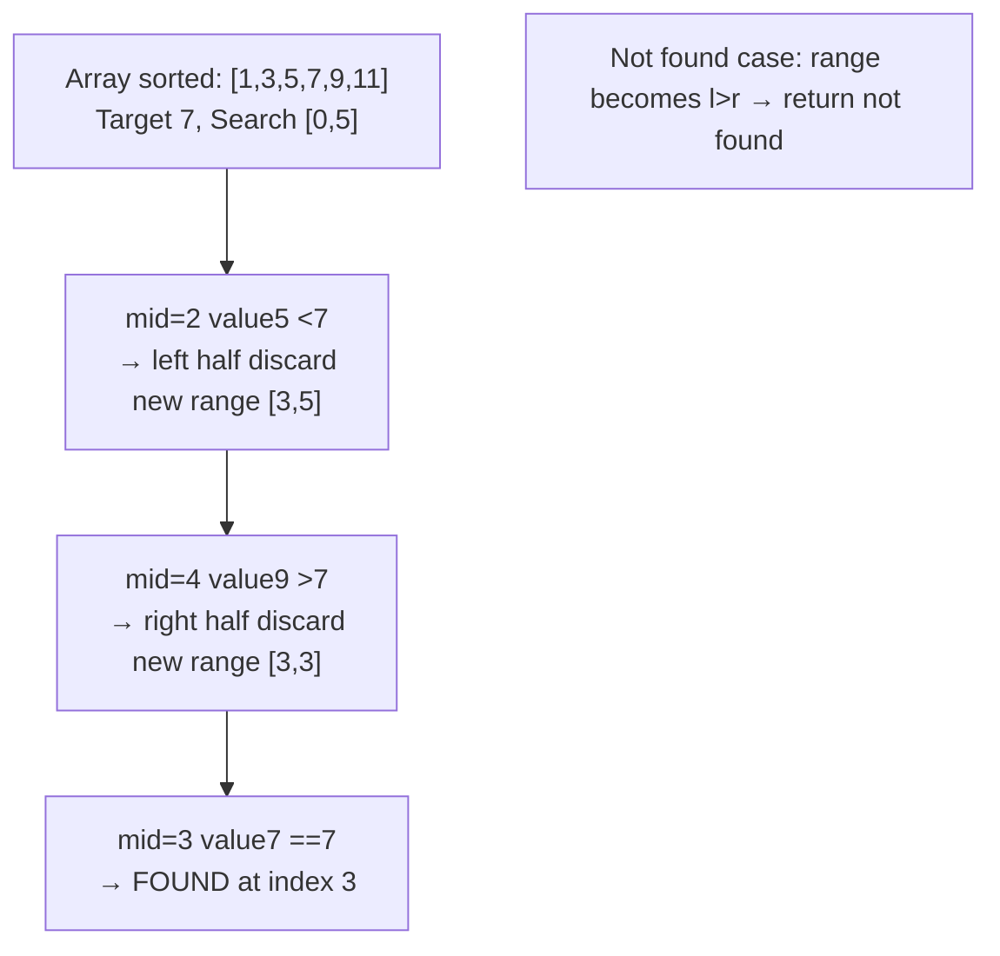
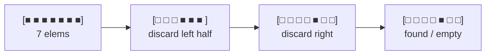

# 이분 탐색과 투 포인터 - 빠르게 찾고 한 번에 스캔

## 왜 배워야 할까?

정렬된 배열은 **로그** 검색을 잠금 해제합니다.두 개의 포인터를 사용하면 배열을 두 번이 아닌 **한 번** 스캔할 수 있습니다.그들은 함께 O(n²) 무차별 대입을 O(n log n) 또는 O(n)(n=200,000일 때 TLE와 AC의 차이)로 바꿉니다.

> 비유: "KOI 가이드"에 대한 정렬된 책장 검색.중간 책을 엽니다. 제목 < 대상인 경우 왼쪽 절반을 무시하고 그렇지 않으면 오른쪽 절반을 무시합니다.각 단계마다 책의 절반이 버려집니다.두 개의 포인터 = 두 명의 사서가 반대쪽 끝에서 시작하여 쌍을 확인하면서 서로를 향해 걸어갑니다.

KOI는 다음을 자주 묻습니다: "존재하는 경우 찾기", "조건을 만족하는 가장 낮은 값", "쌍 합계가 X와 같음", "하위 배열 개수"는 모두 이진 검색/두 개의 포인터입니다.

---

## 1. 핵심 개념과 도식

### 이진 검색 - 매번 반으로 줄임



```mermaid
xychart-beta
    title "Search steps vs n"
    x-axis ["n=10", "n=1k", "n=1M", "n=1B"]
    y-axis "steps" 0 --> 35
    line [4, 10, 20, 30]

````
2^30 ≒ 10억`이기 때문에 10억 단위 검색에는 30단계 → O(log n)만 필요합니다.

### 두 개의 포인터

```mermaid
flowchart TD
    P1["Sorted a=[1,2,4,6,9]<br/>target sum=10<br/>l=0 (1) r=4 (9)"]
    P1 --> P2["sum=10 == target → found (1,9)"]
    Q1["a=[1,2,4,6,9] target 8<br/>l=0(1) r=4(9) sum10 >8 → r--"]
    Q1 --> Q2["l0(1) r3(6) sum7 <8 → l++"]
    Q2 --> Q3["l1(2) r3(6) sum8 ==8 → found"]

```
유형: **반대쪽 끝**(쌍 합계, 컨테이너 물) 및 **같은 방향/슬라이딩 윈도우**(하위 배열 합계).

---

## 2. 순차적 데이터 변화 과정

### 이진 검색 단계별: `[1,2,5,7,9,11,14]`에서 `x=7` 찾기(색인 0..6)

|단계 |`엘` |`r` |`중간=(l+r)/2` |`a[중간]` |7과 비교 |새로운 범위 |범위 크기 |
|------|-------|------|---------------|----------|---------------|------------|------------|
|0 |0 |6 |3 |7 |== → 발견됨 |— |7 |
|*타겟 9인 경우* |0 |6 |3 |7 |7 < 9 → 오른쪽으로 |[4,6] |3 |
|1 |4 |6 |5 |11 |11 > 9 → 왼쪽 |[4,4] |1 |
|2 |4 |4 |4 |9 |== → 발견됨 |— |1 |

**찾을 수 없는 예** `x=8`:

|단계 |내가 |r |중반 |a[중간] |액션 |새로운 [l,r] |
|------|---|---|------|---------|---------|----------|
|0 |0|6|3|7|7<8 → l=4|[4,6]|
|1 |4|6|5|11|11>8 → r=4|[4,4]|
|2 |4|4|4|9|9>8 → r=3|[4,3]|
|3 |4|3|—|—|l>r → **찾을 수 없음**, 삽입 위치 = l (=4)|

간격 축소 시각화: 너비 진행 `7 → 3 → 1 → 0`(매번 절반으로 줄임, 바닥).


### 두 포인터 - 단계별로 정렬된 `[1,2,4,6,8,9]` 쌍 합계 =10

|단계 |`l`(값) |`r`(값) |합계 `a[l]+a[r]` |액션 |
|------|-------------|-------------|----|-------|
|1 |0 (1) |5 (9) |10 |==10 → 성공 쌍 (1,9) |
|*변형 대상 12* |0(1) |5(9)|10<12 → l++|l=1|
|2 |1(2)|5(9)|11<12 → l++|l=2|
|3 |2(4)|5(9)|13>12 → r--|r=4|
|4 |2(4)|4(8)|12== → 성공 (4,8)|—|

각 포인터가 안쪽으로만 **단조롭게** 이동한다는 점에 유의하세요. 각 인덱스는 최대 한 번 방문 → 총 단계 `O(n)`.재검토하는 대조 무차별 이중 루프: O(n²).

---

## 3. 구현

### C++ - 이진 검색(수동 + STL) 및 두 개의 포인터

```cpp
# include <bits/stdc++.h>
using namespace std;

// 1. Binary search: returns index if found, else -1. Requires sorted array.
int binarySearch(const vector<int>& a, int target) {
    int l = 0, r = (int)a.size() - 1;
    while (l <= r) {
        int mid = l + (r - l) / 2; // avoid overflow vs (l+r)/2
        if (a[mid] == target) return mid;
        if (a[mid] < target) l = mid + 1;
        else r = mid - 1;
    }
    return -1; // not found
}

// Lower bound: first index with a[idx] >= target (KOI staple for "first satisfiable")
int lowerBound(const vector<int>& a, int target) {
    int l = 0, r = (int)a.size(); // [l, r) half-open
    while (l < r) {
        int mid = l + (r - l) / 2;
        if (a[mid] < target) l = mid + 1;
        else r = mid;
    }
    return l; // may be a.size() meaning all < target
}

// 2. Two pointers: count pairs with sum == target in sorted array. Two pointers O(n)
long long countPairs(vector<int> a, int target) {
    sort(a.begin(), a.end());
    int l = 0, r = (int)a.size() - 1;
    long long cnt = 0;
    while (l < r) {
        long long sum = (long long)a[l] + a[r];
        if (sum == target) { cnt++; l++; r--; } // careful with duplicates: need extension
        else if (sum < target) l++;
        else r--;
    }
    return cnt;
}

// 3. Parametric / decision binary search example: BOJ 2805 cutting wood
//    Can we get wood >= M when cutting height = h?
bool canCut(const vector<int>& trees, int h, long long need) {
    long long got = 0;
    for (int t : trees) if (t > h) got += (t - h);
    return got >= need;
}
int maxCutHeight(vector<int>& trees, long long need) {
    int l = 0, r = *max_element(trees.begin(), trees.end());
    int ans = 0;
    while (l <= r) {
        int mid = l + (r - l) / 2;
        if (canCut(trees, mid, need)) { ans = mid; l = mid + 1; } // feasible → try higher
        else r = mid - 1;
    }
    return ans;
}

int main() {
    ios::sync_with_stdio(false);
    cin.tie(nullptr);
    int n; cin >> n;
    vector<int> a(n);
    for (int &x : a) cin >> x;
    sort(a.begin(), a.end());
    int q; cin >> q; // queries
    while (q--) {
        int x; cin >> x;
        cout << binarySearch(a, x) << ' ' << lowerBound(a, x) << "\n";
    }
    return 0;
}

```
### Python - 동일한 논리

```python
import sys

def binary_search(a, target):
    l, r = 0, len(a) - 1
    while l <= r:
        mid = (l + r) // 2
        if a[mid] == target:
            return mid
        if a[mid] < target:
            l = mid + 1
        else:
            r = mid - 1
    return -1

def lower_bound(a, target):
    l, r = 0, len(a)
    while l < r:
        mid = (l + r) // 2
        if a[mid] < target:
            l = mid + 1
        else:
            r = mid
    return l

def count_pairs_sorted(a, target):
    a = sorted(a)
    l, r = 0, len(a) - 1
    cnt = 0
    while l < r:
        s = a[l] + a[r]
        if s == target:
            cnt += 1
            l += 1
            r -= 1
        elif s < target:
            l += 1
        else:
            r -= 1
    return cnt

def can_cut(trees, h, need):
    got = sum((t - h) for t in trees if t > h)
    return got >= need

def max_cut_height(trees, need):
    l, r = 0, max(trees) if trees else 0
    ans = 0
    while l <= r:
        mid = (l + r) // 2
        if can_cut(trees, mid, need):
            ans = mid
            l = mid + 1
        else:
            r = mid - 1
    return ans

def solve():
    data = sys.stdin.read().strip().split()
    if not data:
        return
    it = iter(data)
    n = int(next(it))
    a = [int(next(it)) for _ in range(n)]
    a.sort()
    # example: read queries if present
    remaining = list(it)
    if remaining:
        q = int(remaining[0])
        for i in range(1, min(q, len(remaining)-1)+1):
            x = int(remaining[i])
            sys.stdout.write(f"{binary_search(a,x)} {lower_bound(a,x)}\n")
    else:
        # demo pair count
        sys.stdout.write(str(count_pairs_sorted(a, 10)) + "\n")

if __name__ == "__main__":
    solve()

```
---

## 4. 복잡도 분석

### 시간복잡도

**이진 검색**: 각 반복은 범위를 절반으로 줄입니다: `n → n/2 → n/4 → ... → 1`.반감 단계 수 = `⌈log₂(n+1)⌉`.각 단계는 O(1)입니다.따라서 `T(n) = T(n/2) + O(1)` → 마스터 정리 또는 풀기:

```
T(n) = T(n/2) + c
     = T(n/4) + c + c
     = ... 
     = T(1) + c*log₂n = O(log n)

```
증명: `k` 단계 이후에는 범위 크기 ≤ `n/2^k`입니다.`n/2^k <1` → `2^k > n` → `k > log2n`을 원합니다.

구체적: `n=1,000,000` → 1M 선형 스캔에 비해 단 20개의 비교 → **50,000배 더 빠름**.

**파라메트릭 검색(최적화)**: 결정 문제 `can(mid)`는 `O(n)`扫描을 실행합니다.이진 탐색은 `O(log range)`번 →`O(n log Max)`를 실행합니다.최대 높이 `1e9`까지의 트리의 경우 `log ≒ 31` → `O(31n)`은 `n=1e6`에 대해 여전히 가능합니다.

**두 개의 포인터(쌍 합계)**: 각 포인터는 안쪽으로만 이동하며 최대 `n`은 각각 이동 → 총 `O(n)`.정렬 전제 조건은 `O(n log n)`이 지배적입니다.

|알고리즘 |n=200k에 대한 단계 |1초 맞나요?|
|------------|----|-------------|
|무차별 대입 쌍 `O(n²)` |400억 작전 |❌ 티레 |
|`O(n log n)` + 두 포인터 `O(n)` 정렬 |200k·18 ≒ 3.6M |✅ |

### 공간복잡도

* **이진 검색 매뉴얼**: 인덱스 `l,r,mid`만 → `O(1)` 보조(입력 배열 `O(n)`은 계산되지 않음).재귀 변형은 `O(log n)` 스택 깊이이지만 반복은 `O(1)`입니다.
* **두 개의 포인터**: 두 개의 인덱스 + 어쩌면 정렬된 복사본 → `O(1)` 인덱스 + 내부 정렬인 경우 `O(n)`(내부 정렬은 stdlib의 퀵 정렬을 위해 `O(log n)` 스택이 필요하지만 `O(log n)` 보조로 처리됩니다. 많은 분석에서는 입력 외에 추가로 `O(1)`을 명시합니다).
* **결정 배열**: `trees` 배열은 저장하기에 `O(n)`이므로 피할 수 없습니다.

따라서 둘 다 **메모리 효율적**입니다. KOI 메모리 제한이 512MB인 경우 매우 중요합니다.`n=500k` 정수에도 2MB만 필요합니다.

---

## 5. 직접 풀어보기

**문제 1.** `a=[2,4,7,9,12]`를 정렬하고 `x=9` 및 `x=3`에 대한 이진 검색을 추적합니다(찾을 수 없음).각 단계마다 `(l,r,mid)`를 지정합니다.

<details><summary>풀이</summary>
x=9: [0,4] mid2→7<9 → [3,4] mid3→9==9 2단계의 3에서 찾았습니다.<br>
x=3: [0,4] mid2→7>3 → [0,1] mid0→2<3 → [1,1] mid1→4>3 → [1,0] 비어 있음 → 찾을 수 없습니다.lower_bound는 l=1을 반환합니다(처음 ≥3은 idx1에서 4입니다).삽입 위치가 정확합니다.
</details>

**문제 2.** `a=[1,2,3,7,8]`로 정렬되었으며 두 개의 포인터를 사용하여 합이 9가 되는 쌍 - 단계를 열거하고 계산합니다.

<details><summary>풀이</summary>
l0=1 r4=8 sum9 → 발견됨(1,8) → l1 r3;l1=2 r3=7 sum9 → 발견(2,7) → l2 r2 정지.2번째. 무차별 대입 공격으로 10쌍을 확인합니다.두 개의 포인터는 3개의 합계 평가만 확인합니다.단계는 단조로운 진행을 보여줍니다. 실패한 합계는 한쪽을 영구적으로 폐기합니다. 정확성이 입증됩니다.
</details>

---

## 6. KOI 적용

- **BOJ 1920 수 찾기, 10815 숫자 카드, 7795 처리**: 직선 이진 검색 / 두 포인터 존재 확인.
- **BOJ 2805 나무 자르기, 2110 공유기 설치, 1300 K번째 수**: 매개변수/결정 이진 검색: "조건을 만족하는 최소 실현 가능 값은 무엇입니까?"- KOI 고주파 패턴: 타당성 단조적('높이 h가 작동하면 더 작은 h도 작동함').
- **BOJ 2470 두 차례, 2467, 2003 수들의 합 2**: '0에 가장 가까운 합' 또는 하위 배열 개수에 대한 정렬된 배열의 고전적인 2포인터입니다.`O(n log n)` 정렬 + `O(n)` 스캔이 `O(n²)`보다 뛰어납니다.
- **BOJ 2473 세입자** (중급+): 3개 포인터 + 이진 검색으로 확장합니다.
- **피해야 할 실수**: **정렬되지 않은** 배열에 대해 이진 검색 호출 → 자동 오답.항상 `sort()`를 먼저 실행하세요.또한 `[l,r]` 대 `[l,r)`에서 하나씩 벗어났습니다. 제출하기 전에 `lower_bound` 샘플 `[1,1,2,2]`로 테스트하세요.