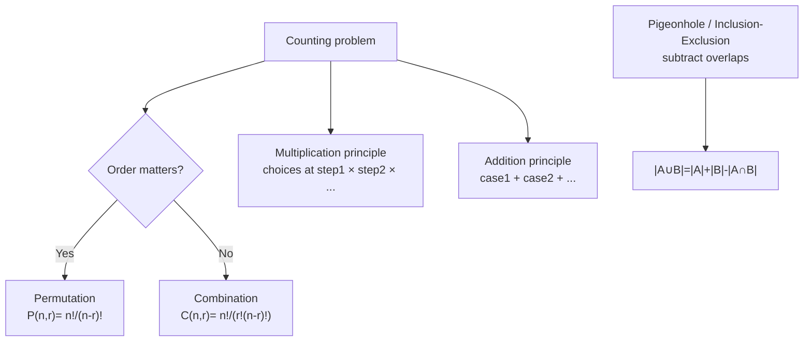
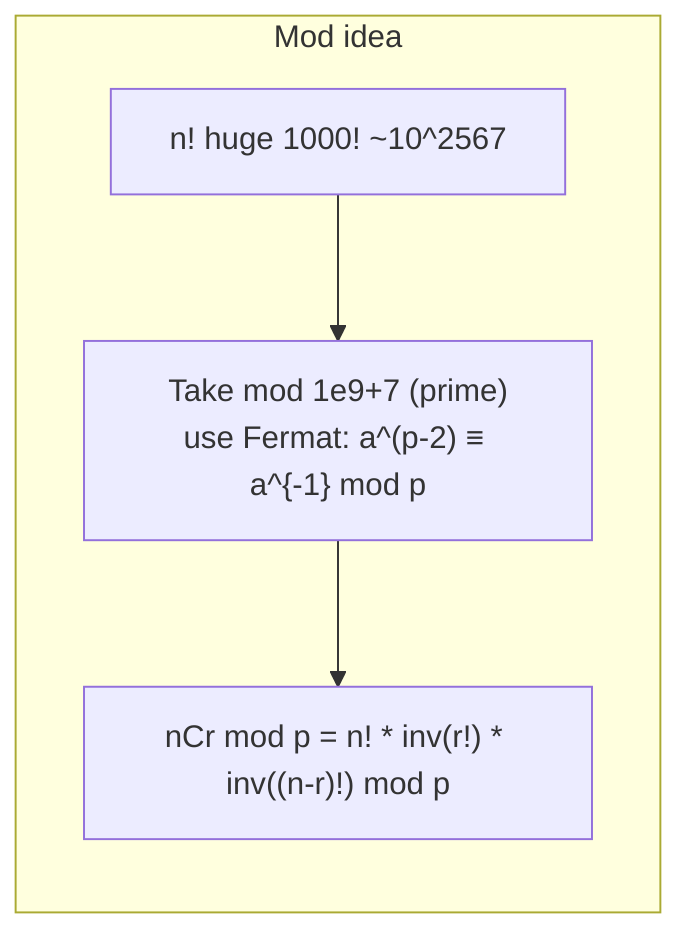

# 조합론과 모듈러 연산 - 세고 나누어 계산

## 왜 배워야 할까?

KOI는 "방법 수", "순열 수", "nCr 모듈로 1e9+7 계산"을 묻습니다.조합 공식이 없으면 무차별 대입이 가능합니다.

> 비유: 제약 조건이 있는 글자에서 단어 수를 세는 것은 체크포인트를 통과하는 경로를 세는 것과 같습니다. 각 단계에서 선택 항목을 곱합니다.일부 경로가 금지된 경우 빼십시오.모듈식 연산은 "시계 래핑"을 통해 숫자를 천문학적으로 큰 내부 경계로 유지합니다.

---

## 1. 핵심 개념과 도식

### 계산 원리


### 큰 nCr을 사용한 모듈러 연산


빠른 지수화는 `O(log p)`에서 `powmod(a, p-2)`를 계산합니다.

---

## 2. 순차적 데이터 변화 과정

### nCr부터 작은 n까지의 파스칼 삼각형 작성(DP 보기): `C[0][0]=1`, `C[i][j]=C[i-1][j-1]+C[i-1][j]`

`n=4` 빌드:

|나는\j |0|1|2|3|4|
|---|---|---|---|---|---|
|0|1|||||
|1|1|1||||
|2|1|2|1|||
|3|1|3|3|1||
|4|1|4|6|4|1|

단계별 채우기 행 `i=3`: `C3.0=1`(가장자리), `C3.1= C2.0+C2.1=1+2=3`, `C3.2=2+1=3`, `C3.3=1`.각 셀은 두 셀 위의 행을 사용합니다.

### `n=5, r=2, p=7`에 대한 계승 및 모듈러 역추적(표시할 작은 소수)

`5C2 =10` → `10 mod7 =3`을 계산합니다.공식을 통해:

1. `사실[0]=1`
2. `사실[1]=1*1=1`
3. `사실[2]=1*2=2`
4. `사실[3]=2*3=6 Д6 mod7`
5. `사실[4]=6*4=24=3`
6. `사실[5]=3*5=15=1`(모드 7부터)

이제 Fermat를 통한 `invFact`: `invFact[2] = powmod(fact2, p-2)=2^(5)=32=4`(7 소수부터 `2*4=8=1`).마찬가지로 `invFact[3]=6^(5)=7776 ל?6*?6*6=36=1` → 6이므로 6의 역 mod7은 6이라고 계산해 보겠습니다.

그러면 `C5.2 = Fact5 * invFact2 * invFact3 =1*4*6=24=3 mod7`은 `10=3`과 직접 일치합니다.

작은 단계는 반복된 곱셈 모드를 나타냅니다.

### 이진 지수화를 통한 빠른 지수화 `powmod(3,13)`

`13=1101₂ =8+4+1`.LSB의 처리 비트:

|비트 |현재 베이스 `b=b² mod p` |비트=1이면 `ans*=b`를 곱합니다 |답변 |
|------|---------------|------------------|-----|
|초기화|b=3 ans=1 |비트0=1 → ans=1*3=3 |3|
|교대 13>>1=6 |b=9 |bit0=0 건너뛰기 |3|
|6>>1=3 |b=81 |비트0=1 → ans=3*81=243 |243|
|3>>1=1|b=81² |bit0=1 → ans=243*81² 등 |...|

복잡성 로그.

---

## 3. 구현

### C++ - 계승 + modpow를 통한 nCr, Pascal DP, next_permutation을 통한 순열

```cpp
# include <bits/stdc++.h>
using namespace std;
const long long MOD=1000000007LL;

long long modpow(long long a,long long e){
    long long r=1;
    while(e){
        if(e&1) r=r*a%MOD;
        a=a*a%MOD;
        e>>=1;
    }
    return r;
}

// Precompute fact and invFact up to N for O(1) nCr modulo prime MOD
struct CombMod{
    int N;
    vector<long long> fact, invFact;
    CombMod(int n=0){init(n);}
    void init(int n){
        N=n;
        fact.assign(N+1,1);
        for(int i=1;i<=N;i++) fact[i]=fact[i-1]*i%MOD;
        invFact.assign(N+1,1);
        invFact[N]=modpow(fact[N], MOD-2);
        for(int i=N;i>0;i--) invFact[i-1]=invFact[i]*i%MOD;
    }
    long long C(int n,int r) const{
        if(r<0||r>n) return 0;
        return fact[n]*invFact[r]%MOD*invFact[n-r]%MOD;
    }
    long long P(int n,int r) const{
        if(r<0||r>n) return 0;
        return fact[n]*invFact[n-r]%MOD;
    }
};

// Pascal for small n without mod (exact fits 64-bit up to n~60)
long long nCr_exact_small(int n,int r){
    if(r<0||r>n) return 0;
    r=min(r,n-r);
    long long res=1;
    for(int i=1;i<=r;i++) res=res*(n-r+i)/i; // divide early to keep ints small
    return res;
}

int main(){
    ios::sync_with_stdio(false);
    cin.tie(nullptr);
    // Example counts
    CombMod cm(200000);
    int n,r; if(!(cin>>n>>r)) return 0;
    cout<<"C(n,r) mod = "<<cm.C(n,r)<<"\n";
    cout<<"P(n,r) mod = "<<cm.P(n,r)<<"\n";
    cout<<"exact small (if fits 64) "<<nCr_exact_small(min(n,60), min(r,30))<<"\n";
    // List permutations of 1..3 as demo brute force counterpart
    vector<int> v={1,2,3};
    int cnt=0;
    do{ for(int x:v) cout<<x<<' '; cout<<"\n"; cnt++; }while(next_permutation(v.begin(), v.end()));
    cout<<"total permutations 3! ="<<cnt<<"\n";
    return 0;
}

```
### Python - 동일한 논리

```python
import sys
MOD=1000000007

def modpow(a,e,mod=MOD):
    r=1
    while e:
        if e&1: r=r*a%mod
        a=a*a%mod
        e>>=1
    return r

class CombMod:
    def __init__(self,n):
        self.N=n
        self.fact=[1]*(n+1)
        for i in range(1,n+1): self.fact[i]=self.fact[i-1]*i%MOD
        self.invFact=[1]*(n+1)
        self.invFact[n]=modpow(self.fact[n], MOD-2)
        for i in range(n,0,-1): self.invFact[i-1]=self.invFact[i]*i%MOD
    def C(self,n,r):
        if r<0 or r>n: return 0
        return self.fact[n]*self.invFact[r]%MOD*self.invFact[n-r]%MOD
    def P(self,n,r):
        if r<0 or r>n: return 0
        return self.fact[n]*self.invFact[n-r]%MOD

def nCr_exact_small(n,r):
    if r<0 or r>n: return 0
    r=min(r,n-r)
    res=1
    for i in range(1,r+1):
        res=res*(n-r+i)//i
    return res

def solve():
    data=sys.stdin.read().strip().split()
    if not data: return
    n=int(data[0]); r=int(data[1]) if len(data)>1 else 0
    cm=CombMod(max(200000, n))
    out=[]
    out.append(f"C(n,r) mod = {cm.C(n,r)}")
    out.append(f"P(n,r) mod = {cm.P(n,r)}")
    out.append(f"exact small {nCr_exact_small(min(n,60), min(r,30))}")
    # permutations demo for n=3
    import itertools
    cnt=0
    for perm in itertools.permutations([1,2,3]):
        out.append(" ".join(map(str,perm)))
        cnt+=1
    out.append(f"total permutations 3! ={cnt}")
    sys.stdout.write("\n".join(out))

if __name__=="__main__":
    solve()

```
---

## 4. 복잡도 분석

### 시간복잡도

* **`Fact`를 `N`까지 미리 계산합니다**: `N` 곱셈 → `O(N)` 시간을 한 번 통과합니다.
* **modpow `a^(MOD-2)`**: 이진 지수화는 호출당 `log2(MOD)` ≒30 단계 → `O(log MOD)`를 사용합니다.`fact[N]` 역을 한 번 호출한 다음 `O(N)` 역방향 재발 `invFact[i-1]=invFact[i]*i` → 전체 `O(N+log MOD)` → `O(N)`을 호출합니다.
* **각 쿼리 `C(n,r)`**: `fact[n]*invFact[r]*invFact[n-r]` → 3개의 배열 액세스 + 2개의 모드 → 쿼리당 `O(1)`.그래서 `q`는 → `O(N+q)`를 쿼리합니다.
* **Pascal DP `C[n][r]` 테이블과 비교**: `n=5000` 구축 Pascal에서는 `n²/2≒12.5M`이 필요합니다. → `O(n²)` → `n=200k`에 대해서는 실행 불가능합니다.계승 방법이 훨씬 우수합니다.

* **nCr 완전 작음(곱셈 공식)**: `r` 반복 → `O(r)`을 반복합니다.각각 곱한 다음 중간 크기를 작게 유지 → `O(r) ≤ O(n)`으로 나눕니다.

* **순열 열거** (무차별): 모든 `n!` 순열 생성 → `O(n·n!)` 시간/메모리 거대함 → `n≤8`에 대해서만.

### 공간복잡도

* **요인 배열**: `fact` 크기 `N+1` 및 `invFact` 크기 `N+1` → `2·(N+1)` longs → `O(N)` 메모리.`N=2e6` → `16MB`(`2*2e6*8`)의 경우.512MB에 적합;`N=2e7`의 경우 → 160MB는 무거울 수 있지만 통과합니다.
* **파스칼 삼각형** 완전히 저장되면 `(n+1)×(n+1)` → `O(n²)` → 수천 개 이상은 불가능합니다.
* **무차별 순열 저장**: 저장된 경우 `O(n·n!)`;우리는 `O(n)`을 하나씩 반복합니다.

mod 소수가 중요한 이유: 'MOD=1e9+7' 소수는 Fermat 반전을 허용합니다.복합 계수에는 다른 알고리즘이 필요합니다(쿼리 'O(log MOD)' 또는 인자 소수 분해당 확장된 유클리드).

---

## 5. 직접 풀어보기

**문제 1.** 파스칼 회귀를 통해 `C(5,2)`를 단계적으로 계산하고 `5!/(2!3!) =10` 공식으로 검증합니다.

<details><summary>풀이</summary>
Pascal 행 0: [1]<br>row1: [1,1]<br>row2: [1,2,1]<br>row3: [1,3,3,1]<br>row4: [1,4,6,4,1] → 필요하지 않지만 C5.2 직접: row5 행: [1,5,10,10,5,1] → C5.2=10 일치120/(2*6)=10.덧셈 경로와 곱셈을 보여줍니다.
</details>

**문제 2.** `n=6, r=3` 가역 단계를 확인하기 위해 미리 계산된 계승 수동 소형 모드 13(소수)을 사용하여 `C mod 1e9+7`을 계산합니다.왜 'r=0' 가장자리입니까?

<details><summary>풀이</summary>
mod13의 경우: 사실3=6, 사실6=720=5 mod13(720%13=5).invFact3 = pow(6,11) mod13 =?6*11=66=1 그럼 6의 역수는 11인가요?6*11=66=1이 맞는지 → invFact3=11인지 확인하세요.마찬가지로 invFact3도 중복됩니다.그러면 C6.3=5*11*11=605 ħ605%13=7?그러나 실제로는 20%13=7이 일치합니다.Edge r0: 빈 선택은 1방향으로 계산되므로 항상 C(n,0)=1입니다.수식 사실 n *invFact0*invFact n =fact n *1*invFact n =1 invFact0=1이므로 정확합니다.
</details>

---

## 6. KOI 적용

- **BOJ 11050 이항씩 1, 11051 이항끼리 2, 11401 이항끼리 3, 1394?**: Sequential: Small Exact → Pascal mod 10007 → Large Mod Prime 1e9+7 with 계승.11401에는 `N 최대 4,000,000`이 필요합니다. → `O(N)`만 미리 계산합니다.
- **BOJ 17271 리그 오브 레전드, 1010 다리 밑기**: 직접 C(n,r) 쿼리 다중.
- **BOJ 1727?**: DP를 사용한 계산에는 조합 전환이 사용됩니다.
- **카탈로니아어, 스털링** 고급 콤보는 조합 재발을 기반으로 구축된 DP를 사용합니다.또한 모듈러 연산을 통한 'n!'이 기본입니다.
- **패턴**: `n 최대 30` 조합 답변이 64비트에 맞는 경우 → 오버플로를 방지하기 위해 초기에 분할을 유지하면서 `res*(n-r+i)/i`를 사용하여 정확한 계산을 수행합니다.`n이 최대 400k이고 모듈러스 소수`인 경우 → 계승 `O(N)`을 미리 계산합니다.`mod small non-prime` → Lucas 정리가 고급(중급 이상)인 경우.