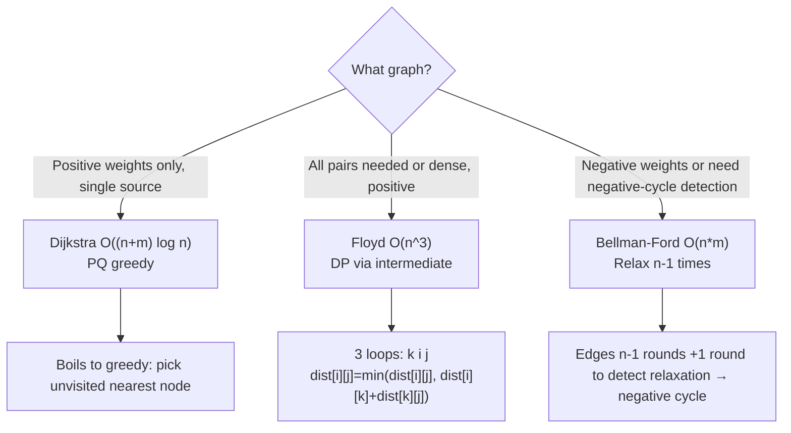
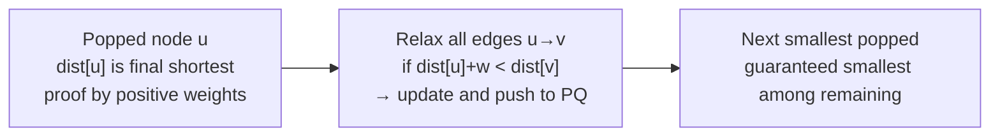
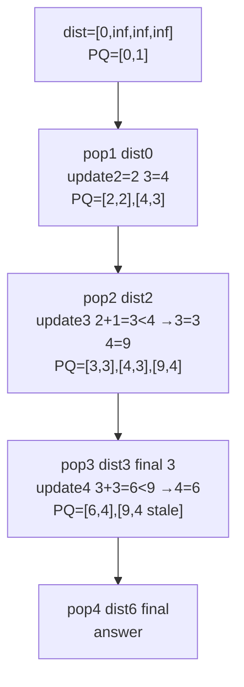

# 최단 경로 - 다익스트라, 플로이드-워셜, 벨만-포드

## 왜 배워야 할까?

가장 저렴한 경로를 찾는 것은 유비쿼터스 정렬과 동일한 그래프입니다.내비게이션, 네트워크 지연, 게임 AI, KOI의 "최단 거리"가 모두 최단 경로로 단축됩니다.

> 비유: Dijkstra = 소스로부터 일정한 속도로 확장되는 전파: 가장 가까운 노드에 먼저 도달한 다음 파동이 이를 통해 진행됩니다.Floyd = "k를 통해 i에서 j로 가는 경로를 개선할 수 있나요?"모든 k를 중간으로 확인하십시오.Bellman-Ford = 안정될 때까지 부채 협상과 같이 모든 에지를 반복적으로 완화하여 음의 에지를 처리하고 음의 순환을 감지할 수 있습니다.

---

## 1. 핵심 개념과 도식

### 상태 비교


### 다익스트라 불변


---

## 2. 순차적 데이터 변화 과정

### 다익스트라에 대한 그래프: `1→2(2), 1→3(4), 2→3(1), 2→4(7), 3→4(3)`

소스 '1'.우선순위 큐(dist, node)를 사용하여 Dijkstra `O((n+m) log n)`를 실행합니다.

|단계 |PQ(최소힙) 내용 |`(d,u)`가 터졌습니다 |dist[1..4] 이전 |당신의 가장자리를 완화 |이후 거리 |방문했나요?|
|------|------------|---|------|-------|------------|------------|
|초기화 |(0,1) |— |[0,무한대,무한대,무한] |— |— |— |
|1 |(0,1) |(0,1) |[0,무한대,무한대,무한] |1→2 (0+2<무한대 →2), 1→3 (0+4)→4 |[0,2,4,무한대] |{1}에 대해 |
|2 |(2,2),(4,3) |(2,2) |[0,2,4,무한대] |2→3 (2+1=3<4→3), 2→4 (2+7=9<무한→9) |[0,2,3,9] |반대 {1,2} |
|3 |(3,3),(9,4) (이전 (4,3) 오래됨) |(3,3) |[0,2,3,9] |3→4 (3+3=6<9→6) |[0,2,3,6] |반대 {1,2,3} |
|4 |(6,4),(9,4) |(6,4) |[0,2,3,6] |— |[0,2,3,6] 최종 |{1,2,3,4}에 대해 |
|5 |(9,4) |오래된 팝 dist 9 > 6 건너뛰기 |— |— |— |완료 |

1로부터의 최종 거리: `[0,2,3,6]`.4번 경로는 '1→2→3→4' 비용 6입니다(직접 1→2→4 비용 9 아님).


오래된 항목 `(4,3)`은 `if d != dist[u] continue`를 통해 무시됩니다.

### 플로이드-워샬 DP: `n=3` 그래프 `1→2:3, 2→3:4, 1→3:10`.행렬 `dist`

`dist[i][j]=0 if i==j else w or `를 초기화합니다.그런 다음 `k=1..n`을 중간으로 반복합니다.

|케이 |k 이전의 거리 |확인: k를 통해 개선되나요?`dist[i][j] > dist[i][k]+dist[k][j]` |k 이후의 거리 |
|---|---------------|-----------------------------------------------|--------------|
|초기화 |`[[0,3,10],[무한대,0,4],[무한대,무한대,0]]` |— |— |
|k=1 |위와 같이 |`i→1→j'가 있나요?1개의 행/열만: 개선 없음(1에 대한 인바운드 없음) |같은 |
|k=2 |같은 |`1→3` 개선: 현재 10 대 `1→2 +2→3 =3+4=7` → 7 |`[[0,3,7],[무한대,0,4],[무한대,무한대,0]]` |
|k=3 |위와 같이 |3번을 통해요?3시부터 발신 불가 |최종 `[[0,3,7],[무한대,0,4],[무한대,무한대,0]]` |

결과 모든 쌍은 2를 통해 '1→3' =7을 수정합니다.

### Bellman-Ford: `n=4` 에지는 위와 같지만 음수일 수도 있음, 음수 사이클 감지

표준: 모든 가장자리를 'n-1'번 완화합니다.n번째 라운드가 여전히 완화되면 → 음의 순환이 발생합니다.

양수 가중치의 경우 3라운드(n-1=3) 후에 거리는 Dijkstra의 결과와 동일합니다.4라운드 변화 없음 → 마이너스 사이클 없음.

---

## 3. 구현

### C++ - 세 가지 알고리즘

```cpp
# include <bits/stdc++.h>
using namespace std;
const long long INF = 4e18;

// Dijkstra single source, positive weights
vector<long long> dijkstra(int n, const vector<vector<pair<int,int>>>& adj, int src){
    vector<long long> dist(n+1, INF);
    priority_queue<pair<long long,int>, vector<pair<long long,int>>, greater<pair<long long,int>>> pq;
    dist[src]=0;
    pq.push({0,src});
    while(!pq.empty()){
        auto [d,u]=pq.top(); pq.pop();
        if(d!=dist[u]) continue; // stale
        for(auto [v,w]: adj[u]){
            if(dist[v] > d + w){
                dist[v]=d+w;
                pq.push({dist[v], v});
            }
        }
    }
    return dist;
}

// Floyd all pairs: dist is (n+1)x(n+1) matrix init INF, 0 on diagonal, w if edge
void floyd(int n, vector<vector<long long>>& dist){
    for(int k=1;k<=n;k++)
        for(int i=1;i<=n;i++) for(int j=1;j<=n;j++)
            if(dist[i][k]<INF && dist[k][j]<INF)
                dist[i][j]=min(dist[i][j], dist[i][k]+dist[k][j]);
    // detect negative cycle: dist[i][i] <0 => negative cycle involving i
}

// Bellman-Ford single source, detects negative cycle reachable from src
// edges list {u,v,w}, returns true if negative cycle reachable
bool bellmanFord(int n, const vector<array<long long,3>>& edges, int src, vector<long long>& dist){
    dist.assign(n+1, INF);
    dist[src]=0;
    for(int i=1;i<=n-1;i++){
        bool any=false;
        for(auto &e: edges){
            int u=e[0], v=e[1]; long long w=e[2];
            if(dist[u]!=INF && dist[v] > dist[u]+w){
                dist[v]=dist[u]+w; any=true;
            }
        }
        if(!any) break;
    }
    // one more round to check negative cycle
    for(auto &e: edges){
        int u=e[0], v=e[1]; long long w=e[2];
        if(dist[u]!=INF && dist[v] > dist[u]+w) return true; // negative cycle
    }
    return false;
}

int main(){
    ios::sync_with_stdio(false);
    cin.tie(nullptr);
    int n,m; if(!(cin>>n>>m)) return 0;
    vector<vector<pair<int,int>>> adj(n+1);
    vector<array<long long,3>> edgeList;
    vector<vector<long long>> mat(n+1, vector<long long>(n+1, INF));
    for(int i=1;i<=n;i++) mat[i][i]=0;
    for(int i=0;i<m;i++){int u,v,w; cin>>u>>v>>w; adj[u].push_back({v,w}); edgeList.push_back({u,v,w}); mat[u][v]=min(mat[u][v],(long long)w);}
    auto d=dijkstra(n, adj, 1);
    for(int i=1;i<=n;i++) cout<<d[i]<<" \n"[i==n];
    floyd(n, mat);
    for(int i=1;i<=n;i++){ for(int j=1;j<=n;j++) cout<<(mat[i][j]==INF?-1:mat[i][j])<<" "; cout<<"\n";}
    vector<long long> bf;
    bool hasNeg=bellmanFord(n, edgeList, 1, bf);
    cout<<(hasNeg?"NEGATIVE CYCLE\n":"NO CYCLE\n");
    return 0;
}

```
### Python - 동일한 논리

```python
import sys
import heapq

INF=10**18

def dijkstra(n, adj, src):
    dist=[INF]*(n+1)
    dist[src]=0
    pq=[(0,src)]
    while pq:
        d,u=heapq.heappop(pq)
        if d!=dist[u]:
            continue
        for v,w in adj[u]:
            nd=d+w
            if nd < dist[v]:
                dist[v]=nd
                heapq.heappush(pq,(nd,v))
    return dist

def floyd(n, dist):
    for k in range(1,n+1):
        dk=dist[k]
        for i in range(1,n+1):
            dik=dist[i][k]
            if dik==INF: continue
            di=dist[i]
            for j in range(1,n+1):
                if dk[j]==INF: continue
                nd=dik+dk[j]
                if nd < di[j]:
                    di[j]=nd

def bellman_ford(n, edges, src):
    dist=[INF]*(n+1)
    dist[src]=0
    for _ in range(n-1):
        any_rel=False
        for u,v,w in edges:
            if dist[u]!=INF and dist[v] > dist[u]+w:
                dist[v]=dist[u]+w
                any_rel=True
        if not any_rel: break
    has_neg=False
    for u,v,w in edges:
        if dist[u]!=INF and dist[v] > dist[u]+w:
            has_neg=True
            break
    return dist, has_neg

def solve():
    import sys
    data=sys.stdin.read().strip().split()
    if not data: return
    it=iter(data)
    n=int(next(it)); m=int(next(it))
    adj=[[] for _ in range(n+1)]
    edges=[]
    mat=[[INF]*(n+1) for _ in range(n+1)]
    for i in range(1,n+1): mat[i][i]=0
    for _ in range(m):
        try:
            u=int(next(it)); v=int(next(it)); w=int(next(it))
        except: break
        adj[u].append((v,w))
        edges.append((u,v,w))
        if w < mat[u][v]: mat[u][v]=w
    d=dijkstra(n, adj, 1)
    sys.stdout.write(" ".join(str(x if x!=INF else -1) for x in d[1:])+"\n")
    floyd(n, mat)
    for i in range(1,n+1):
        sys.stdout.write(" ".join(str(mat[i][j] if mat[i][j]!=INF else -1) for j in range(1,n+1))+"\n")
    _, has_neg=bellman_ford(n, edges, 1)
    sys.stdout.write("NEGATIVE CYCLE\n" if has_neg else "NO CYCLE\n")

if __name__=="__main__":
    solve()

```
---

## 4. 복잡도 분석

### 시간복잡도

**바이너리 힙이 있는 Dijkstra**: 각 노드는 `O(n log n)` 한 번 팝되고 각 가장자리는 한 번 완화되어 `O(m log n)` 푸시를 유발합니다(개선된 경우에만).합계 `O((n+m) log n)`.인접 행렬 `O(n²)` 사용.피보나치 힙은 'O(m + n log n)'을 제공하지만 KOI에는 PQ로 충분합니다.

파생: `힙 크기 ≤ m`, `pop n` 회: `n·log m`, `push ≤ m` 회: `m·log m` → `(n+m)·log n`.

`n=100k, m=300k`의 경우: `(400k)·17 ≒ 6.8M` 힙 작업 → C++에서는 1초 이내에 괜찮습니다.

**Floyd-Warshall**: `k,i,j` 각각 최대 `n`까지 삼중 루프 → 긴밀한 `Θ(n³)`.각 반복 `O(1)`.`n=500` → 125M 반복 → 경계선에 있지만 괜찮아 최적화된 C++입니다.`n=4000`의 경우 불가능 → `n`번으로 전환 Dijkstra `O(n·(n+m)log n)`은 희소할 때 더 나을 수 있습니다.

**Bellman-Ford**: 외부 `n-1` 라운드, 모든 `m` 모서리에 대한 내부 루프 → `O(n·m)`.`n=500, m=10000`의 경우 → 5M 완화 → OK.`n=10000, m=100k` → 1B → 너무 무거움.최적화: 완화가 없으면 조기 종료 및 SPFA 변형(그러나 퇴화될 수 있음).

### 공간복잡도

* **Dijkstra**: `dist` 배열 `O(n)`, `adj` 목록 `O(n+m)`, `PQ` 최대 `O(m)` → 전체 `O(n+m)`.
* **플로이드**: `long long` → `O(n²)` 메모리의 2D 매트릭스 `(n+1)²`.`n=500` → 250k ×8=2MB.`n=2000` → 4M ×8=32MB.`n=10000` → 100M ×8=800MB → MLE(대안 필요).
* **Bellman-Ford**: `dist` `O(n)`, `edges` 목록 `O(m)` → `O(n+m)`.PQ가 없습니다.

선택 이유: `n≤400`이 모든 쌍이 필요한 경우 → Floyd `O(n³)`가 더 간단합니다.단일 소스가 긍정적인 경우 → Dijkstra.네거티브 에지 또는 네거티브 사이클 감지가 필요한 경우 → Bellman-Ford.

---

## 5. 직접 풀어보기

**문제 1.** 앞선 Dijkstra 예제 그래프의 경우 각 팝 후에 dist 배열을 나열하고 포지티브 그래프에서 노드의 거리가 팝된 후에 왜 변경되지 않는지 설명하십시오.

<details><summary>풀이</summary>
증명 스케치: PQ는 항상 최소 남은 거리를 추출합니다.해당 노드에 대한 대체 경로는 dist가 현재 팝된 dist(PQ 순서) 이상이고 추가 양수 가중치를 더한 → 더 짧을 수 없는 다른 방문하지 않은 노드를 통과해야 합니다.따라서 거리는 팝으로 마무리됩니다.음수 가중치의 경우 이는 실패합니다. 음수 가장자리를 통한 나중에 더 작은 거리의 노드는 이미 팝된 노드를 향상시킬 수 있습니다 → Bellman-Ford가 필요합니다.
</details>

**문제 2.** 모서리가 '1-2:5,2-3:1,1-3:10'인 'n=4' 매트입니다.Floyd의 k=1,2,3 수동 채우기를 실행하고 어떤 k가 실제로 1→3을 향상시키는지 보여줍니다.

<details><summary>풀이</summary>
이전과 같이 매트 행을 초기화합니다. k=1 변경 없음(1을 통한 경로 없음).k=2: dist1-3은 1→2(5)+2→3(1)을 통해 10에서 6으로 향상됩니다.더 이상 k=3이 아닙니다.결과 1→3=6.외부 루프에서 중간 k가 올바르게 선택되어야 함을 보여줍니다.루프를 'i j k'로 바꾸면 DP 순서가 깨지고 잘못된 답이 나옵니다.
</details>

---

## 6. KOI 적용

- **BOJ 1753 최단경로, 1916 소수 수수료**: 단일 소스 Dijkstra bare - 우선순위 큐 비활성 조건 확인 `if d!=dist[u] continue` 필수.
- **BOJ 11404플로이드, 2458 키 타이머, 1389 케빈 베이컨**: 플로이드 전체 쌍 소형 'n≤500'.또한 트릭: `dist` 부울을 사용하여 Floyd를 통한 전이적 폐쇄입니다.
- **BOJ 11657 타임머신, 1865 웜홀, 1738 골목길**: Bellman-Ford / 네거티브 사이클.연결이 끊어진 구성 요소에서 잘못된 순환을 피하기 위해 완화하기 전에 도달 가능 확인 `dist[u]!=INF`를 기억하세요.
- **BOJ 10217 KCM Travel, 2887 위성 채널, 2211 복구 복구**: 상태 확장 또는 MST 하이브리드가 포함된 Dijkstra 변종.
- **패턴**: 입력이 '1 ≤ n ≤ 10000, m 최대 200k, 가중치 양수' → Dijkstra O((n+m) log n)이라고 말하면.`n ≤ 400`인 경우 → 플로이드.'가중치에 음수 포함' 또는 설명이 "무한대가 영원히 더 저렴할 수 있습니까?"라고 묻는 경우 → Bellman-Ford 음수 사이클.