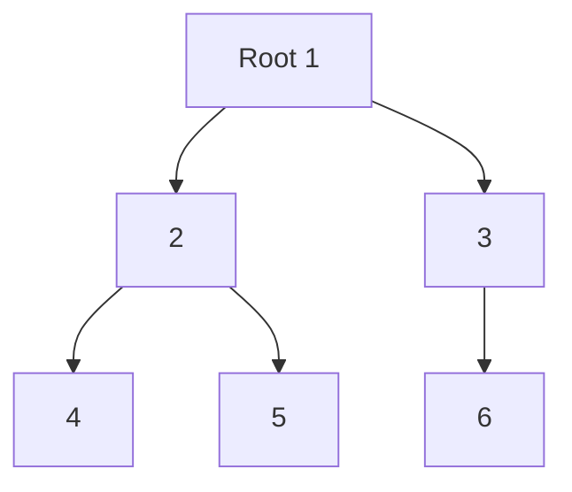
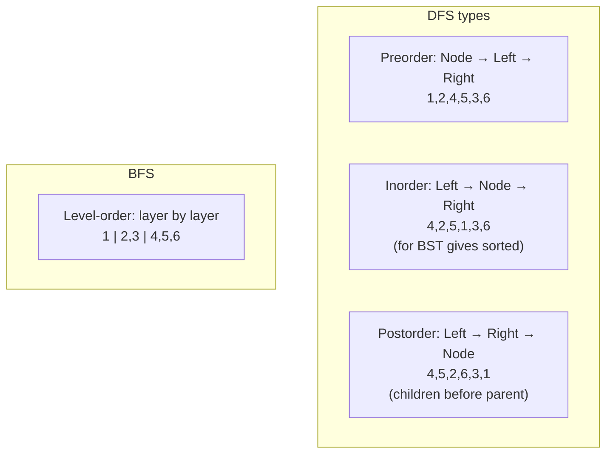

# 트리 순회 - 계층의 모든 노드 방문

## 왜 배워야 할까?

트리는 순환이 없고 루트가 있는 그래프입니다.모든 파일 시스템, 회사 조직도, 재귀 호출 트리 및 KOI "트리" 문제는 계층적입니다.

> 비유: 사전 주문 = 자녀보다 먼저 사람의 사진을 찍습니다.Inorder = 연령 균형을 맞춘 순서(왼쪽, 당신, 오른쪽)에 따라 사람들을 정렬합니다.후주문 = 부모에게 요약하기 전에 아이들로부터 선물을 수집합니다.레벨순 = 세대별 이산가족 상봉사진처럼 겹겹이 쌓인 BFS.

Mastery는 개념적으로 LCA, 트리 DP, 세그먼트 트리를 가능하게 합니다.

---

## 1. 핵심 개념과 도식

### 부모 포인터로서의 트리


인접 + 상위, 루트 고정 방향.

### 순회


재귀는 자연스럽게 DFS 순회를 구현합니다.

---

## 2. 순차적 데이터 변화 과정

### 위의 트리, Trace Preorder recursive `pre(u) = print u, pre(left), pre(right)` 트리로 구축된 인접성(부모 순서)

호출 스택 확장:

|전화 |액션 |재귀 스택 |지금까지의 출력 |
|------|---------|----|---------------|
|사전(1) |방문 1 |[1] |1 |
|→ 사전(2) |방문 2 |[1,2] |1,2 |
|→ 사전(4) |방문 4 |[1,2,4] |1,2,4 |
|→ pre(4) 완료(리프) |반환 |[1,2] |— |
|→ 사전(5) |방문 5 |[1,2,5] |1,2,4,5 |
|→ 사전(5) 완료 |반환 |[1,2] → [1] 2개 완료 후 |— |
|→ 사전(3) |방문 3 |[1,3] |1,2,4,5,3 |
|→ 사전(6) |방문 6 |[1,3,6] |1,2,4,5,3,6 |
|긴장을 풀다 |모두 반환 |[] |완료 |

동일한 트리 `post(1)`에 대한 사후 추적:

반환 순서: `4 →5 →2 →6 →3 →1` 따라서 `4,5,2,6,3,1`을 출력합니다.하위 트리 DP(`dp[u]는 하위 dp에서 계산됨`)에 중요합니다. 하위 항목이 완전히 처리된 **후** 상위 인쇄를 관찰하세요.

### 큐(BFS)를 통한 레벨 순서

|단계 |팝/푸시 후 큐 |터졌다 |방문한 순서 |
|------|---------|---------|---------------|
|초기화 |[1] |— |— |
|1 |pop1 푸시 2,3 → [2,3] |1 |1 |
|2 |pop2 push4,5 → [3,4,5] |2 |1,2 |
|3|pop3 push6 → [4,5,6] |3 |1,2,3 |
|4|팝4 → [5,6] |4|1,2,3,4|
|5|팝5 → [6] |5|1,2,3,4,5|
|6|pop6 → [] |6|1,2,3,4,5,6 완료|

### 후위 DP에 대한 데이터 상태 테이블 예: node1..6에 대한 하위 트리 합계 `sum[u]=val[u]+ Σ sum[child]`, `val=[1,2,3,4,5,6]`

상향식 계산 순서는 후순을 따릅니다.

|노드 처리 순서(postorder) |합계 계산 |이후 합계 |
|----------------------|------|-----------|
|4 |4 |합계4=4 |
|5|5|합계5=5|
|2|2 +4+5=11|합계2=11|
|6|6|합계6=6|
|3|3+6=9|합계3=9|
|1|1+11+9=21|sum1=21 루트 합계|

---

## 3. 구현

### C++ - DFS 순회 및 BFS 레벨 순서, 하위 트리 크기

```cpp
# include <bits/stdc++.h>
using namespace std;

// adjacency list for tree (undirected), we'll root traversal from 1 with parent
vector<vector<int>> adj;
vector<int> preorder, inorder, postorder, levelorder;

void dfs_pre(int u,int parent){
    preorder.push_back(u);
    for(int v: adj[u]) if(v!=parent) dfs_pre(v,u);
}
void dfs_in(int u,int parent){ // for binary tree representation; for general tree inorder defined via first child etc. Here for binary tree demo using adjacency with left/right order
    // For this demo, assume binary tree stored via left/right. Simplified: we simulate with two children only. We'll instead write generic postorder that works for any tree.
    // Placeholder for binary: this function expects binary structure - not used for general tree inorder conventionally
}
void dfs_post(int u,int parent){
    for(int v: adj[u]) if(v!=parent) dfs_post(v,u);
    postorder.push_back(u);
}
vector<int> bfs_level(int n, int root){
    vector<int> order;
    queue<int> q;
    vector<char> vis(n+1,false);
    q.push(root); vis[root]=true;
    while(!q.empty()){
        int u=q.front(); q.pop();
        order.push_back(u);
        for(int v: adj[u]) if(!vis[v]){vis[v]=true; q.push(v);}
    }
    return order;
}

// subtree sum example
vector<long long> val, subSum;
void dfsSubSum(int u,int parent){
    subSum[u]=val[u];
    for(int v: adj[u]) if(v!=parent){ dfsSubSum(v,u); subSum[u]+=subSum[v];}
}

int main(){
    ios::sync_with_stdio(false); cin.tie(nullptr);
    int n; if(!(cin>>n)) return 0;
    adj.assign(n+1,{});
    for(int i=0;i<n-1;i++){int u,v; cin>>u>>v; adj[u].push_back(v); adj[v].push_back(u);}
    val.assign(n+1,0); for(int i=1;i<=n;i++) val[i]=i; // demo

    dfs_pre(1,0);
    dfs_post(1,0);
    levelorder=bfs_level(n,1);
    subSum.assign(n+1,0); dfsSubSum(1,0);

    cout<<"pre: "; for(int x: preorder) cout<<x<<' '; cout<<"\n";
    cout<<"post: "; for(int x: postorder) cout<<x<<' '; cout<<"\n";
    cout<<"level: "; for(int x: levelorder) cout<<x<<' '; cout<<"\n";
    cout<<"subSum root="<<subSum[1]<<"\n";
    return 0;
}

```
확장 이진 트리 순서별:

```cpp
struct Node{int left=-1,right=-1;};
vector<Node> binTree;
// inorder for binary
void inorderBin(int u){
    if(u==-1) return;
    inorderBin(binTree[u].left);
    inorder.push_back(u);
    inorderBin(binTree[u].right);
}

```
### Python - 동일한 논리

```python
import sys
sys.setrecursionlimit(200000)
from collections import deque

def dfs_pre(u, parent, adj, preorder):
    preorder.append(u)
    for v in adj[u]:
        if v!=parent:
            dfs_pre(v,u,adj,preorder)

def dfs_post(u, parent, adj, postorder):
    for v in adj[u]:
        if v!=parent:
            dfs_post(v,u,adj,postorder)
    postorder.append(u)

def bfs_level(n, root, adj):
    order=[]
    q=deque([root])
    vis=[False]*(n+1)
    vis[root]=True
    while q:
        u=q.popleft()
        order.append(u)
        for v in adj[u]:
            if not vis[v]:
                vis[v]=True
                q.append(v)
    return order

def dfs_subsum(u, parent, adj, val, sub):
    s=val[u]
    for v in adj[u]:
        if v!=parent:
            dfs_subsum(v,u,adj,val,sub)
            s+=sub[v]
    sub[u]=s

# binary tree inorder example
class Node:
    def __init__(self,l=-1,r=-1):
        self.left=l; self.right=r

def inorder_bin(u, tree, out):
    if u==-1: return
    inorder_bin(tree[u].left, tree, out)
    out.append(u)
    inorder_bin(tree[u].right, tree, out)

def solve():
    data=list(map(int, sys.stdin.read().split()))
    if not data: return
    n=data[0]
    adj=[[] for _ in range(n+1)]
    idx=1
    for _ in range(n-1):
        if idx+1 >= len(data): break
        u=data[idx]; v=data[idx+1]; idx+=2
        adj[u].append(v); adj[v].append(u)
    preorder=[]; postorder=[]
    if n>=1:
        dfs_pre(1,0,adj,preorder)
        dfs_post(1,0,adj,postorder)
        lvl=bfs_level(n,1,adj)
        val=[0]+list(range(1,n+1))
        sub=[0]*(n+1)
        dfs_subsum(1,0,adj,val,sub)
        sys.stdout.write("pre: "+" ".join(map(str,preorder))+"\n")
        sys.stdout.write("post: "+" ".join(map(str,postorder))+"\n")
        sys.stdout.write("level: "+" ".join(map(str,lvl))+"\n")
        sys.stdout.write(f"subSum root={sub[1]}\n")

if __name__=="__main__":
    solve()

```
---

## 4. 복잡도 분석

### 시간복잡도

* **재귀를 통한 DFS 순회(사전/인/사후)**: 각 노드를 한 번 방문하고 인접 목록을 한 번 반복합니다.핸드쉐이킹 보조정리: 트리의 차수 합 = 2·(n-1).따라서 총 인접 스캔 = `2(n-1)` → `O(n)` 시간입니다.노드 'O(1)'에 차수를 더한 작업입니다.

정식: `T(n)= Θ(n)`.재귀 호출 `n` 프레임.

* **BFS 레벨 순서**: 대기열에 추가된 각 노드는 한 번씩 대기열에 추가되고, 각 에지는 두 번 검사됩니다. → `O(n + (n-1)) = O(n)`.각각 'O(1)'을 팝/푸시합니다.

* **하위 트리 DP 예**: dfs가 n 노드를 방문하므로 `O(n)`과 동일합니다.

`n=200k`의 경우 `O(n)=200k` 단계 순회 → C++에서 <0.01초.반복 스택 또는 증가된 재귀 제한을 사용해야 합니다. 재귀 깊이는 기울어진 트리(체인)에서 'n'일 수 있습니다.체인 `n=200k`의 경우 재귀 깊이 200k는 C++ 및 Python 재귀 제한의 기본 스택을 오버플로합니다.해결 방법: DFS의 반복 스택 또는 `sys.setrecursionlimit(400k)` + PyPy의 더 큰 스택, 또는 명시적으로 반복을 사용합니다.

### 공간복잡도

* **인접 목록**: `n+1` 벡터, 총 항목 `2·(n-1)` → `O(n)`.
* **방문 / 사전 주문 벡터**: 각각 최대 `n` 정수 → `O(n)`을 저장합니다.
* **재귀 호출 스택**:
* 균형 트리 높이 `O(log n)` → 스택 `O(log n)`.
* 최악의 경우 체인/비뚤어짐 → 깊이 `n` → `O(n)`.
* 반복 BFS 큐 최악의 경우 너비: 스타 트리의 경우 루트에는 `n-1` 자식이 있고 큐는 이를 저장 → `O(n)`.따라서 최악의 경우 보조 'O(n)'은 어느 쪽이든 가능합니다.
* **일반**: 총 메모리 'O(n)'이 지배적입니다.`n=1e6`의 경우 정수 ~8MB + 벡터 오버헤드 ~32MB의 인접성입니다.

---

## 5. 직접 풀어보기

**문제 1.** 값 `[1:10,2:5,3:3,4:2,5:1]`을 포함하는 트리 `1-2,1-3,2-4,2-5`.후위 및 하위 트리 합계를 단계적으로 계산합니다.각 노드의 합을 올바르게 계산하는 순서는 무엇이며 그 이유는 무엇입니까?

<details><summary>풀이</summary>
후순위 = [4,5,2,3,1].하위 트리 합계: sum4=2, sum5=1, sum2=5+2+1=8, sum3=3, sum1=10+8+3=21.상위 항목이 하위 항목보다 먼저 계산되므로 합계에 대한 선주문이 실패합니다(하위 항목의 합계가 필요함).Postorder는 DP에 맞는 크기의 부모보다 먼저 자식을 보장합니다.
</details>

**문제 2.** n=1 체인 트리의 경우: BFS와 DFS 레벨 순서가 다릅니까?재귀 깊이 문제를 설명하세요.

<details><summary>풀이</summary>
체인 1-2-3-4-5: DFS pre =1,2,3,4,5;BFS 레벨 = 1,2,3,4,5 각 레이어에는 하나의 노드가 있으므로 우연히 동일한 순서입니다.깊이 문제: 사전/사후(체인)에 대한 재귀 깊이 5가 최대입니다.n=200k 체인의 경우 재귀 깊이 200k는 Python 기본 1000 및 C++ 스택을 오버플로합니다(~8MB는 ~ ~200k 프레임 × ~32바이트 ≒6.4MB 경계선을 보유할 수 있음).반복 스택 사용: 푸시(노드, 상위, 상태) 또는 재귀 제한을 늘리고 안전을 위해 반복을 사용합니다.
</details>

---

## 6. KOI 적용

- **BOJ 1991 트리순회, 11725 트리의 부모 찾기, 1389?**: 기본 트리 순회 교과서.1991은 이진 트리에 대한 선주문/중위/후위 순서를 직접 기대합니다.
- **BOJ 1167 트리의 거리, 1240 별도 거리, 1967**: 트리 DP/경로에는 DFS 거리를 통한 하위 트리 합계와 직경이 필요합니다.
- **BOJ 20399?**: "트리" DP 문제에 대한 트리 DP는 후순위 순서를 기반으로 빌드됩니다. `dp[child]`에서 `dp[u]` → 후순위가 필요합니다.
- **패턴**: 입력이 `n-1` 모서리를 제공하고 "트리"라고 표시되면 즉시 1을 루트로 하고 DFS를 사용합니다.주문 요구 사항을 명확히 합니다. "자녀의 가치를 평가"하는 경우 → 후주문."인쇄주문생성" → 예약주문/BFS인 경우.n이 큰 경우 재귀 오버플로를 방지하려면 반복을 선호합니다.