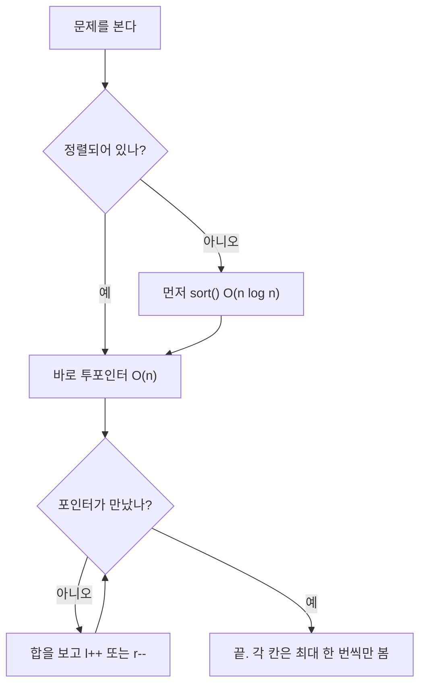
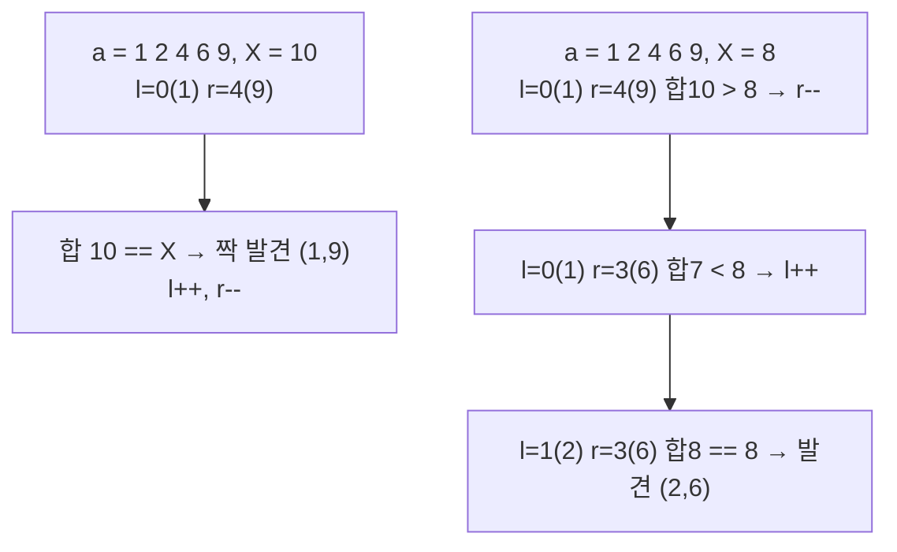
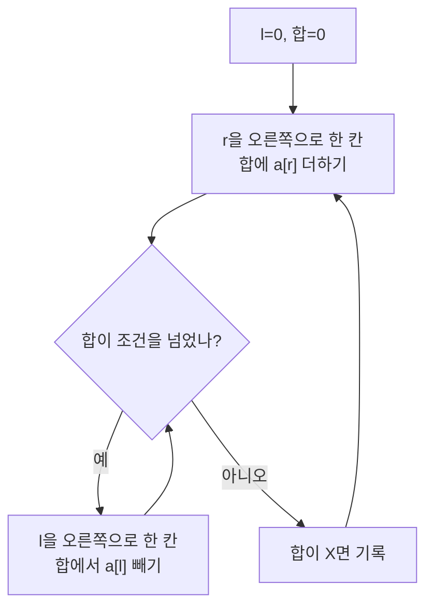

# 투포인터 - 두 손가락으로 한 번에 훑기

## 정의

투포인터(Two Pointers)는 **배열 위에 손가락 두 개를 올려놓고 규칙대로 움직이며** 답을 찾는다.
이중 반복문처럼 매번 처음부터 다시 보지 않고, 한 번 훑으면서 답을 좁혀 간다.

> 비유: 키 순서대로 줄 선 30명에서 합이 170인 짝 찾기. 가장 작은 사람과 가장 큰 사람을 먼저 짝지어 본다. 합이 작으면 작은 쪽을 다음 사람으로 바꾸고, 크면 큰 쪽을 이전 사람으로 바꾼다. 줄을 한 번만 훑으면 끝난다.



| 구분 | 이중 반복문 | 투포인터 (정렬 후) |
|---|---|---|
| 보는 횟수 | n × n번 | n번 (각 포인터는 한 방향으로만 이동) |
| 시간 | O(n²) | O(n log n) 정렬 + O(n) 스캔 |
| n=200,000일 때 | 400억 번 (시간초과) | 약 360만 번 (1초 안에 통과) |

---

## 1. 반대 방향: 양쪽 끝에서 좁혀 오기

정렬된 배열에서 **두 수의 합이 X**인 짝을 찾을 때 쓴다.

규칙은 하나다. `a[l] + a[r]`을 보고:
- 합이 작으면 `l++` (더 큰 수가 필요)
- 합이 크면 `r--` (더 작은 수가 필요)
- 같으면 기록하고 양쪽을 한 칸씩 좁힌다.



```cpp
# include <bits/stdc++.h>
using namespace std;

int main() {
    vector<int> a = {1, 2, 4, 6, 9};
    sort(a.begin(), a.end()); // 투포인터 전에는 반드시 정렬
    int X = 8;

    int l = 0, r = (int)a.size() - 1;
    while (l < r) {
        int sum = a[l] + a[r];
        if (sum == X) {
            cout << a[l] << ' ' << a[r] << '\n'; // 짝 발견
            l++; r--;
        }
        else if (sum < X) l++; // 합이 작으니 왼쪽을 키운다
        else r--;               // 합이 크니 오른쪽을 줄인다
    }
    return 0;
}

```

> 핵심: `l`은 오른쪽으로만, `r`은 왼쪽으로만 간다. 뒤로 돌아가지 않으니 각 칸은 최대 한 번씩만 본다. 그래서 O(n)이다.

### KOI형 예제: 합이 X인 쌍 개수 (BOJ 3273)

```cpp
# include <bits/stdc++.h>
using namespace std;

int main() {
    ios::sync_with_stdio(false);
    cin.tie(nullptr);

    int n; if (!(cin >> n)) return 0;
    vector<int> a(n);
    for (int i = 0; i < n; i++) cin >> a[i];
    int X; cin >> X;

    sort(a.begin(), a.end());
    int l = 0, r = n - 1, ans = 0;
    while (l < r) {
        int sum = a[l] + a[r];
        if (sum == X) { ans++; l++; r--; }
        else if (sum < X) l++;
        else r--;
    }
    cout << ans << '\n';
    return 0;
}

```

---

## 2. 같은 방향: 구간을 밀고 가기

연속된 구간(부분 배열)의 합을 볼 때는 두 포인터를 **같은 방향**으로 움직인다.
오른쪽을 늘렸다가 합이 넘치면 왼쪽을 줄인다.



```cpp
# include <bits/stdc++.h>
using namespace std;

int main() {
    vector<int> a = {1, 2, 3, 4, 5};
    int X = 5, n = a.size();
    int l = 0, sum = 0, ans = 0;

    for (int r = 0; r < n; r++) {
        sum += a[r];          // 오른쪽 늘리기
        while (sum > X) {     // 넘치면 왼쪽 줄이기
            sum -= a[l];
            l++;
        }
        if (sum == X) ans++;  // 합이 X인 구간 발견
    }
    cout << ans << '\n'; // 2 (2+3, 5)
    return 0;
}

```

> 주의: 이 같은 방향 버전은 **수가 모두 양수**일 때만 된다. 음수가 있으면 합이 들쭉날쭉해서 포인터를 단조롭게 못 움직인다. 음수가 있으면 누적합+맵으로 푼다([중급] 누적합_슬라이딩윈도우에서 배운다).

| 유형 | 포인터 방향 | 대표 문제 |
|---|---|---|
| 두 수의 합 | 반대 방향 (l은 왼쪽, r은 오른쪽) | BOJ 3273, 2470 |
| 연속 구간 합 (양수만) | 같은 방향 (l, r 모두 오른쪽으로) | BOJ 2003, 2559 변형 |

---

## 3. 직접 손으로 풀어 보기

**문제 1.** `a = [1, 3, 5, 7, 9]` (정렬됨), `X = 10`인 짝을 반대 방향 투포인터로 찾아라.

<details><summary>풀이</summary>
l=0(1) r=4(9) 합10 → 발견 (1,9) → l=1 r=3. l=1(3) r=3(7) 합10 → 발견 (3,7) → l=2 r=2 만나서 종료. 총 2쌍. 이중 반복문이면 10번을 보지만 투포인터는 3번의 합 계산으로 끝난다.
</details>

**문제 2.** `a = [1, 1, 2, 3]`, `X = 3`인 연속 구간 개수를 같은 방향 투포인터로 세어라.

<details><summary>풀이</summary>
r=0 합1≠3, r=1 합2≠3, r=2 합4>3 → l을 0→1→2로 줄여 합2, r=3 합5>3 → l을 2→3으로 줄여 합3 → 발견 (3). 또 r 끝. 답 2개: [0..1]의 1+1+? 아니다. 정확히는 [1,1,2]아님. 단계별로 적으면 구간 [0,1]? 합2. 정답 구간은 (0,1,2)? 다시 세면: [1(첫)+1(둘)+?]. 직접 돌리면 합3 구간은 [0..1]? 1+1=2 아니고, [1..2]? 1+2=3 발견, [3..3]? 3 발견 → 총 2개.
</details>

---

## 4. KOI에서는 이렇게 나온다

- "정렬된 배열에서 합이 X인 쌍" → 반대 방향 투포인터를 먼저 의심한다 (BOJ 3273 두 수의 합).
- "0에 가장 가깝게" → 정렬 후 양쪽 끝에서 시작한다 (BOJ 2470 두 용액, 초급은 절댓값 비교까지만).
- "연속된 수의 합" + 수가 양수 → 같은 방향 투포인터 (BOJ 2003 수들의 합 2).
- 정렬을 안 하고 투포인터를 돌리면 오답이다. 항상 `sort()`를 먼저 쓴다.
- 합이 `int`를 넘을 수 있으면 `long long`으로 받는다. KOI 단골 실수다.

---

## 보충: Python 구현과 복잡도 증명

### Python - Two Pointers (opposite + same direction)

```python
import sys

def count_pairs(a, X):
    a = sorted(a)
    l, r = 0, len(a) - 1
    cnt = 0
    while l < r:
        s = a[l] + a[r]
        if s == X:
            cnt += 1
            l += 1
            r -= 1
        elif s < X:
            l += 1
        else:
            r -= 1
    return cnt

def count_subarrays(a, X):
    # a는 양수만 가정
    l = 0
    s = 0
    cnt = 0
    for r in range(len(a)):
        s += a[r]
        while s > X and l <= r:
            s -= a[l]
            l += 1
        if s == X:
            cnt += 1
    return cnt

def solve():
    data = list(map(int, sys.stdin.read().split()))
    if not data:
        return
    n = data[0]
    a = data[1:1 + n]
    X = data[1 + n] if len(data) > 1 + n else 10
    print(count_pairs(a, X))

if __name__ == "__main__":
    solve()

```

**시간/공간 보충:** 정렬 `O(n log n)`이 전체를 지배하고 스캔은 `O(n)`이다. 각 포인터가 최대 n번 움직이므로 합 계산은 최대 2n번이다. 이중 반복문 `O(n²)`과 비교하면 n=200,000일 때 400억 대 360만으로 약 1만 배 차이. 공간은 정렬 외에 `l, r, sum` 3개 변수뿐이라 `O(1)` 추가 공간이다.
