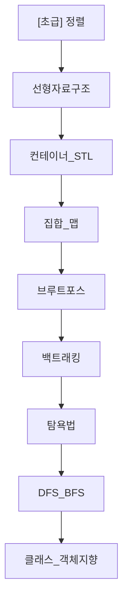
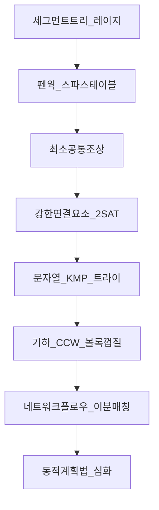

# 알고리즘 클래스 목차 - KOI를 위한 4단계 로드맵

> **"이 순서대로 들으면 됩니다."**  
> 입문 4개 → 초급 9개 → 중급 9개 → 고급 8개, 총 30개 파일을 단계별로 쌓으면 KOI 초등부부터 고등부 최고 난도까지 자연스럽게 연결됩니다. 각 파일은 `md`와 `pdf`가 1:1로 존재하며, `mermaid` 도식은 PDF에서 이미지로 렌더링되어 그대로 보입니다.

---

## 전체 30개 파일 - 권장 학습 순서

### [입문] - 코딩을 처음 시작하는 단계 (4개)

| 순서 | 파일명 | 핵심 키워드 | 다음으로 가기 전 체크 |
|---|---|---|---|
| 1 | [입문] 배열_문자열_함수.md | `vector`, `string`, 함수 분리 | `a[i]` 접근과 2차원 배열 이중 루프를 막힘없이 작성 |
| 2 | [입문] 정수론.md | 약수·배수·소수, `O(√n)` | 1~N 약수를 `√N`으로 구하고 에라토스테네스 체를 설명할 수 있음 |
| 3 | [입문] 재귀.md | 기저·재귀 사례, 호출 스택 | 팩토리얼/피보나치를 재귀로 짜고 스택 깊이를 그림으로 그릴 수 있음 |
| 4 | [입문] 시간복잡도_공간복잡도.md | `O(n)`, `O(log n)`, 1초 1억 연산 | `n` 제한을 보고 `O(n²)` 가능 여부를 즉시 판단 |

> **입문을 마치면:** `BOJ 10807, 10870, 11659` 수준의 입출력·재귀·누적합 문제를 15분 안에 풀 수 있다.

---

### [초급] - KOI 초등부 / 중등부 입문 (9개)

| 순서 | 파일명 | 핵심 키워드 | 선수 과목 |
|---|---|---|---|
| 5 | [초급] 정렬.md | 버블/선택/삽입/병합/퀵, `sort()` | [입문] 배열 |
| 6 | [초급] 선형자료구조.md | 스택·큐·덱 | [입문] 배열 |
| 7 | [초급] 컨테이너_STL.md | `vector`, `deque`, `priority_queue` | 6 |
| 8 | [초급] 집합_맵.md | `set`, `map`, `unordered_map` | 7 |
| 9 | [초급] 브루트포스.md | `O(2ⁿ)`, `next_permutation` | 4. 시간복잡도 |
| 10 | [초급] 백트래킹.md | 가지치기, `dfs+pop` | 9 |
| 11 | [초급] 탐욕법.md | 정렬 후 탐욕, 반례 찾기 | 5 |
| 12 | [초급] DFS_BFS.md | 재귀 DFS, 큐 BFS, 격자 4방향 | 3. 재귀 + 6 |
| 13 | [초급] 클래스_객체지향.md | `struct` vs `class`, 생성자, 상속 | [입문] 배열_문자열_함수 |

> **초급을 마치면:** `BOJ 1920, 2606, 2178, 14888` 등 정렬·스택·DFS/BFS·백트래킹을 조합한 문제를 풀 수 있다.

---

### [중급] - KOI 중등부 / 고등부 중급 (9개)

| 순서 | 파일명 | 핵심 키워드 | 선수 과목 |
|---|---|---|---|
| 14 | [중급] 분할정복.md | `T(n)=2T(n/2)+O(n)` | [초급] 재귀 |
| 15 | [중급] 이분탐색_투포인터.md | `lower_bound`, 파라메트릭 서치 | 14 |
| 16 | [중급] 누적합_슬라이딩윈도우.md | `P[r+1]-P[l]`, 투 포인터 윈도우 | 15 |
| 17 | [중급] 조합론.md | `nCr`, `mod 1e9+7`, 페르마 | [입문] 정수론 |
| 18 | [중급] 비트마스크.md | `1<<n`, 부분집합 `O(2ⁿ)` | 17 |
| 19 | [중급] 동적계획법.md | `dp[i]=dp[i-1]+dp[i-2]`, 배낭, LCS, LIS | 18 |
| 20 | [중급] 트리순회.md | 전위·중위·후위, 레벨오더 | [초급] DFS_BFS |
| 21 | [중급] 최단경로.md | 다익스트라, 플로이드, 벨만-포드 | 20 |
| 22 | [중급] 유니온파인드_MST_위상정렬.md | DSU, 크루스칼, Kahn | 21 |

> **중급을 마치면:** `BOJ 2110, 2805, 11660, 12865, 1753, 1197` 등 이분탐색·DP·최단경로·MST를 1시간 안에 설계할 수 있다.

---

### [고급] - KOI 고등부 최고난도 (8개)

| 순서 | 파일명 | 핵심 키워드 | 선수 과목 |
|---|---|---|---|
| 23 | [고급] 세그먼트트리_레이지.md | `tree[4n]`, `lazy` | [중급] 동적계획법 |
| 24 | [고급] 펜윅트리_스파스테이블.md | `lowbit`, `st[k][i]` | 23 |
| 25 | [고급] 최소공통조상_LCA.md | `up[k][v]`, 바이너리 리프팅 | [중급] 트리순회 |
| 26 | [고급] 강한연결요소_2SAT.md | Kosaraju/Tarjan, `x → ¬x` | 25 |
| 27 | [고급] 문자열_KMP_트라이.md | `pi`, Trie, 롤링 해시 | 24 |
| 28 | [고급] 기하_CCW_볼록껍질.md | `cross`, Andrew, 선분 교차 | 23 |
| 29 | [고급] 네트워크플로우_이분매칭.md | Dinic, Hopcroft-Karp | 26 |
| 30 | [고급] 동적계획법_심화.md | 비트마스크 DP, CHT | 19 + 23 |

> **고급을 마치면:** `BOJ 16975, 11438, 2150, 1786, 1708, 11375, 11401` 등 Platinum 난도에서도 4단계 레시피(`상태 정의→점화식→기저→순서`)를 그림으로 그리며 풀 수 있다.

---

## 파일 형식 안내

- 모든 파일은 `md`와 `pdf`가 쌍으로 존재합니다. 예: `[중급] 동적계획법.md` ↔ `[중급] 동적계획법.pdf`
- `md`에는 `  ` 코드가 그대로 있어 수정이 쉽고, `pdf`에는 해당 코드가 **이미지로 렌더링**되어 바로 보입니다.
- 이미지는 `/.mermaid_images/`에 100개가 캐시되어 있으며, 파일명 변경 시 자동 리네임됩니다.

| 구분 | 경로 예시 |
|---|---|
| md | `algorithm_class/[중급] 동적계획법.md` |
| pdf | `algorithm_class/[중급] 동적계획법.pdf` |
| 이미지 | `algorithm_class/.mermaid_images/[중급] 동적계획법_mermaid_0_*.png` |

---

## 바로가기 (상대 링크)

### [입문]
- [배열_문자열_함수](./[입문]%20배열_문자열_함수.md)
- [정수론](./[입문]%20정수론.md)
- [재귀](./[입문]%20재귀.md)
- [시간복잡도_공간복잡도](./[입문]%20시간복잡도_공간복잡도.md)

### [초급]
- [정렬](./[초급]%20정렬.md)
- [선형자료구조](./[초급]%20선형자료구조.md)
- [컨테이너_STL](./[초급]%20컨테이너_STL.md)
- [집합_맵](./[초급]%20집합_맵.md)
- [브루트포스](./[초급]%20브루트포스.md)
- [백트래킹](./[초급]%20백트래킹.md)
- [탐욕법](./[초급]%20탐욕법.md)
- [DFS_BFS](./[초급]%20DFS_BFS.md)
- [클래스_객체지향](./[초급]%20클래스_객체지향.md)

### [중급]
- [분할정복](./[중급]%20분할정복.md)
- [이분탐색_투포인터](./[중급]%20이분탐색_투포인터.md)
- [누적합_슬라이딩윈도우](./[중급]%20누적합_슬라이딩윈도우.md)
- [조합론](./[중급]%20조합론.md)
- [비트마스크](./[중급]%20비트마스크.md)
- [동적계획법](./[중급]%20동적계획법.md)
- [트리순회](./[중급]%20트리순회.md)
- [최단경로](./[중급]%20최단경로.md)
- [유니온파인드_MST_위상정렬](./[중급]%20유니온파인드_MST_위상정렬.md)

### [고급]
- [세그먼트트리_레이지](./[고급]%20세그먼트트리_레이지.md)
- [펜윅트리_스파스테이블](./[고급]%20펜윅트리_스파스테이블.md)
- [최소공통조상_LCA](./[고급]%20최소공통조상_LCA.md)
- [강한연결요소_2SAT](./[고급]%20강한연결요소_2SAT.md)
- [문자열_KMP_트라이](./[고급]%20문자열_KMP_트라이.md)
- [기하_CCW_볼록껍질](./[고급]%20기하_CCW_볼록껍질.md)
- [네트워크플로우_이분매칭](./[고급]%20네트워크플로우_이분매칭.md)
- [동적계획법_심화](./[고급]%20동적계획법_심화.md)

---

## 학습 팁

1. **하루 1개** — 각 파일은 250~350줄, mermaid 3~5개, 코드 5개로 40분 컷으로 설계됨
2. **그림을 먼저** — 코드를 보기 전에 `mermaid`를 손으로 따라 그려보면 점화식이 보인다
3. **직접 손으로 풀어 보기 2문제는 반드시 손으로** — `
` 열기 전에 노트에 먼저 적기
4. **보충 Python은 나중에** — C++로 통과한 뒤 Python으로 다시 짜면 두 언어 감각이 동시에 는다

> 이 목차대로 30개를 끝내면, KOI 예선 → 본선 → 고등부 최종까지 같은 템플릿(도식·순차 변화·C++/Python·복잡도 증명)으로 대응할 수 있습니다.
